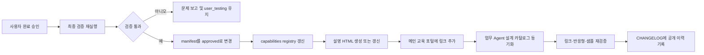

# Agent_ground 프로젝트 마스터 가이드

> 문서 상태: 초기 기준안 1.0  
> 작성일: 2026-07-10  
> 적용 대상: `C:\Users\<사용자명>\Desktop\Agent_ground`  
> 기존 참고 자료: `C:\Users\<사용자명>\Desktop\langflow교육자료`, `C:\Users\<사용자명>\Desktop\기능flow`  
> 필수 실행 조건: 모든 Langflow 커스텀 Python 자산은 **Standalone 방식**으로 구현한다. 단, Standalone 파일이라고 모두 Component로 분류하지는 않는다.

---

## 1. 이 프로젝트에서 만들고자 하는 것

`Agent_ground`는 코딩이 익숙하지 않은 사람도 Agent Builder(Langflow)를 이용해 실제 업무용 AI Agent를 만들 수 있도록 돕는 통합 개발·교육 프로젝트다.

이 프로젝트는 따로 진행되던 다음 작업을 하나의 체계 안에서 운영한다.

1. **교육자료**: Langflow를 처음 사용하는 사람도 따라 할 수 있는 단계별 학습 자료
2. **Components**: 한 파일만 등록해 독립적으로 사용할 수 있는 재사용 커스텀 컴포넌트
3. **Flows**: 여러 기본 노드와 커스텀 컴포넌트를 연결해 완성한 유용한 Flow
4. **실패와 해결 기록**: 실제 환경에서 잘 되지 않았던 증상, 원인, 수정 방법, 재검증 결과
5. **업무 Agent 설계**: 사용자가 업무를 자연어로 설명하면 승인된 Flow와 Component를 근거로 Agent 구현안을 제안하는 별도 서비스
6. **통합 HTML 포털**: 교육자료, 사용 설명서, 문제 해결 문서, 업무 Agent 설계 안내를 한곳에서 탐색할 수 있는 서비스 수준의 정적 웹사이트

프로젝트의 최종 목표는 단순한 코드 저장소가 아니다. 사용자가 **배우고, 가져다 쓰고, 실패를 해결하고, 자신의 업무를 Agent로 설계할 수 있는 하나의 제품형 환경**을 만드는 것이다.

---

## 2. 사용자가 원하는 핵심 결과

### 2.1 초보자도 실제로 사용할 수 있어야 한다

- Python이나 Langflow 내부 구조를 잘 몰라도 따라 할 수 있어야 한다.
- 설명은 “무엇을 추가하는가 → 어디에 연결하는가 → 무엇을 입력하는가 → 어떤 결과가 나와야 하는가” 순서로 작성한다.
- 추상적인 설명만 하지 않고 정확한 노드 이름, 입력·출력 이름과 타입, 연결표, 복사 가능한 샘플 입력, 기대 결과를 제공한다.
- 사용자가 직접 구현해야 하는 부분은 화면에서 해야 할 행동까지 구체적으로 설명한다.

### 2.2 실제 사용 환경을 기준으로 해야 한다

- 일반적인 Langflow 지식이나 공식 문서만으로 “될 것”이라고 가정하지 않는다.
- 이 프로젝트의 실제 Agent Builder 환경에서 보이는 노드, 입력 필드, 타입, 패키지, 제약을 우선한다.
- 구현자는 로컬 검증을 하고, 사용자는 실제 환경에서 직접 실행해 확인한다.
- 문서에는 마지막으로 확인한 환경과 날짜를 표시한다.
- 확인하지 않은 내용은 `검증 완료`처럼 표현하지 않고 `사용자 환경 확인 필요`로 표시한다.

### 2.3 Flow와 Component를 구분해 축적해야 한다

- `flows/`에는 완성된 연결 구조, Flow JSON, 연결 가이드, 샘플과 검증 자료를 둔다.
- `components/`에는 Flow 밖에서도 직접 재사용할 수 있는 독립 기능 단위만 둔다.
- Flow 전용 adapter, prompt 조립, demo seed, 결과 포장과 내부 envelope 변환은 `flows/<flow_id>/nodes/`에 둔다.
- Standalone은 파일 배포 제약이고 Component는 기능 분류다. 파일 하나로 등록된다는 사실만으로 Component가 되지는 않는다.
- Flow의 `component_refs.json`에는 실제 재사용 Component만 기록하고, 내부 노드는 `internal_nodes.json`에 별도로 기록한다.
- Python 원본은 Component면 `components/`, 내부 노드면 소유 Flow의 `nodes/` 한곳에만 둔다. Flow JSON에는 import를 위한 내장 code가 포함될 수 있다.

### 2.4 사용자가 완료라고 판단한 뒤에 공개 문서에 반영해야 한다

- 개발 중인 Flow나 Component는 곧바로 메인 교육자료에 추가하지 않는다.
- 사용자가 직접 시험한 뒤 “이제 완성된 것 같다”, “완료로 반영해줘” 등 완료 의사를 밝힌 시점을 **승인 게이트**로 사용한다.
- 승인 전 상태는 `idea`, `building`, `user_testing` 중 하나로 관리한다.
- 승인 후 최종 검증까지 통과해야 `approved`가 된다.
- `approved` 자산만 통합 HTML 포털과 업무 Agent 설계 추천 카탈로그에 노출한다.

### 2.5 실패 과정도 교육 자산이 되어야 한다

- 사용자 환경에서 실패한 사례는 단순 채팅 기록으로 끝내지 않는다.
- 증상, 재현 조건, 원인, 해결 방법, 검증 결과를 별도의 HTML 문서로 만든다.
- 교육자료에는 `문제 해결 기록`으로 가는 링크를 항상 제공한다.
- 특정 Flow나 Component에서 발생한 문제라면 해당 설명서에서도 관련 해결 문서로 연결한다.

### 2.6 HTML은 서비스 수준의 디자인이어야 한다

- 모든 HTML 결과물은 `html/` 아래에 모은다.
- 메인 화면, 교육자료, Flow 설명서, Component 설명서, 문제 해결 문서, 업무 Agent 설계 문서가 같은 디자인 시스템과 탐색 구조를 사용한다.
- 각 하위 화면에는 최소한 `홈`, `이전 화면`, `상위 목록` 이동 기능을 제공한다.
- 데스크톱, 태블릿, 모바일에서 레이아웃과 버튼이 정상 작동해야 한다.
- 보기 좋은 화면뿐 아니라 키보드 탐색, 명확한 포커스 표시, 충분한 색상 대비, 긴 코드와 표의 넘침 처리까지 포함한다.

---

## 3. 프로젝트 운영 원칙

다음 원칙은 향후 모든 구현과 문서 작업에 공통으로 적용한다.

1. **Beginner first**: 초보자가 실제로 실행할 수 있는지를 우선한다.
2. **Actual environment first**: 기억이나 일반론보다 현재 환경에서 확인한 사실을 우선한다.
3. **Functional boundary first**: 독립 기능 단위만 Component로 승격하고 Flow 내부 단계를 공용 자산처럼 노출하지 않는다.
4. **Standalone packaging**: 모든 커스텀 Python 자산은 파일 하나만 등록해 실행할 수 있어야 한다.
5. **Contract first**: 구현 전에 입력, 출력, 타입, 오류 형태, 다음 연결 지점을 먼저 정한다.
6. **Evidence before completion**: 컴파일 성공만으로 완료라고 하지 않고 대표 입력의 실제 결과를 확인한다.
7. **User approval gate**: 사용자의 완료 승인 전에는 공식 포털과 추천 카탈로그에 공개하지 않는다.
8. **One source of truth**: 승인 상태와 추천 정보는 registry를 기준으로 관리한다.
9. **Failure becomes knowledge**: 실패 원인과 해결 과정을 재사용 가능한 문서로 남긴다.
10. **Safe by default**: 비밀값을 코드에 넣지 않고, 외부 발송·시스템 쓰기·승인 업무에는 사람 확인 지점을 둔다.
11. **Preserve proven assets**: 기존 자료를 무조건 다시 만들지 않고, 실제로 검증된 코드·샘플·설명은 선별해 이관한다.

---

## 4. 권장 최종 디렉터리 구조

```text
Agent_ground/
├─ README.md
├─ AGENT_GROUND_PROJECT_MASTER_GUIDE.md
├─ CHANGELOG.md
│
├─ environment/
│  ├─ ENVIRONMENT_PROFILE.md
│  ├─ DEPENDENCY_MATRIX.md
│  └─ .env.example
│
├─ training/
│  ├─ source/
│  ├─ examples/
│  ├─ samples/
│  └─ references/
│
├─ components/
│  └─ <component_id>/
│     ├─ <component_id>.py
│     ├─ manifest.json
│     ├─ README.md
│     ├─ samples/
│     └─ tests/
│
├─ flows/
│  └─ <flow_id>/
│     ├─ <flow_id>.json
│     ├─ manifest.json
│     ├─ README.md
│     ├─ CONNECTION_GUIDE.md
│     ├─ component_refs.json
│     ├─ internal_nodes.json
│     ├─ nodes/
│     │  └─ <node_id>.py
│     ├─ samples/
│     ├─ tests/
│     └─ release/
│
├─ business_agent_design/
│  ├─ README.md
│  ├─ flow/
│  ├─ components/
│  ├─ prompts/
│  ├─ schemas/
│  ├─ catalog_sync/
│  ├─ samples/
│  └─ tests/
│
├─ registry/
│  ├─ capabilities.json
│  ├─ site_pages.json
│  ├─ troubleshooting.json
│  └─ schemas/
│
├─ html/
│  ├─ index.html
│  ├─ training/
│  │  └─ index.html
│  ├─ flows/
│  │  ├─ index.html
│  │  └─ <flow_id>/index.html
│  ├─ components/
│  │  ├─ index.html
│  │  └─ <component_id>/index.html
│  ├─ troubleshooting/
│  │  ├─ index.html
│  │  └─ <issue_id>/index.html
│  ├─ business-agent-design/
│  │  └─ index.html
│  └─ assets/
│     ├─ css/
│     ├─ js/
│     ├─ images/
│     └─ icons/
│
├─ scripts/
│  ├─ build_site.*
│  ├─ validate_registry.*
│  ├─ validate_links.*
│  ├─ package_flow.*
│  └─ sync_business_catalog.*
│
├─ skills/
│  ├─ maintain-agent-ground/
│  ├─ build-langflow-standalone-component/
│  ├─ build-langflow-flow-package/
│  ├─ maintain-agent-ground-portal/
│  └─ install.ps1
│
├─ tests/
│  ├─ component_contracts/
│  ├─ flow_contracts/
│  ├─ site/
│  └─ smoke/
│
└─ archive/
   └─ migration_snapshots/
```

### 4.1 구조 해석

- `training/`은 교육 내용의 원본, 예제 코드, 샘플 파일을 보관한다.
- `components/`는 독립 사용 사례와 안정된 계약을 가진 기능 단위 Component의 기준 원본이다.
- `flows/`는 Flow JSON, 연결 정보, 샘플, 검증 자료와 Flow 내부 Python 노드 원본을 보관한다.
- `business_agent_design/`은 일반 Flow 라이브러리와 분리된 별도 상위 서비스다.
- `registry/`는 어떤 자산이 승인되었고 포털과 업무 Agent 설계에 노출될 수 있는지 결정하는 기준 데이터다.
- `html/`은 사용자가 브라우저로 보는 모든 HTML 결과물을 모으는 곳이다. HTML 파일은 다른 폴더에 흩어 두지 않는다.
- `scripts/`는 registry를 읽어 HTML 목록, 배포 묶음, 업무 Agent 카탈로그를 만드는 자동화 도구를 보관한다.
- `skills/`는 이 프로젝트의 구현·검증·병합 규칙을 다른 개발 환경에서도 그대로 적용할 수 있는 이동식 Agent Skill 묶음이다.
- `archive/`는 이관 전 스냅샷이나 폐기된 버전을 보관하되 포털에는 노출하지 않는다.

---

## 5. 자산 상태와 공개 규칙

모든 Flow, Component, 교육 페이지, 문제 해결 문서는 다음 상태 중 하나를 가진다.

| 상태 | 의미 | 메인 포털 노출 | 업무 Agent 추천 사용 |
| --- | --- | --- | --- |
| `idea` | 아이디어만 등록됨 | 아니오 | 아니오 |
| `building` | 구현 또는 문서 작성 중 | 아니오 | 아니오 |
| `user_testing` | 로컬 검증 후 사용자 실제 환경 확인 중 | 아니오 | 아니오 |
| `approved` | 사용자 완료 승인과 최종 검증 완료 | 예 | Flow/Component만 예 |
| `deprecated` | 더 이상 권장하지 않음 | 별도 보관 목록만 | 아니오 |

### 승인 게이트 규칙

사용자가 완료 의사를 밝히면 다음 순서로 처리한다.



사용자 승인 후에도 최종 검증이 실패하면 `approved`로 바꾸지 않는다. 무엇이 실패했는지 설명하고 수정한 뒤 다시 확인한다.

---

## 6. Component와 Standalone Python 자산 구현 표준

이 프로젝트의 모든 커스텀 Python 자산은 실제 Agent Builder 환경의 제약 때문에 Standalone 방식으로 작성한다. 그러나 Standalone은 포장 방식일 뿐 Component 자격을 의미하지 않는다.

### 6.1 Component 승격 기준

다음 조건을 모두 만족할 때만 `components/`와 registry에 Component로 등록한다.

- 특정 Flow를 몰라도 독립 사용 사례를 한 문장으로 설명할 수 있다.
- 다른 Flow나 Agent가 직접 연결할 수 있는 안정된 입력·출력 계약이 있다.
- 단순 필드 변환, prompt 조립, demo 값 생성이나 최종 포장을 넘어 의미 있는 업무 기능을 수행한다.
- 오류·보안·크기 제한을 독립적으로 정의하고 검증할 수 있다.
- 별도 버전, manifest, 단위 테스트와 사용자 설명서를 유지할 가치가 있다.

기준을 통과하지 못한 Python 단계는 `flows/<flow_id>/nodes/`에 두고 `internal_nodes.json`으로 관리한다. 내부 노드는 Component Library, registry와 업무 Agent 추천 대상에서 제외하며 소유 Flow 설명서 안에서만 보여준다.

### 6.2 Standalone 필수 조건

- 한 개의 `.py` 파일만 Langflow 커스텀 컴포넌트 위치 또는 코드 편집기에 등록해 동작해야 한다.
- 형제 파일, 저장소 내부 공통 모듈, 상대 경로 모듈을 import하지 않는다.
- 예: `from .common import ...`, `from helpers import ...` 형태를 금지한다.
- 필요한 작은 helper는 해당 파일 내부에 포함한다.
- 표준 라이브러리 외 패키지는 실제 환경에 설치되어 있는지 확인하고 manifest에 기록한다.
- 비밀키, URI, 토큰, 사내 주소를 코드에 하드코딩하지 않는다.
- 입력값의 기본값은 안전해야 하며, 운영자용 값은 고급 설정으로 분리한다.
- 각 Output은 어떤 Langflow 타입인지 명확해야 한다.
- 실패 시 빈 성공값을 조용히 반환하지 말고 사용자가 이해할 수 있는 상태 또는 오류 정보를 제공한다.

### 6.3 Component manifest 필수 필드

```json
{
  "id": "example_component",
  "name_ko": "예제 컴포넌트",
  "asset_type": "component",
  "status": "building",
  "version": "0.1.0",
  "standalone": true,
  "packaging": "standalone",
  "component_scope": "general",
  "reusability": "shared",
  "summary_ko": "이 컴포넌트가 해결하는 문제",
  "inputs": [],
  "outputs": [],
  "dependencies": [],
  "used_by_flows": [],
  "risk_tags": [],
  "verified_environment": null,
  "last_verified_at": null,
  "documentation_path": null
}
```

### 6.4 Component 설명서 필수 항목

1. 이 컴포넌트가 필요한 이유
2. 기본 Langflow 노드만으로 해결하기 어려운 점
3. 입력 필드와 연결 입력의 차이
4. 입력별 타입, 예시값, 필수 여부
5. 출력별 타입과 다음 연결 대상
6. Langflow에 등록하는 방법
7. 가장 짧은 연결 예제
8. 복사 가능한 테스트 입력
9. 기대 결과
10. 흔한 실패와 관련 문제 해결 링크
11. 검증한 환경과 날짜

### 6.5 Component 완료 기준

- [ ] 파일 하나만 복사 또는 등록해 로드된다.
- [ ] 형제/로컬 모듈 import가 없다.
- [ ] Python 문법 검사가 통과한다.
- [ ] 실제 Langflow 화면에 의도한 이름과 입력·출력이 표시된다.
- [ ] 정상 입력의 출력 타입과 내용이 계약과 일치한다.
- [ ] 빈 입력, 잘못된 입력, 외부 연결 실패 등 대표 오류가 확인된다.
- [ ] 샘플 입력과 기대 결과가 있다.
- [ ] 사용자가 실제 환경에서 직접 확인했다.
- [ ] 사용자가 완료를 승인했다.
- [ ] HTML 설명서와 registry 반영이 완료됐다.

---

## 7. Flow 구현 표준

### 7.1 Flow 폴더에 포함할 것

- 가져오기 가능한 Flow JSON
- Flow manifest
- 필요한 실제 Component ID와 정확한 버전을 담은 `component_refs.json`
- Flow 전용 Python 노드와 원본 경로를 담은 `internal_nodes.json`
- 내부 노드 원본을 담는 `nodes/`
- 초보자용 README
- 포트 단위 연결표가 있는 `CONNECTION_GUIDE.md`
- 복사 가능한 최소 입력과 실제 업무형 입력
- 정상 결과와 실패 결과의 확인 기준
- 로컬 자동 검사와 실제 Langflow 수동 검사 결과
- 승인 후 생성한 HTML 설명서

### 7.2 Flow manifest 필수 필드

- Flow ID, 한글 이름, 버전, 상태
- 해결하는 업무 문제
- 대상 사용자와 난이도
- 필요한 기본 노드
- 필요한 커스텀 Component ID와 버전
- 입력 계약과 최종 출력 계약
- 외부 시스템 또는 패키지 의존성
- 보안·승인·개인정보 관련 위험 태그
- 대표 샘플 경로
- 검증 환경과 마지막 검증일
- HTML 설명서 경로

### 7.3 Flow 설명서 필수 항목

1. 이 Flow가 해결하는 업무
2. 전체 동작을 초보자 언어로 설명한 요약
3. 실제 분기와 병합을 반영한 구조도
4. 사용하는 기본 노드와 커스텀 컴포넌트 목록
5. 정확한 연결 순서와 포트 연결표
6. 환경 설정과 비밀값 입력 위치
7. 가져오기 또는 직접 조립 방법
8. 최소 실행 예제
9. 실무형 실행 예제
10. 기대 결과와 성공 판정 기준
11. 흔한 문제와 해결 문서 링크
12. 버전, 승인 상태, 마지막 검증 환경

### 7.4 Flow 완료 기준

- [ ] Flow JSON이 파싱되고 실제 환경에서 가져와진다.
- [ ] `component_refs.json`의 모든 Component가 존재하고 버전이 맞는다.
- [ ] `internal_nodes.json`의 모든 source가 소유 Flow의 `nodes/`에 존재하고 Flow JSON의 내장 code와 일치한다.
- [ ] 연결표와 실제 Flow 연결이 일치한다.
- [ ] 대표 질문 또는 입력으로 끝까지 실행된다.
- [ ] 최종 결과뿐 아니라 주요 중간 결과도 확인했다.
- [ ] 외부 시스템이 없을 때의 안내 또는 안전한 fallback이 있다.
- [ ] 비밀값이 코드·Flow JSON·샘플에 노출되지 않는다.
- [ ] 위험한 자동 발송이나 시스템 쓰기는 사람 확인 지점을 가진다.
- [ ] 사용자가 실제 환경에서 직접 확인했다.
- [ ] 사용자가 완료를 승인했다.
- [ ] HTML 설명서, 포털 링크, 업무 Agent 카탈로그 반영이 완료됐다.

---

## 8. 교육자료 운영 방식

### 8.1 교육자료의 대상

교육자료의 기본 독자는 Python 기초가 약하거나 Langflow를 처음 사용하는 사람이다. 전문 용어를 먼저 제시하지 말고 쉬운 표현을 먼저 쓴 뒤 실제 Langflow 이름을 함께 표기한다.

예:

- “결과 묶음(`payload`)”
- “결과 모양(`schema`)”
- “문서 조각(`chunk`)”
- “연결점(`port`)”
- “분기 흐름(`branch`)”

### 8.2 한 학습 항목의 기본 구성

모든 실습은 다음 질문에 답해야 한다.

1. 무엇을 만들 것인가?
2. 왜 필요한가?
3. 어떤 노드를 추가하는가?
4. 어느 출력과 어느 입력을 연결하는가?
5. 연결되는 데이터 타입은 무엇인가?
6. 어떤 샘플 파일 또는 문장을 넣는가?
7. Playground에서 무엇을 질문하는가?
8. 어떤 결과가 나오면 성공인가?
9. 잘 안 되면 어디를 확인하는가?

### 8.3 실제 환경 차이를 다루는 방식

- 교육 문서 상단에 `검증 환경`, `마지막 검증일`, `상태`를 표시한다.
- 일반 Langflow와 실제 환경이 다르면 실제 환경 기준 절차를 본문에 쓰고, 일반 방식은 참고로 분리한다.
- 사용자가 직접 실행하다 발견한 차이는 문제 해결 기록으로 남기고 본문에서도 연결한다.
- 공식 문서가 현재 환경과 다르면 공식 문서의 설명과 실제 관찰 결과를 구분해서 쓴다.

### 8.4 교육자료 반영 규칙

- 개발 중 자산은 교육자료의 정식 목록에 넣지 않는다.
- 승인된 Component는 `컴포넌트 라이브러리` 목록에 추가한다.
- 승인된 Flow는 `Flow 실습과 활용` 목록에 추가한다.
- 문제 해결 문서는 `실패와 해결` 목록에 즉시 추가할 수 있다. 단, 원인과 해결이 검증되지 않았다면 `조사 중` 상태를 표시한다.
- 기존 단일 HTML은 통합 포털의 교육 허브로 이관하되, 너무 긴 내용은 주제별 페이지로 나누고 상호 링크한다.

---

## 9. 실패 및 해결 기록 표준

### 9.1 문서 생성 시점

다음 중 하나가 발생하면 문제 해결 기록을 만든다.

- 사용자 실제 환경에서 컴포넌트가 보이지 않음
- 입력·출력 타입이 달라 연결할 수 없음
- Flow JSON을 가져올 수 없음
- 로컬에서는 되지만 실제 환경에서는 실패함
- 화면 설명과 실제 UI가 다름
- 패키지, 권한, API, 인증, 네트워크 차이로 실패함
- 한글, HTML, 파일, 이미지가 깨짐
- 기대 결과와 실제 결과가 의미 있게 다름

### 9.2 문제 해결 문서 필수 항목

| 항목 | 내용 |
| --- | --- |
| Issue ID | 예: `TRB-20260710-001` |
| 상태 | 조사 중 / 해결 / 환경 제약 / 재현 불가 |
| 대상 환경 | Langflow 버전, 배포 형태, 관련 노드 |
| 증상 | 사용자가 실제로 본 현상과 오류 문구 |
| 기대 결과 | 원래 나와야 했던 결과 |
| 재현 절차 | 같은 문제를 다시 만드는 최소 단계 |
| 원인 | 확인된 직접 원인과 근본 원인 |
| 해결 방법 | 실제로 적용한 수정 |
| 검증 | 어떤 입력으로 무엇을 다시 확인했는지 |
| 영향 자산 | 관련 Flow, Component, 교육 페이지 |
| 예방 규칙 | 이후 같은 문제를 막기 위한 기준 |

### 9.3 링크 규칙

- `html/troubleshooting/index.html`에서 모든 문제 해결 문서를 상태와 자산별로 탐색할 수 있어야 한다.
- `html/training/index.html`에 `실패와 해결 기록` 고정 링크를 둔다.
- 관련 Flow 또는 Component 설명서에는 해당 Issue 문서로 가는 링크를 둔다.
- Issue 문서에는 `홈`, `문제 해결 목록`, `관련 자산으로 돌아가기` 버튼을 둔다.

---

## 10. 통합 HTML 포털 설계 기준

### 10.1 정보 구조

메인 포털은 다음 진입점을 제공한다.

- 처음 배우기
- Component 찾아보기
- Flow 찾아보기
- 실패와 해결 기록
- 내 업무를 Agent로 설계하기
- 최근 승인·변경 내역

### 10.2 공통 탐색 요소

모든 하위 페이지에 다음 요소를 공통 적용한다.

- 전역 헤더와 프로젝트 로고/이름
- 현재 위치를 보여주는 breadcrumb
- 홈 버튼
- 상위 목록으로 돌아가기 버튼
- 브라우저 이전 화면 버튼 또는 명확한 이전 링크
- 페이지 내 목차
- 모바일 메뉴
- 현재 상태와 마지막 검증일 배지

### 10.3 반응형·접근성 기준

- 최소 확인 폭: 모바일 375px, 태블릿 768px, 데스크톱 1440px
- 버튼과 링크는 마우스 hover, 키보드 focus, active 상태를 구분한다.
- 터치 버튼은 충분한 크기와 간격을 갖는다.
- 표와 코드는 작은 화면에서 잘리지 않고 가로 스크롤 또는 카드 변환을 사용한다.
- 색만으로 상태를 구분하지 않고 텍스트 또는 아이콘을 함께 사용한다.
- `aria-label`, 의미 있는 heading 순서, 이미지 대체 텍스트를 사용한다.
- 애니메이션은 과하지 않게 사용하고 `prefers-reduced-motion`을 지원한다.

### 10.4 기술 기준

- 모든 내부 링크는 `html/` 기준 상대 경로를 사용해 로컬 파일과 정적 서버 양쪽에서 열릴 수 있게 한다.
- 공통 CSS와 JavaScript는 `html/assets/`에서 재사용한다.
- 외부 링크는 새 탭에서 열고 `rel="noopener noreferrer"`를 사용한다.
- HTML에 비밀값이나 실제 사내 연결 문자열을 넣지 않는다.
- 빌드 없이도 핵심 내용을 열어 볼 수 있는 정적 HTML을 기본으로 한다.
- registry 기반 생성 방식을 사용해 목록과 링크의 수작업 불일치를 줄인다.

### 10.5 HTML 완료 기준

- [ ] HTML 파싱 검사가 통과한다.
- [ ] 모든 내부 링크와 자산 경로가 유효하다.
- [ ] 홈·이전·상위 목록 이동이 작동한다.
- [ ] 모바일·태블릿·데스크톱에서 깨짐이 없다.
- [ ] 긴 표, 코드, 한글 텍스트가 잘리지 않는다.
- [ ] 키보드만으로 주요 기능을 사용할 수 있다.
- [ ] 페이지 내용과 manifest/registry 상태가 일치한다.
- [ ] 관련 문제 해결 문서 링크가 연결되어 있다.

---

## 11. 업무 Agent 설계 서비스의 위치와 역할

`business_agent_design/`은 유용한 Flow와 Component를 저장하는 일반 라이브러리가 아니다. 사용자의 업무 설명을 읽고 **어떤 Agent를 어떤 구조로 만들지 제안하는 별도 상위 서비스**다.

> 2026-07-10 구현 상태: Langflow 1.8.2용 24-node / 34-edge 실행 Flow, 공용 Component Library와 분리된 메인 10개·운영자용 5개 Standalone 실행 Node, graph Normalizer, 분기형 HTML Renderer와 Import Bundle까지 구현했으며 현재 `user_testing`이다. 추천 정책은 계속 `status=approved` 자산만 허용한다.

### 11.1 목표 사용자 경험

사용자는 여러 설정칸이 아니라 업무 설명 한 칸을 중심으로 입력한다.

서비스는 다음 결과를 제공한다.

1. 현재 업무 절차(AS-IS)
2. 개선 가능한 지점
3. Agent 적용 후 업무 절차(TO-BE)
4. 추천하는 승인된 Flow와 Component
5. 각 추천의 이유와 근거
6. 구현 순서와 연결 방식
7. 사람이 확인해야 하는 위험 지점
8. 부족한 정보와 확인이 필요한 가정
9. 서비스 수준의 HTML 설계 결과

### 11.2 추천 데이터 원칙

- `registry/capabilities.json`의 `approved` 자산만 추천한다.
- 개발 중이거나 폐기된 자산은 추천하지 않는다.
- 추천 결과에는 Component/Flow ID, 버전, 추천 이유, 관련 업무 단계, 문서 링크를 포함한다.
- 카탈로그에 없는 기능을 제안할 때는 `미검증 제안`으로 분리하고 승인된 자산처럼 표현하지 않는다.
- 추천에 사용한 자산 버전을 결과에 남겨 이후 변경을 추적할 수 있게 한다.

### 11.3 자동 반영 방식

승인된 Flow 또는 Component가 생기면 다음 작업을 하나의 공개 절차로 처리한다.

1. 자산 manifest의 상태를 `approved`로 변경
2. `registry/capabilities.json`에 자산 정보 등록 또는 갱신
3. 자산 설명 HTML 생성
4. 통합 포털 목록과 교육자료 링크 갱신
5. 업무 Agent 설계용 카탈로그 생성
6. MongoDB를 사용할 경우 생성된 카탈로그를 upsert 동기화
7. MongoDB 미연결 fallback seed도 같은 registry에서 재생성
8. 추천 smoke test로 새 자산이 관련 업무에만 추천되는지 확인

registry, MongoDB, 코드 내부 seed를 각각 손으로 관리하지 않는다. **registry가 기준 원본이고 나머지는 생성 또는 동기화 결과**여야 한다.

### 11.4 기존 구현에서 반영한 개념

기존 `business_agent_design_flow`에서 다음 개념을 가져와 Agent Ground의 graph 계약과 검증 기준에 맞게 재구축했다.

- 업무 설명 한 칸 중심의 낮은 입력 부담
- 기능·사례 카탈로그 검색
- 어떤 자산이 왜 추천되었는지 보여주는 recommendation trace
- AS-IS/TO-BE와 구현 로드맵
- 외부 발송, 시스템 쓰기, 승인, 개인정보 처리의 human review 지점
- LLM이 직접 HTML 코드를 만들지 않고 검증된 구조를 안전한 renderer가 출력하는 방식
- 공용 Report API가 있을 때 HTML 보기·다운로드 링크를 제공하는 방식

실행 구현은 기존 코드를 그대로 복원하지 않고, `flow_visualization.before/after`, decision branch, change map, improvement detail, 안전한 고정 Renderer를 기준으로 다시 구성했다.

---

## 12. Registry 표준

`registry/capabilities.json`은 통합 포털과 업무 Agent 설계가 함께 읽는 기준 데이터다.

권장 필드:

```json
{
  "id": "html_report_flow",
  "asset_type": "flow",
  "name_ko": "HTML 분석 리포트 Flow",
  "status": "approved",
  "version": "1.0.0",
  "summary_ko": "CSV 또는 JSON 결과를 HTML 분석 리포트로 구성합니다.",
  "categories": ["reporting", "visualization"],
  "trigger_signals": ["리포트", "대시보드", "그래프", "공유"],
  "inputs": [],
  "outputs": [],
  "dependencies": [],
  "risk_tags": [],
  "documentation_path": "html/flows/html_report_flow/index.html",
  "source_path": "flows/html_report_flow",
  "verified_environment": "environment profile id",
  "last_verified_at": "2026-07-10",
  "approved_by_user_at": "2026-07-10"
}
```

### Registry 운영 규칙

- ID는 한 번 공개한 뒤 임의로 바꾸지 않는다.
- 화면 표시명은 바꿀 수 있지만 ID와 버전 이력은 유지한다.
- 입력·출력 계약이 깨지는 변경은 major 버전을 올린다.
- 설명이나 내부 오류 수정은 patch 버전으로 관리한다.
- deprecated 자산은 삭제보다 대체 자산과 이전 방법을 기록한다.
- registry에 등록된 경로가 실제로 존재하는지 자동 검사한다.

---

## 13. 검증 체계

### 13.1 검증 사다리

1. **정적 검사**: Python 문법, JSON 파싱, manifest schema, HTML 파싱
2. **계약 검사**: 입력·출력 타입, 필수 필드, 오류 구조
3. **컴포넌트 smoke test**: 정상·빈 값·잘못된 값 대표 입력
4. **Flow 대표 시나리오**: 처음부터 끝까지 실행하고 주요 중간값 확인
5. **실제 Agent Builder 확인**: 사용자의 환경에서 UI 등록, 연결, 실행 확인
6. **문서·사이트 확인**: 링크, 반응형, 탐색, 한글 렌더링 확인
7. **공개 상태 확인**: registry, 포털, 업무 Agent 추천 카탈로그 일치 확인

### 13.2 검증 결과 기록

각 자산에는 최소한 다음 근거를 남긴다.

- 실행한 검사 또는 명령
- 사용한 샘플 입력
- 실제 결과의 핵심 확인값
- 검증 날짜와 환경
- 확인하지 못한 항목
- 사용자의 수동 확인 결과

로컬에 Langflow 런타임이 없어 import가 불가능하면 Python 문법 검사와 stub 기반 계약 검사를 수행하고, 실제 환경 검증이 남았음을 분명히 표시한다.

---

## 14. 기존 자료의 권장 이관 계획

기존 폴더는 즉시 삭제하거나 한꺼번에 이동하지 않는다. 먼저 `Agent_ground`에 복사해 구조를 바꾸고, 경로와 동작을 검증한 다음 새 프로젝트를 기준 원본으로 전환한다.

| 기존 자산 | 새 위치 제안 | 처리 원칙 |
| --- | --- | --- |
| `langflow교육자료/LANGFLOW_INTERNAL_TRAINING_PORTAL.html` | `html/training/index.html` | 기존 내용을 보존한 채 통합 탐색 구조와 상태·문제 해결 링크 추가 |
| `langflow교육자료/LANGFLOW_CUSTOM_NODE_CODE_GUIDE.md` | `training/references/` | 교육 원본 참고자료로 이관하고 HTML 교육 페이지에서 연결 |
| `langflow교육자료/examples/*.py` | `components/<id>/` 또는 `flows/<id>/nodes/` 후보 | 독립 기능 기준과 실제 환경 동작을 확인한 뒤 Component 또는 내부 노드로 분류 |
| `langflow교육자료/sample_files/` | `training/samples/` | 질문, 기대 결과, 관련 실습 정보를 함께 유지 |
| `기능flow/html_report_flow` | `flows/html_report_flow` + `components/` | 독립 기능만 Component로 승격하고 전용 단계는 Flow `nodes/`로 분리 |
| `기능flow/reusable_data_flow` | `flows/reusable_data_flow` + `components/` | 데이터 계약을 유지하면서 독립 기능과 Flow 내부 단계를 구분 |
| `기능flow/card_news_flow` | `flows/card_news_flow` + `components/` | 이미지 자산과 샘플을 함께 이관하고 기능 경계와 경로 재검증 |
| `기능flow/langflow_api_examples` | `training/examples/api/` 또는 `integrations/` | Flow 라이브러리가 아니라 API 사용 예제로 분류 |
| `기능flow/business_agent_design_flow` | `business_agent_design/` | 별도 상위 서비스로 재설계하고 승인 registry 연동 |
| `기능flow/llm_wiki_easy_intro_strategy.html` | `html/training/references/` 후보 | 교육 목적과 범위를 확인한 뒤 포털 참고자료로 분류 |

### 이관 시 주의사항

- 기존 저장소의 사용자 수정사항을 덮어쓰지 않는다.
- 원본 폴더는 새 구조의 검증이 끝날 때까지 읽기 기준으로 보존한다.
- 파일을 옮긴 뒤 상대 링크, 이미지, Flow JSON 내부 참조, 샘플 경로를 다시 검사한다.
- 기존 Python 파일이 Standalone처럼 보여도 Component 승격 기준, 형제 import와 숨은 파일 의존성을 다시 검사한다.
- 기존 자산을 이관했다는 이유만으로 `approved` 상태를 부여하지 않는다.

---

## 15. 권장 구현 순서

### Phase 1. 프로젝트 골격과 기준 데이터

- 위 디렉터리 구조 생성
- `ENVIRONMENT_PROFILE.md` 작성
- manifest와 registry schema 정의
- 자산 상태 모델과 버전 규칙 적용
- 기본 검증 스크립트 준비

### Phase 2. 통합 HTML 셸

- `html/index.html` 생성
- 공통 디자인 토큰, 헤더, breadcrumb, 홈·뒤로가기 버튼 구현
- 교육, Flow, Component, 문제 해결, 업무 Agent 설계의 빈 목록 화면 생성
- 반응형·접근성 기준을 먼저 확립

### Phase 3. 기존 교육자료 이관

- 기존 교육 포털과 예제·샘플을 보존해 복사
- 실제 환경 차이와 마지막 검증일 표시
- 문제 해결 허브 연결
- 긴 단일 페이지를 필요한 범위에서 주제별 페이지로 분리

### Phase 4. Flow와 Component 재분류

- 한 번에 한 자산군씩 이관
- 기능 단위 Standalone Component와 Flow 내부 노드 원본 분리
- Flow manifest, `component_refs.json`, `internal_nodes.json` 생성
- 대표 입력 검증 후 `user_testing`으로 전환
- 사용자의 완료 승인 후 포털과 registry에 공개

### Phase 5. 업무 Agent 설계 서비스 재구축 — 구현 완료, 사용자 검증 중

- 승인 registry 검색 구조 구현
- 한 칸 업무 입력, 구조화, AS-IS/TO-BE, 추천 근거, 구현 로드맵, 위험 통제 구현
- MongoDB 동기화와 fallback seed를 registry 기반으로 통일
- 안전한 HTML renderer와 공유 링크 기능 검증

### Phase 6. 자동화와 품질 강화

- registry 기반 HTML 목록 생성
- 승인 자산의 설명 페이지 생성 또는 갱신
- 내부 링크와 접근성 검사
- Flow release 패키징
- 업무 Agent 설계 카탈로그 자동 동기화
- 회귀 테스트와 CHANGELOG 자동 보조

---

## 16. 이 프로젝트에서 Codex가 따라야 할 상세 작업 지시

### 16.1 작업 시작 전

1. 이 문서를 읽는다.
2. `environment/ENVIRONMENT_PROFILE.md`가 있으면 실제 환경 제약을 확인한다.
3. 관련 manifest, registry, 기존 코드, 샘플, 사용자 실패 증상을 확인한다.
4. 기존 별도 폴더의 패턴을 그대로 복사하지 말고 현재 `Agent_ground`의 계약에 맞춘다.
5. 작업 대상이 교육, Component, Flow, 문제 해결, 업무 Agent 설계 중 무엇인지 명확히 분류한다.

### 16.2 구현 중

1. 입력·출력 계약과 초보자 사용 흐름을 먼저 정한다.
2. 커스텀 Python 자산은 반드시 Standalone으로 작성하되 독립 기능 기준을 통과한 것만 Component로 등록한다.
3. 사용자가 만지는 설정은 이해하기 쉬운 UI 필드로 제공하고 운영자용 설정은 고급 항목으로 분리한다.
4. 정상 경로뿐 아니라 빈 입력, 잘못된 입력, 외부 시스템 미연결 상황을 처리한다.
5. 비밀값, 개인정보, 실제 사내 URI가 코드·샘플·HTML에 들어가지 않게 한다.
6. LLM 출력은 그대로 신뢰하지 말고 정규화·검증한 뒤 다음 단계에 전달한다.
7. HTML은 구조화된 검증 결과를 deterministic renderer로 만드는 방식을 우선한다.
8. 기존 공용 Report API 또는 재사용 자산이 있으면 먼저 확인한 뒤 중복 구현 여부를 결정한다.

### 16.3 검증 중

1. 사용자가 제시한 실제 실패 입력이나 질문이 있으면 그것부터 재현한다.
2. 정적 검사만으로 완료를 주장하지 않는다.
3. 대표 질문 또는 입력으로 주요 중간 결과와 최종 결과를 확인한다.
4. 실제 Agent Builder 확인이 필요한 항목을 사용자에게 정확한 순서로 안내한다.
5. 사용자가 확인한 결과와 새로 발견한 차이를 문서에 반영한다.

### 16.4 문서화 중

1. 초보자가 그대로 따라 할 수 있는 노드 이름, 포트, 타입, 샘플, 기대 결과를 쓴다.
2. 실패와 해결은 별도 HTML로 남긴다.
3. 개발 중 Flow와 Component는 공식 교육 목록에 미리 노출하지 않는다.
4. 사용자 완료 승인 후 설명 HTML, 교육 링크, registry, 업무 Agent 설계 카탈로그를 함께 갱신한다.
5. 모든 HTML에 홈·이전·상위 목록 이동과 상태·검증일 표시를 둔다.

### 16.5 작업 완료 보고

Codex는 작업이 끝날 때 다음을 짧고 명확하게 보고한다.

- 무엇을 구현하거나 수정했는지
- 어떤 파일이 바뀌었는지
- 어떤 검증을 통과했는지
- 사용자가 실제 환경에서 무엇을 확인해야 하는지
- 현재 상태가 `building`, `user_testing`, `approved` 중 무엇인지
- 승인 후 추가로 자동 반영한 항목이 무엇인지

Git commit, push, 배포는 사용자가 명시적으로 요청했을 때만 수행한다.

---

## 17. 사용자와 Codex의 역할

| 역할 | 책임 |
| --- | --- |
| 사용자 | 실제 Agent Builder 환경에서 실행하고 사용성·동작을 확인하며 완료 승인 여부를 결정 |
| Codex | 구조 설계, 구현, 로컬 검증, 실패 원인 분석, 수정, 설명서와 HTML 제작, 승인 후 registry·포털·카탈로그 통합 |
| Registry | 승인 상태와 공개 가능한 자산 정보를 일관되게 제공하는 기준 원본 |
| 통합 포털 | 초보자가 교육, 자산, 해결 방법, 업무 Agent 설계 기능을 탐색하는 최종 사용자 화면 |

작업 과정은 다음 반복을 기본으로 한다.

```text
요구 설명
  -> 설계와 계약 정리
  -> 구현
  -> 로컬 검증
  -> 사용자 실제 환경 확인
  -> 실패 기록과 수정
  -> 재검증
  -> 사용자 완료 승인
  -> 정식 문서·포털·업무 Agent 카탈로그 반영
```

---

## 18. 이 문서 작성 시점의 현재 상태

- `Agent_ground` 통합 폴더, 공통 manifest/registry, 반응형 HTML 포털과 자동 검증 도구를 구현했다.
- 기존 전체 교육 포털의 본문·제목·링크·예제·샘플을 새 디자인에 이관했고, 별도 학습 안내와 문제 해결 동선을 연결했다.
- `html_report_flow`, `enterprise_document_rag_flow`, `skill_based_agent_flow`, `ppt_reference_html_flow`와 회의 전용 하위 Flow인 `meeting_action_skill_flow`를 실행 자산으로 관리한다. 독립 기능 원본은 `components/`, Flow 종속 원본은 각 Flow의 `nodes/`로 분리했다.
- `reusable_data_flow`는 12개 Flow 내부 Python 원본과 연결 설계를 보존하지만 실제 JSON이 과거 `업무분석flow`로 확인되어 `building`으로 격리했다. 올바른 export 제공 또는 신규 재구축 전까지 import와 전체 Bundle에서 제외한다.
- `business_agent_design_complete`는 별도 상위 서비스로 구현했고, BEFORE/AFTER 분기형 Flow Chart와 개선 설명 HTML을 생성한다.
- 신규 `enterprise_document_rag_flow`는 Langflow `1.8.2` / LFX `0.3.4`에서 13 nodes / 10 edges를 실제 Upload하고, 실행 node 11/11 valid 및 인용 포함 Chat Output까지 확인했다.
- 문서 RAG의 첫 검증 backend는 외부 key가 필요 없는 `payload_lexical_v1`이며, 운영 persistent vector store·SSO·DLP는 별도 adapter와 통합 테스트가 필요한 명시적 확장 경계다.
- 신규 `skill_based_agent_flow`는 공식 Simple Agent의 Tool 연결 계약을 사용한 하이브리드 예시다. LLM은 경비·휴가·회의 Skill Tool 중 하나를 선택하며, 경비·휴가는 개별 계산 Component를 직접 실행하고 회의는 개선형 이름 기반 Run Flow Tool이 `meeting_action_skill_flow`를 호출한다.
- Skill Agent 예시는 `SKILL.md` 자동 탐색 구현이 아니다. 상위 Agent와 회의 하위 Flow는 2개 Flow Bundle로 함께 제공되고, 현재 전체 프로젝트 Bundle에는 격리된 재사용 데이터 Flow를 제외한 실행 가능 6개 Flow가 들어간다. 특정 모델·API Key를 JSON에 저장하지 않았으므로 실제 Agent Tool 선택과 같은 프로젝트 하위 Flow 호출 E2E는 사용자 환경의 승인 모델을 연결한 뒤 확인해야 한다.
- `ppt_reference_html_flow`는 표지·본문 이미지의 문구나 수치를 사실로 사용하지 않고 색상·여백·타이포 위계·그리드만 디자인 근거로 관찰한다. 발표 내용과 모든 표·차트 값은 사용자 brief와 dataset만 근거로 하며, LLM은 HTML/CSS/JavaScript가 아닌 디자인 분석 JSON과 슬라이드 계획 JSON만 제안한다.
- 프레젠테이션 계획은 Flow 내부 Normalizer가 실제 dataset·column에 다시 연결하고 미지원 시각화는 명시적으로 안전한 표현으로 낮춘다. 독립 `html_presentation_renderer`는 허용된 계획만 16:9 자체 포함 HTML로 렌더링하며 외부 URL·CDN과 사용자 제공 실행 코드를 허용하지 않는다.
- 2026-07-12에는 사내에서 반복 활용할 공용 Standalone Component 추천 후보 30종을 P0/P1/P2로 조사했고, 사용자가 선택한 `multi_image_base64_encoder`와 외부 참조 기반 `cached_named_run_flow_tool` 두 종을 실제 구현했다.
- `cached_named_run_flow_tool`은 외부 Agent Tool schema의 `flow_tweak_data` 안에 필수 `question` 하나만 노출하고, 실행 시점의 현재 하위 Flow 그래프에서 유일한 Chat Input ID를 찾아 내부 입력으로 변환한다. provider의 특수문자 정규화와 Flow 재import로 node ID가 바뀌어도 외부 계약은 유지한다.
- 추천 근거, 선택 구현 상태와 공통 계약은 [`components/ENTERPRISE_UTILITY_COMPONENT_ITEM_LIST.md`](components/ENTERPRISE_UTILITY_COMPONENT_ITEM_LIST.md)를 기준으로 하며, 각 Component 폴더의 `USAGE_GUIDE.md`에 연결·운영 조건을 상세히 기록한다.
- 두 Component는 파일 하나로 등록 가능한 Standalone 원본, manifest, 테스트와 HTML 설명서를 가진다. 별도 Utility 전용 Flow는 만들지 않았지만 `cached_named_run_flow_tool`은 이후 하이브리드 Skill Agent에서 회의 하위 Flow 호출에 재사용했다. 나머지 추천 ITEM은 사용자가 선택하기 전까지 코드가 없는 `추천·미구현` 상태를 유지한다.
- 같은 날 기존 `reusable_data_flow`의 유연 조회 구조와 별개로 Oracle, H-API, Datalake, GooDocs, 일반 JSON API를 각각 한 번 호출하는 최소 단위 Standalone Component 5종을 새 ID로 구현했다.
- 직접 조회 5종은 입력을 화면에 명시적으로 노출하고 출력 포트를 모두 `data_table: DataFrame` 하나로 통일한다. Source Catalog, 소스 라우팅, 다중 요청 병합, 결과 envelope와 dummy row는 포함하지 않는다.
- 인증정보를 보내는 HTTP는 기본 차단한다. Datalake는 API가 반환한 DB host의 허용목록과 CA 기반 인증서·hostname 검증을 통과한 뒤에만 JWT를 DB 연결에 사용한다.
- 기존 `0.9.0` 내부 노드 원본과 연결 설계는 재구축 근거로 보존했다. 현재 Flow JSON은 이 계약과 일치하지 않으므로 실행 호환성을 주장하지 않는다. 새 Component의 공통 계약과 실제 환경 확인 순서는 [`components/DIRECT_DATA_ACCESS_COMPONENTS_GUIDE.md`](components/DIRECT_DATA_ACCESS_COMPONENTS_GUIDE.md)를 기준으로 한다.
- 실제 Langflow `1.8.2` / LFX `0.3.4` template과 격리 계약 테스트는 통과했지만, 사내 endpoint·계정 호출과 GooDocs 실제 모듈 교체, Datalake MySQL driver 설치는 사용자 환경에서 확인해야 한다.
- 실행 가능한 공개 자산은 여전히 `user_testing`이고 재사용 데이터 Flow는 `building`이다. 사용자의 완료 승인과 최종 재검증 전에는 `approved` 또는 Business Agent 추천 자산으로 전환하지 않는다.
- 프로젝트 운영, Standalone Component, Flow 패키지, 포털 유지보수 규칙을 `skills/` 아래 4개 이동식 Skill로 분리했다. 각 폴더는 `SKILL.md`, UI metadata와 필요한 reference만 포함하며 `skills/install.ps1`로 다른 환경의 Skill 경로에 복사할 수 있다.

---

## 19. 최종 판단 기준

이 프로젝트가 성공적으로 운영되고 있는지는 다음 질문으로 판단한다.

1. 코딩을 어려워하는 사용자가 설명만 보고 Component 또는 Flow를 실제로 실행할 수 있는가?
2. 모든 커스텀 Python 자산이 Standalone으로 등록되고, 독립 기능만 Component로 분류되는가?
3. 문서와 실제 Agent Builder 화면이 일치하는가?
4. 실패했을 때 원인과 해결 방법을 쉽게 찾을 수 있는가?
5. 사용자가 완료 승인한 자산만 정식 포털에 공개되는가?
6. 승인된 Flow와 Component가 업무 Agent 설계 추천에 자동 반영되는가?
7. 모든 HTML 문서가 한곳에서 연결되고 모바일과 데스크톱에서 서비스 수준으로 보이는가?
8. 새 기능을 추가해도 registry, 설명서, 교육 링크, 업무 Agent 추천 정보가 서로 어긋나지 않는가?

위 질문에 지속적으로 “예”라고 답할 수 있도록 만드는 것이 `Agent_ground`의 핵심 운영 목표다.
