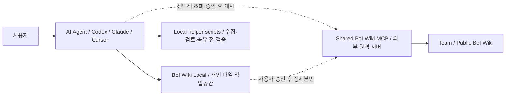
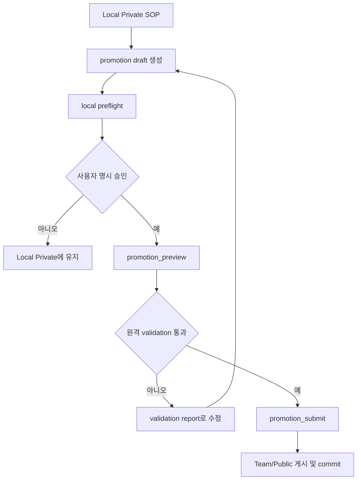

# BoI Wiki MCP 기능 분석

> 기준 저장소: [chokukil/boi-wiki-local](https://github.com/chokukil/boi-wiki-local)
>
> 확인 기준: 저장소 `README.md`, `AGENTS.md`, `CLAUDE.md`, `.codex/config.toml.example`,
> `.agents/skills/*`, `scripts/local_*.py`, `scripts/promotion_preflight.py`.
>
> 작성일: 2026-08-06
>
> 로컬 검토 snapshot: `93978a9a82bbafcf57bf83fc0e3ae12debb39bd3` (`feat: add local second brain helpers`)

## 1. 먼저 확인해야 할 결론

`boi-wiki-local` 저장소 자체는 MCP 서버 구현체가 아닙니다. 이 저장소는 다음 세 가지를 묶은 **로컬 작업공간 + Agent 규칙 + 선택적 원격 MCP 연결 설정**입니다.

1. 개인 PC에 Local Private 문서를 Markdown/OKF 형태로 저장합니다.
2. Codex, Claude, Cursor 같은 Agent가 문서를 만들고 검증하도록 `AGENTS.md`, `CLAUDE.md`, Skills를 제공합니다.
3. 별도로 운영되는 `shared BoI Wiki MCP`가 연결되면 공유 Wiki의 검색, 중복 확인, 초안 작성, 승인 후 게시, 실행 현황 조회를 Agent가 호출할 수 있습니다.

따라서 이 Git을 설치한다고 MCP 서버가 로컬에서 자동 실행되는 것은 아닙니다. 저장소에는 MCP 서버 코드나 각 Tool의 실제 API schema가 없고, 외부 MCP endpoint 설정 예시만 있습니다. 현재 공개된 endpoint도 `http://boi-wiki-mcp.example:28200/mcp`라는 placeholder입니다.

현재 구현한 AI_SOP 웹앱도 MCP를 호출하지 않습니다. 현재 흐름은 `MongoDB + Gemini + Git 템플릿`이며, MCP 연동은 이후 별도 Adapter를 추가해야 합니다.

## 2. 저장소가 의도한 전체 구조



### Local Private와 원격 Wiki의 경계

- Local Private 원문은 `data/boi/private/{7자리사번}/` 아래에 남습니다.
- 사용자가 명시적으로 승인하기 전에는 원격 MCP로 원문을 전송하거나 Team/Public에 게시하지 않습니다.
- 공유 요청이 들어오면 먼저 `promotion-drafts`와 preflight/preview를 만들고, 승인된 정제본만 원격 검증·게시 대상으로 보냅니다.
- MCP가 연결되지 않아도 Local Private 문서 작성, Mermaid 생성, Dictionary 초안, Context Pack 초안은 계속 동작합니다.

## 3. MCP 연결 설정

저장소의 [`.codex/config.toml.example`](https://github.com/chokukil/boi-wiki-local/blob/main/.codex/config.toml.example)는 다음 형태를 보여줍니다.

```toml
[mcp_servers.boi-wiki-mcp]
url = "http://boi-wiki-mcp.example:28200/mcp"
enabled = true
```

로컬 개발용 대체 주소로 `http://localhost:8200/mcp`가 주석으로 제시되어 있습니다. 사내 실제 주소와 Service Token은 저장소에 커밋하지 않고 개인 환경변수 또는 MCP Client secret 설정에 넣어야 합니다.

이 저장소에서 확인되는 연결 정보는 endpoint 예시뿐이며, 다음 내용은 저장소에 정의되어 있지 않습니다.

- 실제 운영 hostname과 TLS 인증서
- 각 Tool의 JSON 입력/출력 schema
- 권한 모델과 사용자/조직 매핑
- Service Token 발급·갱신 방법
- 원격 서버 내부 DB와 Git 저장소 구조
- 원격 게시 후 rollback 정책

즉, 아래 Tool 목록은 Git 문서가 명시한 **의도와 호출 정책**의 정리입니다. 실제 Adapter 구현 전에는 운영 MCP의 `tools/list` 또는 공식 API 문서로 schema를 다시 확인해야 합니다.

## 4. Tool 목록 요약

### 4.1 용어·온톨로지·중복 확인

| Tool | 성격 | 실행 목적 | 일반적인 사용 시점 |
|---|---|---|---|
| `dictionary_resolve` | 조회 | 현장 용어, 약어, 별칭을 `private → team → public` 우선순위로 해석 | SOP나 Dictionary 초안 작성 전 |
| `ontology_search` | 조회 | SOP, Event Type, Action, Dictionary, BoI 문서, runtime evidence를 넓게 검색 | 도메인 질문, 관련 지식 탐색 |
| `boi_search` | 조회 | 문서 목록만 검색 | 상세 해석 없이 문서 후보 목록이 필요할 때 |
| `workflow_definitions_search` | 내부 중복 확인 | 기존 WorkflowDefinition과 연결·중복 후보 검색 | 새 SOP/API/MCP/Skill/Event/Action 제안 전 |
| `workflow_definition_get` | 내부 상세 조회 | WorkflowDefinition의 업무 목적, 필요한 BoI, 근거, 완료 조건 조회 | 검색된 WorkflowDefinition을 검토할 때 |
| `workflow_definition_deduplicate` | 내부 중복 판단 | 신규 정의가 기존 것을 재사용·확장할지 신규 생성할지 판단 근거 제공 | 등록 계획을 확정하기 전 |

`workflow_*` Tool은 사용자에게 WorkflowDefinition 페이지를 직접 보여주기 위한 기능이라기보다, 내부적으로 중복 개발과 잘못된 연결을 줄이기 위한 검사 단계입니다. Agent는 결과를 SOP, BoI Wiki, Event, Action 관점으로 설명하도록 지시되어 있습니다.

### 4.2 SOP/Event/Action 등록 계획과 Preview

| Tool | 성격 | 실행 목적 | 승인 규칙 |
|---|---|---|---|
| `sop_registration_plan` | 계획 | 자연어 요청을 Event–SOP–Action 3단 흐름으로 정리하고 기존 후보·추천 필드·draft payload를 제안 | 원격 draft 전에 계획을 보여주고 확인 |
| `sop_registration_preview` | 비변경 검토 | 권한, 과거 이력, 연결된 SOP/Event/Action, 등록 가능성을 먼저 확인 | 게시·생성 전에 실행 가능 |
| `registration_plan` | 호환 계획 | 통합 SOP 흐름만으로 부족한 컴포넌트 단위 등록 계획 작성 | 원격 등록 흐름에서는 승인 후 사용 |
| `registration_verification_preview` | 호환 검증 | 컴포넌트 단위 등록 전 기존 연결·검증 결과 미리 보기 | 원격 등록 흐름에서는 승인 후 사용 |
| `event_publish_plan` | 계획 | 업무 Event 게시 요청을 기존 Event 후보와 연결하고 필요한 실행 전 확인을 구성 | 게시 전 확인 |
| `event_publish_preview` | 비변경 검토 | Event 게시 예상 결과와 검증 상태를 미리 확인 | 사용자 승인 전에 실행 가능 |
| `event_pattern_preview` | 비변경 검토 | 반복 Event 이력을 새 Event 정의 후보로 승격할지 검토 | 후보 검토 단계 |

### 4.3 Draft 생성 및 등록 후보 작성

아래 Tool들은 실제 원격 상태에 draft 또는 등록 후보를 만들 수 있으므로, 저장소 규칙상 사용자의 명시적 확인 뒤에만 호출합니다.

| Tool | 생성 대상 | 핵심 역할 |
|---|---|---|
| `sop_registration_draft_create` | 통합 SOP 등록 draft | SOP를 중심으로 필요한 Event/Action 연결까지 포함한 등록 초안 생성 |
| `registration_draft_create` | SOP/Event/Action 공통 draft | 공통 등록 payload를 하나의 초안으로 생성 |
| `sop_draft_create` | SOP 전용 draft | SOP만 원격 draft로 만들며 shared Wiki에 즉시 게시하지 않음 |
| `event_type_draft_create` | Event Type draft | Event Type 등록 후보 생성. 별도 검증·승인 전에는 Event catalog에 반영하지 않음 |
| `action_draft_create` | Action Spec draft | API, MCP, Webhook, Manual, Event Broker, BoI Writer, Langflow 중 하나의 connector kind로 Action 초안 생성 |
| `event_pattern_promote_to_draft` | Event 이력 기반 draft | 반복 Event 패턴을 새 Event 정의 draft 후보로 변환 |

`action_draft_create`는 connector 종류만 지정하는 것이 아니라 선택한 `connector_kind`에 맞는 `connector_config`를 함께 보내도록 설계되어 있습니다. 따라서 API URL, Webhook 계약, MCP Tool 이름, Langflow endpoint 같은 실행 연결 정보는 Action 초안의 별도 구성값으로 관리됩니다.

### 4.4 실행 현황·Agent 상호작용·Inbox

| Tool | 성격 | 실행 목적 |
|---|---|---|
| `sop_run_history` | 조회 | SOP 기준 실행 이력, 남은 승인, 수동 조치 상태 확인 |
| `boi_agent_chat` | 질의 | 현재 페이지나 업무 context를 바탕으로 BoI Agent 답변·추천 요청 |
| `boi_inbox` | 조회 | 사용자가 담당자로 처리해야 하는 검증된 BoI Inbox 보고서와 manual/approval task 조회 |
| `agent_inbox` | 호환 alias | 구버전 호환용 이름. 신규 흐름에서는 `boi_inbox` 우선 |
| `action_invoke` | 실행 | 승인된 Action을 실제로 호출. 원격 실행 Tool이므로 사용자 승인 필수 |

### 4.5 Private Second Brain과 공유/게시

| Tool | 성격 | 실행 목적 | 승인 규칙 |
|---|---|---|---|
| `agent_memory_review` | 조회/검토 | 원격 Web Private의 memory 후보, cleanup 후보, promotion 후보를 검토 | 제안 전 실행 가능 |
| `private_memory_cleanup_preview` | 비변경 Preview | generated/background 상태의 원격 Private 정리 후보 확인 | 실행 전 필수 |
| `private_memory_cleanup_run` | 변경 | 원격 Private 문서를 quarantine으로 이동 | 사용자 확인 후 |
| `private_memory_restore` | 변경 | quarantine 문서 복구 | 사용자 확인 후 |
| `private_memory_mark_memory` | 변경 | 문서를 장기 memory로 보호 표시 | 사용자 확인 후 |
| `promotion_preview` | 비변경 Preview | Team/Public 공유 전 권한, source, 민감정보, validation 결과 확인 | 승인 전에 실행 |
| `promotion_submit` | 원격 게시 | 승인된 promotion candidate를 원격 검증·게시 흐름으로 제출 | 사용자 명시 승인 필수 |

### 4.6 Source Wiki·품질 검증·운영 준비

| Tool | 성격 | 실행 목적 |
|---|---|---|
| `source_wiki_plan` | 계획/조회 | 저장소 문서 inventory, 선택·제외 파일, citation 계획 작성 |
| `source_wiki_refresh_preview` | 비변경 Preview | 기존 source wiki를 갱신할 때 변경 예정 내용을 미리 확인 |
| `harness_acceptance` | 비변경 검증 | 원격 BoI Wiki와 Agent harness의 release readiness 확인 |
| `source_apply` | 원격 변경 | 승인된 source wiki 변경을 적용 |
| `doc_body_apply` | 원격 변경 | 승인된 문서 본문 변경을 적용 |

`source_wiki_plan`과 `harness_acceptance`는 저장소 문서화·검증을 위한 선택적 흐름입니다. Local workspace의 SOP 작성 자체에 필수인 기능은 아닙니다.

### 4.7 Validation/Publish 호환 Tool

AGENTS 규칙에는 다음 호환 Tool도 원격 상태를 바꿀 수 있는 흐름으로 분류되어 있습니다.

- `sop_registration_validate`
- `sop_registration_publish`
- `registration_draft_publish`

이름만 보면 검증과 게시가 분리되어 있습니다. 구현 시에는 `validate` 결과를 먼저 사용자에게 보여주고, `publish`는 별도 승인 단계로 분리해야 합니다. Git 저장소만으로는 두 Tool의 세부 payload나 commit 동작을 확정할 수 없습니다.

## 5. 실제 사용 흐름

### 5.1 개인 SOP 작성

1. 사용자가 자연어 또는 이미지로 업무를 설명합니다.
2. Agent가 Local Private의 `notes/`, `sop-drafts/`, `diagrams/` 등에 초안을 만듭니다.
3. Agent가 OKF metadata, source_refs, 판단 기준, 예외, 완료 조건을 채웁니다.
4. 필요하면 `dictionary_resolve`, `ontology_search`로 용어와 관련 지식을 조회합니다.
5. Local self-check와 Mermaid/Markdown 검증을 수행합니다.
6. 이 단계에서는 원격 MCP가 없어도 작업이 완료됩니다.

### 5.2 Team/Public 공유



원문 전체를 자동으로 원격에 올리는 구조가 아닙니다. 공유 전에는 target visibility, source_refs, 민감정보 점검, preview/diff가 있어야 하며, 승인 후에는 정제된 promotion candidate만 제출합니다.

### 5.3 기존 업무와 연결된 신규 Action 만들기

1. `dictionary_resolve`로 현장 용어와 약어를 확인합니다.
2. `workflow_definitions_search`로 기존 연결을 검색합니다.
3. 필요하면 `workflow_definition_get`과 `workflow_definition_deduplicate`로 재사용 여부를 판단합니다.
4. `sop_registration_plan` 또는 `action_draft_create`로 등록 초안을 구성합니다.
5. 사용자가 connector kind와 payload를 확인합니다.
6. 승인 후에만 draft create/validate/publish를 호출합니다.

## 6. MCP가 없을 때 저장소가 대신 제공하는 기능

이 부분은 MCP Tool이 아니라 로컬 Python helper입니다.

| 파일 | 기능 |
|---|---|
| `scripts/local_capture.py` | 자유 메모를 `notes/capture-inbox/` 아래 Local capture 후보로 저장 |
| `scripts/local_review.py` | stale, duplicate, memory, cleanup, promotion 후보를 비파괴적으로 조회 |
| `scripts/promotion_preflight.py` | target visibility, source_refs, 민감정보 패턴, preview를 점검하고 promotion draft 생성 |
| `check.ps1` / `check.sh` | Local workspace 구조와 문서 규칙 검증 |

따라서 “Git을 설치하면 MCP가 실행된다”가 아니라, “Git을 설치하면 Agent가 일관된 Local 문서 구조와 승인 규칙을 사용할 수 있다”가 정확한 표현입니다.

## 7. 현재 AI_SOP 웹앱과의 관계

현재 AI_SOP는 다음 경로로 동작합니다.

```text
사용자 입력
  → FastAPI
  → Gemini/LangChain provider
  → SopDraftIR
  → OKF Markdown + Mermaid + 읽기 화면
  → MongoDB 개인 초안
  → 사용자 승인
  → MongoDB Team/Public snapshot
```

현재는 `boi-wiki-local`의 규칙·템플릿·OKF 개념을 반영했지만, `boi-wiki-mcp`의 원격 Tool을 호출하지 않습니다. MCP를 추가할 때는 다음 Adapter 경계를 권장합니다.

```text
app/service.py
  └─ BoIWikiMcpAdapter
       ├─ search / dictionary / workflow 조회
       ├─ registration preview
       ├─ promotion preview
       └─ approval-gated submit/publish
```

권장 순서는 다음과 같습니다.

1. `ontology_search`, `dictionary_resolve`, `boi_search` 같은 조회 Tool만 연결합니다.
2. 기존 Mongo 초안과 원격 검색 결과를 UI에서 출처와 함께 보여줍니다.
3. `sop_registration_preview`, `promotion_preview`를 연결합니다.
4. 사용자 승인 이벤트를 별도로 저장합니다.
5. 마지막에 `sop_draft_create`, `promotion_submit`, `publish` 계열을 연결합니다.
6. `action_invoke`는 게시와 별도의 고위험 실행 승인으로 운영합니다.

## 8. 보안·운영 시 주의점

- Local Private 원문을 MCP 조회 Tool에 무조건 보내지 않습니다.
- 공유 요청 전 source_refs와 민감정보를 확인합니다.
- MCP URL, Service Token, Authorization header는 `.env`나 secret store에만 둡니다.
- `promotion_preview` 없이 `promotion_submit`을 호출하지 않습니다.
- 초안 생성과 실제 게시를 같은 버튼으로 묶지 않습니다.
- `action_invoke`는 문서 등록보다 위험도가 높으므로 실행 대상, 입력 payload, 실행 결과, 승인자를 기록합니다.
- 실제 MCP Tool schema는 공개 Git에 없으므로 Adapter 구현 전 운영 서버의 schema와 권한을 확인합니다.

## 9. 기능별 판단표

| 질문 | 답 |
|---|---|
| 이 Git 저장소만으로 원격 Wiki에 검색할 수 있나? | 아니요. MCP endpoint와 권한 설정이 추가로 필요합니다. |
| MCP 없이 SOP 초안을 만들 수 있나? | 가능합니다. Local Markdown/OKF와 helper script만으로 동작합니다. |
| Local Private 문서가 자동으로 Team/Public에 올라가나? | 아닙니다. 명시적 승인과 promotion 흐름이 필요합니다. |
| `sop_draft_create`가 바로 공개 게시하나? | 문서상 shared Wiki 즉시 게시가 아니라 draft 생성입니다. 실제 publish는 별도 Tool입니다. |
| 이 저장소에서 Tool의 입력 JSON schema를 확인할 수 있나? | 아니요. Tool 이름과 정책은 있지만 원격 서버 schema는 포함되어 있지 않습니다. |
| 현재 AI_SOP가 이 MCP를 사용하나? | 아직 사용하지 않습니다. 현재는 MongoDB/Gemini 기반입니다. |

## 10. 원본 참고 링크

- [Repository README](https://github.com/chokukil/boi-wiki-local/blob/main/README.md)
- [Agent rules](https://github.com/chokukil/boi-wiki-local/blob/main/AGENTS.md)
- [Claude rules](https://github.com/chokukil/boi-wiki-local/blob/main/CLAUDE.md)
- [Codex MCP config example](https://github.com/chokukil/boi-wiki-local/blob/main/.codex/config.toml.example)
- [BoI Wiki Local skill](https://github.com/chokukil/boi-wiki-local/blob/main/.agents/skills/boi-wiki-local/SKILL.md)
- Local helper source: `scripts/local_capture.py`, `scripts/local_review.py`, `scripts/promotion_preflight.py`
