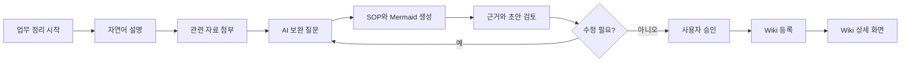
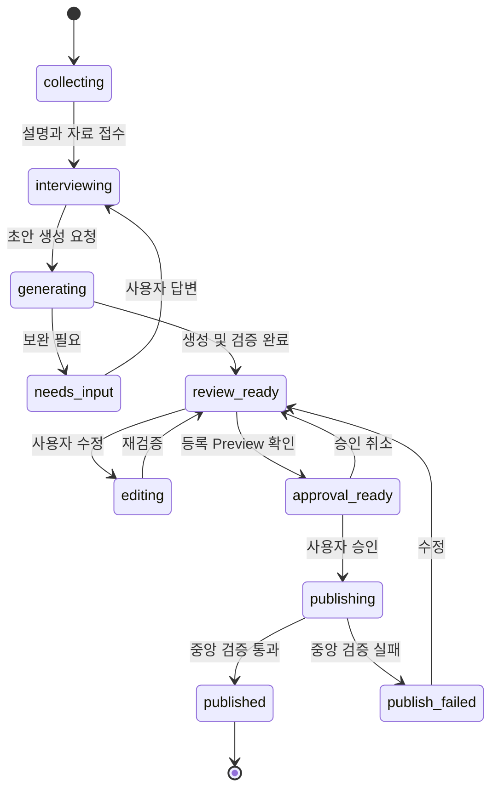
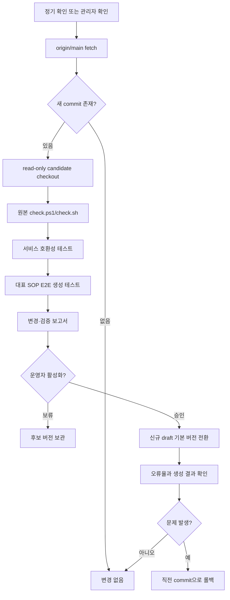

# AI SOP Web 서비스 기능 설계

## 1. 문서 목적

이 문서는 사용자가 Git, Markdown, YAML, Mermaid를 몰라도 다음 경험을 할 수 있는 AI SOP Web 서비스의 1차 기능 설계를 정의한다.

> 내가 하는 업무를 자유롭게 설명하거나 관련 자료를 올리면, AI가 추가로 필요한 내용을 질문하고, BoI Wiki Local 규칙에 맞는 SOP와 흐름도로 변환한다. 사용자가 결과를 확인하고 승인하면 공식 Wiki에 저장한다.

이 설계는 [`chokukil/boi-wiki-local`](https://github.com/chokukil/boi-wiki-local) 원본을 서비스 내부의 지식 작성 규칙과 템플릿으로 사용한다. 원본 저장소는 수정하지 않고, 버전별로 교체·검증·롤백할 수 있어야 한다.

## 2. 설계 기준

### 2.1 현재 확인한 원본 기준

| 항목 | 기준값 |
|---|---|
| Repository | `https://github.com/chokukil/boi-wiki-local` |
| Branch | `main` |
| 확인 커밋 | `93978a9a82bbafcf57bf83fc0e3ae12debb39bd3` |
| 확인 일시 | 2026-08-05 |
| 핵심 규칙 | `AGENTS.md`, `CLAUDE.md`, `.agents/skills/**/SKILL.md` |
| 개인 문서 경로 | `data/boi/private/{7자리 employee_id}/` |
| SOP 초안 | `sop-drafts/` |
| Mermaid | `diagrams/` |
| 공유 후보 | `promotion-drafts/` |
| 검증 | `check.ps1` 또는 `check.sh`와 Agent Level 0 self-check |

### 2.2 제품 원칙

1. 사용자는 자연어와 파일만 입력한다.
2. OKF, YAML, Git, 폴더 경로는 기본 화면에서 숨긴다.
3. AI가 확인한 내용과 추정하거나 보완이 필요한 내용을 구분한다.
4. 사용자가 최종 Preview를 승인하기 전에는 공식 Wiki에 등록하지 않는다.
5. 개인 초안은 작성자 세션의 비공개 영역에 저장하고 공용 검색에서 제외한다.
6. 원본 자료와 생성 결과의 근거 관계를 유지한다.
7. `boi-wiki-local` 원본은 수정하지 않고 버전 단위로 사용한다.
8. 새 원본 버전은 자동 확인할 수 있지만, 호환성 검증 없이 운영 버전으로 자동 전환하지 않는다.

## 3. 1차 시연에서 보여줄 핵심 경험

시연의 성공 기준은 기능 수가 아니라 한 명의 사용자가 실제 업무 하나를 Wiki SOP로 바꾸는 경험을 끝까지 완료하는 것이다.



### 3.1 대표 시연 시나리오

1. 사용자가 `매주 품질 Trend 보고를 만드는 업무를 정리하고 싶어요`라고 입력한다.
2. 기존 보고서 PDF, 화면 캡처, 메모 파일을 올린다.
3. AI가 자료를 읽고 `보고 주기`, `입력 데이터`, `이상 기준`, `최종 공유 대상` 등 부족한 정보만 질문한다.
4. AI가 목적, 입력, 절차, 판단 기준, 예외, 완료 조건을 가진 SOP 초안을 생성한다.
5. 원본에서 직접 확인된 항목과 사용자의 답변으로 보완된 항목을 표시한다.
6. Overview와 Swimlane Mermaid를 생성한다.
7. 사용자가 문장을 수정하거나 `3단계만 다시 작성`을 요청한다.
8. 사용자가 `이 내용으로 Wiki에 등록`을 누른다.
9. 검증을 통과한 승인본만 Wiki 목록과 검색에 나타난다.

## 4. 정보 구조와 화면 구성

### 4.1 전체 화면 구조

```text
AI SOP
├── 업무 정리 시작
├── 내 초안
├── Wiki
│   ├── 전체 SOP
│   ├── 업무별
│   └── 최근 등록
└── 도움말

운영 전용
└── Template 버전 관리
```

SSO를 제외한 1차 시연에서는 브라우저 세션마다 임시 7자리 `employee_id`를 서버가 발급한다. 이 값은 BoI 경로 규칙을 충족하기 위한 namespace일 뿐 인증 수단이 아니다. 실제 운영에서는 SSO의 `emp_no`로 교체한다.

## 5. 화면별 상세 설계

### 화면 1. 시작 화면

#### 목적

사용자가 문서 양식을 고민하지 않고 바로 자신의 업무를 설명하게 한다.

#### 화면 구성

```text
┌──────────────────────────────────────────────────────────────────┐
│ AI SOP                                      내 초안     Wiki     │
├──────────────────────────────────────────────────────────────────┤
│ 어떤 업무를 정리해 볼까요?                                      │
│                                                                  │
│ ┌──────────────────────────────────────────────────────────────┐ │
│ │ 평소 업무를 말하듯이 적어주세요.                            │ │
│ │ 예: 매주 월요일 품질 Trend를 확인하고 보고하는 업무입니다.  │ │
│ └──────────────────────────────────────────────────────────────┘ │
│                                                                  │
│ [파일 추가]  이미지, PDF, Word, Excel, PPT, TXT, Markdown       │
│                                               [업무 정리 시작]   │
│                                                                  │
│ 설명이 어려우면 시작 문장 선택                                  │
│ · 반복 업무를 정리하고 싶어요                                   │
│ · 기존 SOP 자료를 새로 정리하고 싶어요                          │
│ · 장애 대응 절차를 정리하고 싶어요                              │
└──────────────────────────────────────────────────────────────────┘
```

#### 기능

- 자유 형식 자연어 입력
- 여러 파일 drag-and-drop 및 선택 업로드
- 음성 입력은 후속 범위로 두되 UI 확장 위치는 확보
- 예시 문장을 누르면 입력창에 시작 문장만 삽입
- 입력 내용과 파일은 개인 초안이 생성되기 전 임시 업로드 영역에 저장
- `업무 정리 시작`을 누르면 개인 draft와 격리 workspace 생성

#### UX 원칙

- 처음부터 목적·입력·절차 등의 긴 Form을 요구하지 않는다.
- 사용자가 아는 만큼만 말하게 하고 부족한 내용은 AI가 질문한다.
- 업로드 파일을 바로 공식 저장하지 않는다.

### 화면 2. AI 인터뷰 화면

#### 목적

자유로운 설명을 BoI SOP로 만들기 위해 필요한 정보만 대화로 보완한다.

#### 화면 구성

```text
┌──────────────────────────────────────────────────────────────────┐
│ ← 내 초안       품질 Trend 보고 업무                 자동 저장됨 │
├───────────────────────────────┬──────────────────────────────────┤
│ AI와 업무 정리                │ 현재까지 정리된 내용              │
│                               │                                  │
│ 사용자: 매주 품질 Trend를 ... │ ✓ 목적                            │
│                               │ ✓ 입력 자료                       │
│ AI: 이상으로 판단하는 기준은  │ ◐ 절차                            │
│ 무엇인가요?                   │ ? 판단 기준                       │
│                               │ ? 예외 상황                       │
│ [답변 입력________________]   │ ? 완료 조건                       │
│ [자료 추가]        [답변 전송]│                                  │
│                               │ 자료 3개                          │
│                               │ · weekly-report.pdf               │
│                               │ · trend-screen.png                │
│                               │ · memo.txt                        │
├───────────────────────────────┴──────────────────────────────────┤
│                 [아는 내용으로 우선 초안 만들기]                 │
└──────────────────────────────────────────────────────────────────┘
```

#### 기능

- AI가 한 번에 1~3개의 관련 질문만 제시
- 이미 자료에서 확인한 내용을 다시 묻지 않음
- 모르는 질문은 `잘 모르겠음`, `담당자 확인 필요`로 남길 수 있음
- 대화 중 추가 파일 업로드
- 진행 항목: 목적, 입력, 절차, 판단 기준, 예외, 완료 조건
- 충분한 정보가 없어도 초안 생성을 허용하고 `보완 필요`로 표시
- 모든 답변과 파일 근거를 draft source로 기록

### 화면 3. 생성 진행 화면

#### 목적

AI가 무엇을 하고 있는지 사용자가 이해하고, 실패 시 어디에서 문제가 발생했는지 알 수 있게 한다.

#### 표시 단계

```text
자료 확인          완료
업무 단계 추출     완료
판단·예외 분석     진행 중
SOP 초안 작성      대기
Mermaid 생성       대기
BoI 규칙 검증      대기
```

#### 기능

- 비동기 작업 상태 표시
- 파일별 추출 성공·실패 표시
- 특정 파일 실패가 전체 생성 실패로 이어지지 않도록 부분 진행
- 실패한 단계만 재시도
- 생성에 사용한 `template_commit` 기록

### 화면 4. SOP 검토 스튜디오

#### 목적

사용자가 Markdown을 몰라도 내용을 읽고 수정하며, AI가 무엇을 근거로 작성했는지 확인하게 한다.

#### 화면 구성

```text
┌──────────────────────────────────────────────────────────────────┐
│ ← 인터뷰   품질 Trend 보고 SOP 초안        [다시 생성] [승인]   │
├──────────────────────────────────────────────────────────────────┤
│ [SOP] [업무 흐름] [근거 자료] [보완 필요] [기술 정보]           │
├───────────────────────────────────┬──────────────────────────────┤
│ 목적                              │ 선택 항목의 근거               │
│ 주간 품질 Trend를 확인하여...     │ weekly-report.pdf 2페이지      │
│ [이 부분 수정]                    │ 사용자 답변 #3                 │
│                                   │ 신뢰 상태: 확인됨               │
│ 입력                              │                              │
│ · 주간 품질 데이터                │ [원본 보기]                     │
│ · 이상 기준표                     │                              │
│                                   │                              │
│ 절차                              │                              │
│ 1. 데이터 수집                    │                              │
│ 2. 이상 여부 판단                 │                              │
│ 3. 보고서 작성                    │                              │
└───────────────────────────────────┴──────────────────────────────┘
```

#### 기본 탭

1. `SOP`: 사람이 읽기 쉬운 본문
2. `업무 흐름`: Overview, Swimlane, 필요 시 Stage Detail Mermaid
3. `근거 자료`: 원본 파일, 추출 내용, SHA-256, 문서 항목과의 연결
4. `보완 필요`: 확인되지 않은 판단 기준, 담당자, 시스템, 완료 조건
5. `기술 정보`: OKF YAML, 저장 경로, 검증 결과, template version. 기본적으로 접어 둔다.

#### 편집 기능

- 문단 직접 편집
- 선택 영역에 대해 `쉽게 다시 작성`, `단계를 나누기`, `원문에 가깝게 수정`
- 단계 추가·삭제·순서 변경
- AI 추정 항목을 `사용자 확인됨`으로 전환
- 수정 후 Mermaid와 Source Mapping만 다시 생성
- 전체 문서를 매번 재생성하지 않고 선택 섹션만 갱신
- 원본 생성본과 현재본 diff 확인

### 화면 5. 승인 및 등록 Preview

#### 목적

공식 Wiki에 들어갈 정확한 내용과 공개 범위를 사용자가 마지막으로 확인하게 한다.

#### 화면 구성

```text
┌──────────────────────────────────────────────────────────────────┐
│ Wiki 등록 전 최종 확인                                           │
├──────────────────────────────────────────────────────────────────┤
│ 문서 제목        품질 Trend 보고 SOP                             │
│ 등록 범위        ○ 개인 보관  ● 팀 Wiki  ○ 전사 Wiki            │
│ 첨부 자료        3개 중 2개 포함                                 │
│ 보완 필요        1개                                              │
│ 민감정보 검사    확인 필요 없음                                  │
│ BoI 검증         통과                                             │
│ Template         93978a9                                         │
│                                                                  │
│ □ 원본 자료와 생성 내용을 확인했습니다.                          │
│ □ 선택한 범위에 등록하는 것에 동의합니다.                        │
│                                                                  │
│                        [돌아가기] [승인하고 Wiki에 등록]          │
└──────────────────────────────────────────────────────────────────┘
```

#### 기능

- 등록 대상 문서와 첨부파일 Preview
- 개인, 팀, 전사 범위 선택 구조. 1차 시연에서는 개인/공용 두 단계로 축소 가능
- `contains_sensitive`, `source_refs`, 필수 metadata, index/log 갱신 여부 검사
- 승인 시점의 Markdown, Mermaid, 첨부파일 hash를 불변 snapshot으로 생성
- 원본 Local Private 파일을 직접 게시하지 않고 promotion candidate를 게시
- 승인 이벤트와 생성 template version 기록

### 화면 6. Wiki 목록

#### 목적

승인된 문서가 실제 공통 지식으로 축적되는 경험을 보여준다.

#### 기능

- 제목, 설명, 업무 단계, 작성자 표시명, 등록일 검색
- 업무·부서·문서 상태 필터는 실제 metadata가 있을 때만 제공
- 최신 버전과 이전 버전 구분
- 승인된 문서만 노출
- 초안은 `내 초안`에서만 접근

### 화면 7. Wiki 상세

#### 화면 구성

- 제목과 설명
- 목적, 입력, 절차, 판단 기준, 예외 상황, 완료 조건
- Mermaid Overview 기본 표시
- 상세 흐름 및 Swimlane
- 관련 문서와 용어
- 출처 목록과 근거 연결
- 문서 버전과 변경 이력
- 원본 template version
- `내 업무에 참고`, `수정 제안`, `새 버전 초안 만들기`

## 6. 개인 초안과 승인 문서 저장 모델

### 6.1 저장 영역

```text
Private Draft Store
└── {employee_id}/{draft_id}/
    ├── workspace/                  # 격리된 BoI Wiki Local 작업공간
    ├── sources/                    # 사용자가 올린 원본
    ├── extracted/                  # 파싱·OCR 결과
    ├── outputs/                    # SOP, Mermaid, validation
    └── draft-manifest.json

Published Wiki Store
└── {document_id}/{version}/
    ├── sop.md
    ├── diagrams/
    ├── approved-sources/
    └── publish-manifest.json
```

### 6.2 구분 원칙

| 구분 | 개인 초안 | 승인 Wiki |
|---|---|---|
| 접근 | 현재 사용자 세션 | 공개 범위에 따른 사용자 |
| 검색 색인 | 제외 | 포함 |
| AI 공통 질의 | 제외 | 포함 |
| 수정 | 자유롭게 가능 | 새 버전 초안으로 수정 |
| 보존 | 정책에 따라 만료 가능 | 버전 이력으로 보존 |
| 원본 자료 | 작성자가 선택 | 승인 시 포함한 자료만 |
| 저장 형식 | BoI Local workspace | 승인 snapshot |

브라우저 `localStorage`에는 문서 본문이나 원본 파일을 저장하지 않는다. 브라우저에는 draft ID와 단기 세션 정보만 둔다.

### 6.3 MongoDB 저장 방식

AI SOP의 주 저장소는 MongoDB로 확정한다. 업무 상태와 metadata는 일반 collection에 저장하고, 업로드 원본과 생성 파일은 GridFS bucket에 저장한다.

```text
MongoDB database: ai_sop
├── sessions
├── drafts
├── draft_messages
├── sources
├── evidence_links
├── generation_jobs
├── publications
├── template_versions
├── audit_events
├── private_assets.files       # GridFS
├── private_assets.chunks      # GridFS
├── published_assets.files     # GridFS
└── published_assets.chunks    # GridFS
```

- `drafts`, `sources`, `evidence_links`에는 조회·상태 관리에 필요한 구조화 metadata를 저장한다.
- 원본 파일, 추출 결과, SOP Markdown, Mermaid, validation report는 GridFS에 저장하고 collection에는 GridFS file ID와 SHA-256만 참조한다.
- 작은 Markdown도 파일 버전과 hash를 동일하게 관리할 수 있도록 GridFS 저장을 기본으로 한다.
- 사용자의 Gemini API key, MongoDB 비밀번호, SSO Cookie는 MongoDB 문서에 저장하지 않는다.

### 6.4 MongoDB index와 보존 정책

| Collection | 주요 index |
|---|---|
| `sessions` | `session_id` unique, `expires_at` TTL |
| `drafts` | `draft_id` unique, `(employee_id, status, updated_at)`, `expires_at` TTL |
| `sources` | `source_id` unique, `(draft_id, created_at)`, `sha256` |
| `generation_jobs` | `job_id` unique, `(draft_id, status)`, `expires_at` TTL |
| `publications` | `(document_id, version)` unique, `(visibility, published_at)` |
| `template_versions` | `commit_sha` unique, `status` |
| `audit_events` | `(resource_type, resource_id, occurred_at)` |

- TTL은 session, 만료 가능한 개인 draft, 완료된 임시 job에만 사용한다.
- 승인 문서, template version, 승인·게시 audit에는 TTL을 사용하지 않는다.
- GridFS file metadata에 TTL만 걸어 chunks를 남기지 않는다. 만료 작업이 `GridFSBucket.delete(file_id)`를 호출해 파일과 chunks를 함께 정리한다.

### 6.5 승인 게시의 일관성

GridFS 작업은 여러 collection을 묶는 transaction 대상으로 사용하지 않으므로 승인을 재시도 가능한 단계로 구현한다.

1. `publications`에 `status: publishing`과 idempotency key 생성
2. 승인 snapshot을 `published_assets` GridFS bucket에 업로드
3. 업로드된 파일의 SHA-256과 manifest 검증
4. `publications.status`를 `published`로 변경
5. `published` 상태만 Wiki 목록과 검색에 노출
6. 실패 시 `publish_failed`로 기록하고 고아 GridFS 파일을 cleanup job이 제거

같은 승인 요청이 재전송되어도 `(draft_id, approved_snapshot_sha256)` idempotency key로 중복 게시를 막는다.

## 7. 상태 모델



### 상태별 검색 노출

- `collecting`부터 `approval_ready`까지: 작성자 전용, 공통 검색 제외
- `publishing`: 검색 제외
- `published`: Wiki와 공통 AI 검색에 포함
- `publish_failed`: 작성자에게 검증 결과 표시, 자동 재게시 금지

## 8. 원본 자료 처리와 근거 관리

### 8.1 지원 파일

1차 시연 우선순위:

- 텍스트: TXT, Markdown
- 이미지: PNG, JPG, JPEG
- 문서: PDF, DOCX
- 표 자료: XLSX, CSV
- 발표자료: PPTX

파일 형식별 추출 실패 가능성을 UI에 표시한다. DRM, 암호화, 손상 파일은 원본을 보존하되 `내용 추출 실패` 상태로 남긴다.

### 8.2 근거 단위

각 SOP 항목에는 다음 중 하나 이상의 근거를 연결한다.

- 업로드 파일과 page/sheet/slide 위치
- 사용자 자연어 설명의 message ID
- AI 인터뷰 답변의 message ID
- 기존 승인 Wiki 문서 링크
- AI 추정. 이 경우 `확인 필요` 상태 필수

### 8.3 AI 표현 구분

| 표시 | 의미 |
|---|---|
| 확인됨 | 원본 또는 사용자 답변으로 직접 확인 |
| 사용자 확인 | AI 초안을 사용자가 명시적으로 확인 |
| 보완 필요 | 필수 정보가 없거나 모호함 |
| AI 제안 | 자동화 후보나 개선 아이디어이며 현재 업무 사실이 아님 |

## 9. BoI Wiki Local 반영 방식

### 9.1 원본 저장소의 역할

원본 저장소는 다음 항목의 source of truth다.

- Agent 작성 규칙
- 경로와 개인 workspace 구조
- YAML metadata 규칙
- Local Private와 promotion 경계
- SOP, Mermaid, Event, Action, Dictionary 관련 Skill
- 예제와 검증 스크립트

Web 서비스는 이 규칙을 별도의 prompt로 복사해 재작성하지 않는다. 활성 template 디렉터리의 `AGENTS.md`, 관련 `SKILL.md`, `index.md`를 매 작업에서 읽게 한다.

### 9.2 원본 무수정 구조

```text
server/
├── app/                            # Web/API/worker, 자체 코드
├── template-registry/
│   ├── 93978a9/                    # 원본 checkout, read-only
│   └── {next_commit}/              # 업데이트 후보, read-only
├── workspaces/
│   └── {employee_id}/{draft_id}/   # 원본에서 생성한 실행 복사본
└── published/
```

- `template-registry/{commit}`의 파일은 수정하지 않는다.
- 사용자 작업은 별도 `workspaces` 복사본에서만 수행한다.
- workspace는 활성 template의 `install.ps1` 또는 `install.sh` 기준으로 구성한다.
- 원본 설치 스크립트가 workspace 안에 Git을 초기화해도 중앙 Wiki 저장소와는 분리한다.
- 서비스 전용 설정과 호환 adapter는 원본 폴더 밖 `app/`에 둔다.

### 9.3 문서 생성 절차

1. 활성 template commit 조회
2. 격리 workspace 생성
3. 원본 template 복사
4. 임시 또는 SSO 기반 7자리 employee ID 주입
5. 원본 설치·check 실행
6. Agent가 원본 규칙을 읽고 SOP 작성
7. `index.md`, `log.md` 업데이트
8. 원본 check와 서비스 추가 validator 실행
9. 생성 결과를 private draft store에 저장
10. 승인 후 promotion snapshot만 published store로 복사

## 10. Git 업데이트 설계

### 10.1 목표

- 사용자는 Git을 설치하거나 pull하지 않는다.
- 운영 서버만 upstream을 확인한다.
- 원본은 수정하지 않는다.
- 새 버전의 검증 결과를 확인한 뒤 활성화한다.
- 기존 문서는 작성 당시 template version으로 재현할 수 있다.
- 문제가 있으면 직전 버전으로 즉시 롤백한다.

### 10.2 업데이트 흐름



### 10.3 자동 업데이트와 자동 활성화의 구분

- 자동으로 해도 되는 일: `fetch`, 신규 commit 탐지, candidate checkout, 검증, 보고서 생성
- 운영자 확인이 필요한 일: 운영 기본 버전 활성화
- 자동으로 하면 안 되는 일: 검증하지 않은 `origin/main`을 실행 중 서비스에 바로 덮어쓰기

### 10.4 호환성 테스트

새 버전마다 최소한 다음을 검사한다.

1. `AGENTS.md`, `data/boi/index.md`, private scaffold 존재
2. `sop-drafts`, `diagrams`, `promotion-drafts` 경로 존재
3. `check.ps1` 또는 `check.sh` 성공
4. 필수 metadata와 reserved file 규칙 인식 가능
5. 대표 자연어 입력으로 SOP 생성 성공
6. 이미지 근거와 `source_refs` 연결 성공
7. Overview와 Swimlane Mermaid 생성 성공
8. `index.md`, `log.md` 갱신 성공
9. promotion preview와 승인 경계 유지
10. 기존 운영 버전과의 schema/path 차이 보고

### 10.5 Template Registry 데이터

| 필드 | 설명 |
|---|---|
| `repository_url` | 원본 Git URL |
| `branch` | 추적 branch |
| `commit_sha` | 정확한 template version |
| `status` | candidate, validated, active, rejected, retired |
| `fetched_at` | 서버 수신 시각 |
| `validated_at` | 검증 완료 시각 |
| `validation_report` | 원본·호환성·E2E 결과 |
| `activated_at` | 운영 전환 시각 |
| `previous_active_sha` | 롤백 기준 |

모든 draft와 published document에 `template_commit`을 저장한다.

## 11. 서비스 기능 목록과 우선순위

### MVP: 반드시 구현

- 브라우저 세션용 임시 사용자 namespace
- 자연어 업무 설명
- 다중 파일 업로드
- 파일 내용 추출과 실패 표시
- AI 보완 질문
- BoI SOP Markdown 생성
- Overview와 Swimlane Mermaid 생성
- 근거와 보완 필요 항목 표시
- 문단 편집 및 부분 재생성
- 원본 check와 서비스 validator
- 개인 초안 자동 저장
- 최종 Preview와 사용자 승인
- 승인된 Wiki 목록·상세 화면
- 승인본만 검색 노출
- template commit 기록
- Git 업데이트 후보 확인·검증·활성화·롤백

### 2차 범위

- SSO 연동과 `emp_no`, `dept_cd` 권한 매핑
- 팀/전사 승인자 workflow
- 기존 Wiki 중복 SOP 추천
- Dictionary와 관련 SOP 연결
- RAG 기반 Wiki 질의
- 변경 제안과 공동 검토
- Office/DRM 문서 처리 강화
- 관리자 운영 dashboard와 감사 로그

### 초기 시연에서 제외

- AI가 사용자 승인 없이 자동 게시
- Event/Action 실제 시스템 실행
- 전체 사내 파일 자동 수집
- 개인 초안의 공통 검색
- Git 사용을 일반 사용자에게 노출
- 완전한 데이터 거버넌스 기능

## 12. 기술 구성 확정

### 12.1 MongoDB

- Python 서비스에서는 공식 PyMongo driver를 사용한다.
- deployment는 사내 self-managed MongoDB와 MongoDB Atlas 중 어느 쪽에도 종속되지 않도록 connection string으로 분리한다.
- 원본·생성 파일은 GridFS, 상태·metadata·권한·근거 링크는 일반 collection에 저장한다.
- 1차 검색은 승인된 `publications`의 제목, 설명, 본문 projection을 대상으로 한다.
- 의미 검색은 후속 범위로 두고, Atlas 사용 여부가 정해진 뒤 MongoDB Search/Vector Search 또는 별도 검색 계층을 선택한다.

### 12.2 Google Gemini API

LLM provider는 Google Gemini API로 확정한다. 공식 Google GenAI SDK를 사용하고, 서비스 내부에는 다음 provider interface를 둔다.

```text
GeminiProvider
├── analyze_sources()
├── propose_questions()
├── build_sop_ir()
├── revise_sop_section()
└── build_diagram_ir()
```

Gemini 응답을 바로 Markdown 파일로 신뢰하지 않는다.

1. 활성 `boi-wiki-local`의 `AGENTS.md`, 관련 `SKILL.md`, `index.md`를 system context로 구성
2. 사용자 설명, 인터뷰 답변, 허용된 원본 자료를 Gemini에 전달
3. Structured Output으로 `SopDraftIR` JSON 생성
4. Pydantic schema와 업무 validation으로 구조·값 검증
5. 서비스 renderer가 활성 template 규칙에 맞춰 SOP Markdown과 Mermaid 생성
6. 원본 `check.ps1`/`check.sh` 및 서비스 validator 실행
7. 실패 시 전체 응답을 그대로 저장하지 않고 검증 오류를 포함해 제한적으로 재시도

Structured Output은 JSON 형태의 안정성을 높이기 위한 것이며, 내용의 사실성은 보장하지 않는다. `source_refs`, 사용자 확인, 보완 필요 상태를 별도로 검증한다.

### 12.3 Gemini 모델 설정

- 모델명은 코드에 하드코딩하지 않고 `GEMINI_MODEL` 환경변수로 관리한다.
- 운영에서는 `latest`나 experimental alias보다 검증한 stable model ID를 고정한다.
- template version과 별도로 각 generation에 실제 `model_id`를 기록한다.
- 새 모델은 대표 SOP 시나리오로 품질, 지연시간, 비용, Structured Output 성공률을 비교한 뒤 전환한다.
- 1차 구현 전 모델 ID를 별도 평가로 확정하며, 현재 설계 문서에는 특정 모델을 고정하지 않는다.

### 12.4 Gemini 파일 처리

| 파일 유형 | 기본 처리 |
|---|---|
| TXT, Markdown, CSV | 서버에서 텍스트 추출 후 필요한 부분만 전달 |
| DOCX, XLSX, PPTX | 서버에서 구조화 추출 후 원본 위치 정보와 함께 전달 |
| PNG, JPG, JPEG | Gemini multimodal input 사용 가능 |
| PDF | 작은 파일은 inline, 큰 파일이나 반복 참조는 정책 승인 시 Files API 사용 |
| DRM, 암호화, 손상 파일 | Gemini 전송 금지, 추출 실패 상태와 원본만 보존 |

원본 파일은 항상 MongoDB GridFS를 canonical source로 유지한다. Gemini Files API를 사용하더라도 Google 측 file URI는 임시 처리 참조일 뿐 원본 저장소로 사용하지 않는다.

### 12.5 외부 전송과 보안 경계

Gemini API를 사용하면 사용자가 입력한 업무 설명과 선택된 자료가 외부 Google API로 전송될 수 있다. 따라서 구현 전에 다음 정책을 확정해야 한다.

- Gemini API 사용이 허용된 자료 등급
- 민감정보 사전 탐지·마스킹
- 프로젝트 logging 비활성화 또는 보존 기간
- 데이터 공유·모델 개선 opt-in 금지
- Gemini Files API 사용 여부와 원격 파일 삭제
- API 요청·응답 원문을 사내 로그에 남길지 여부

기본값은 `원문 logging 없음`, `데이터 공유 opt-in 없음`, `허용된 자료만 전송`, `API key 서버 보관`으로 둔다.

### 12.6 주요 환경변수

```text
MONGODB_URI=
MONGODB_DATABASE=ai_sop
GEMINI_API_KEY=
GEMINI_MODEL=
GEMINI_ENABLE_FILES_API=false
GEMINI_STORE_RAW_REQUESTS=false
BOI_TEMPLATE_REPOSITORY=https://github.com/chokukil/boi-wiki-local
BOI_TEMPLATE_BRANCH=main
BOI_TEMPLATE_ACTIVE_SHA=93978a9a82bbafcf57bf83fc0e3ae12debb39bd3
```

`.env`는 Git에 포함하지 않고, 운영에서는 사내 secret manager 또는 배포 환경의 secret 기능을 사용한다.

## 13. 주요 API 초안

| Method | Path | 목적 |
|---|---|---|
| `POST` | `/api/session` | 시연용 개인 namespace 생성 |
| `POST` | `/api/drafts` | 업무 설명으로 draft 생성 |
| `POST` | `/api/drafts/{id}/sources` | 자료 업로드 |
| `POST` | `/api/drafts/{id}/messages` | AI 인터뷰 답변 |
| `POST` | `/api/drafts/{id}/generate` | SOP 생성 작업 시작 |
| `GET` | `/api/drafts/{id}` | draft와 작업 상태 조회 |
| `PATCH` | `/api/drafts/{id}/sections/{section}` | 섹션 수정 |
| `POST` | `/api/drafts/{id}/regenerate` | 선택 영역 재생성 |
| `POST` | `/api/drafts/{id}/preflight` | 승인 전 검증 |
| `POST` | `/api/drafts/{id}/approve` | 사용자 승인 및 게시 요청 |
| `GET` | `/api/wiki` | 승인 Wiki 목록 |
| `GET` | `/api/wiki/{document_id}` | Wiki 상세와 버전 조회 |
| `GET` | `/api/templates/status` | 활성·최신 후보 버전 조회 |
| `POST` | `/api/admin/templates/check` | upstream 업데이트 확인 |
| `POST` | `/api/admin/templates/{sha}/activate` | 검증 버전 활성화 |
| `POST` | `/api/admin/templates/{sha}/rollback` | 이전 버전 롤백 |

실제 구현 시 비동기 생성 요청은 job ID를 반환하고 진행 상태를 별도 endpoint 또는 Server-Sent Events로 전달한다.

## 14. MongoDB 데이터 모델

### Draft

- `draft_id`
- `employee_id`
- `session_id`
- `title`
- `status`
- `template_commit`
- `workspace_path` 또는 object prefix
- `sop_gridfs_id`
- `diagram_gridfs_ids`
- `contains_sensitive`
- `model_id`
- `created_at`, `updated_at`, `expires_at`

### Source

- `source_id`
- `draft_id`
- `original_name`
- `media_type`
- `sha256`
- `private_gridfs_id`
- `extraction_status`
- `extracted_gridfs_id`
- `gemini_file_uri` 선택값
- `gemini_file_expires_at` 선택값

### Evidence Link

- `draft_id`
- `section_id`
- `source_id` 또는 `message_id`
- `source_location`
- `evidence_status`

### Publication

- `document_id`
- `version`
- `draft_id`
- `target_visibility`
- `approved_snapshot_sha256`
- `published_gridfs_ids`
- `template_commit`
- `model_id`
- `status`
- `published_at`
- `supersedes_version`

### Generation Job

- `job_id`
- `draft_id`
- `job_type`
- `status`
- `template_commit`
- `model_id`
- `request_sha256`
- `response_sha256`
- `usage_metadata`
- `latency_ms`
- `error_code`
- `created_at`, `completed_at`, `expires_at`

사용자 원문과 모델 응답 원문은 기본적으로 job collection에 중복 저장하지 않는다. 필요한 경우 해당 draft의 접근 제어된 GridFS 파일을 참조한다.

## 15. 검증 기준

### 문서 검증

- 7자리 `employee_id`
- 경로와 metadata의 employee ID 일치
- 원본에서 요구하는 YAML metadata 존재
- `visibility: local-private`, `local_only: true`인 개인 초안 유지
- 승인 전 promotion draft와 Preview 존재
- source material이 있으면 `source_refs` 존재
- `index.md`, `log.md` 갱신
- Mermaid syntax와 Source Mapping 존재
- AI 추정과 확인된 사실 구분
- 승인 문서의 파일 hash와 version 기록

### 사용자 경험 검증

- 처음 사용하는 사람이 도움 없이 업무 설명을 시작할 수 있음
- Markdown을 열지 않고 전체 과정을 완료할 수 있음
- 업로드 실패 파일을 알 수 있음
- AI가 왜 해당 내용을 작성했는지 근거를 확인할 수 있음
- 미확인 정보를 알아볼 수 있음
- 승인 전후 상태 차이를 이해할 수 있음
- 승인한 문서만 Wiki 목록에서 확인됨

### Git 업데이트 검증

- 신규 upstream commit을 탐지할 수 있음
- 원본 checkout에 서비스 파일을 쓰지 않음
- 후보 버전 검증 실패 시 active version이 바뀌지 않음
- 기존 draft가 작성 당시 template commit으로 열림
- 직전 active version으로 롤백 가능

### MongoDB 검증

- 사용자 A가 사용자 B의 private draft를 조회할 수 없음
- 만료 draft 삭제 시 연결된 GridFS 파일도 함께 제거됨
- 같은 승인 요청을 반복해도 publication이 중복 생성되지 않음
- `publishing` 또는 `publish_failed` 문서는 Wiki 검색에 노출되지 않음
- MongoDB 재시작 후 job과 draft 상태를 복구할 수 있음
- 승인 문서의 Markdown·Mermaid hash와 GridFS 파일이 일치함

### Gemini 검증

- API key가 브라우저, MongoDB, 로그에 노출되지 않음
- Structured Output이 Pydantic schema를 통과함
- schema 통과 후에도 source_refs와 사실성 규칙을 별도 검사함
- 파일 형식별 허용·차단 정책이 적용됨
- 모델 timeout, quota, malformed output을 사용자에게 구분해 표시함
- 동일한 대표 질문 세트로 모델 변경 전후 품질을 비교할 수 있음
- 실제 generation마다 `model_id`, `template_commit`, 사용량과 지연시간을 기록함

## 16. 구현 권장 순서

### 1단계: 한 사람의 완전한 흐름

- 자연어 입력
- 파일 업로드
- AI 인터뷰
- SOP·Mermaid 생성
- 검토·수정
- 사용자 승인
- Wiki 상세 확인
- MongoDB와 GridFS 저장
- Gemini Structured Output 기반 `SopDraftIR` 생성

### 2단계: 여러 사용자의 분리된 초안

- 임시 session namespace
- draft 접근 분리
- 승인본 공통 목록
- 초안 만료와 삭제 정책

### 3단계: Template Registry

- 현재 원본 commit 고정
- 업데이트 탐지
- candidate 검증
- 활성화와 롤백

### 4단계: 운영 전환

- [`SSO_AUTH_REFERENCE.md`](SSO_AUTH_REFERENCE.md) 기반 SSO 연동
- 조직 권한
- 중앙 감사 로그
- 백업과 복구
- 보안·성능 검증

## 17. 시연 완료 조건

다음 시나리오가 실제 화면에서 중단 없이 동작하면 1차 PoC를 완료한 것으로 본다.

1. 새 브라우저 세션에서 업무 설명을 시작한다.
2. 이미지와 문서를 포함한 여러 자료를 올린다.
3. AI 보완 질문에 답한다.
4. BoI Local metadata를 가진 SOP Markdown이 생성된다.
5. Overview와 Swimlane Mermaid가 표시된다.
6. 사용자가 근거와 보완 필요 내용을 확인한다.
7. 일부 문장을 직접 수정하거나 AI로 재작성한다.
8. 등록 Preview에서 공개 범위와 첨부자료를 확인한다.
9. 사용자가 승인한다.
10. 승인 문서만 Wiki 목록과 상세 화면에 나타난다.
11. 문서 상세에서 사용한 원본 template commit을 확인할 수 있다.
12. 신규 Git commit을 candidate로 받아 검증한 뒤 활성화 또는 롤백할 수 있다.
13. 개인 초안과 원본 자료가 MongoDB/GridFS에 저장되고 승인 전 공통 검색에 나타나지 않는다.
14. Gemini API generation의 model ID와 template commit이 결과에 기록된다.

## 18. 설계 결론

이 서비스의 전면은 사용자가 자신의 일을 말하고 자료를 올리는 간단한 인터뷰 화면이어야 한다. 후면에서는 `boi-wiki-local`이 경로, metadata, 근거, Mermaid, 승인 경계를 강제한다.

사용자가 체감해야 할 핵심은 다음 한 문장이다.

> 내가 하던 일을 말하고 자료를 올렸더니, AI가 빠진 내용을 물어보고, 근거가 연결된 업무 SOP와 흐름도를 만들어 주었고, 내가 승인한 문서만 회사 Wiki에 저장되었다.
