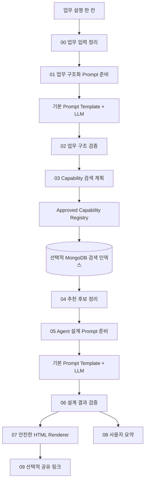
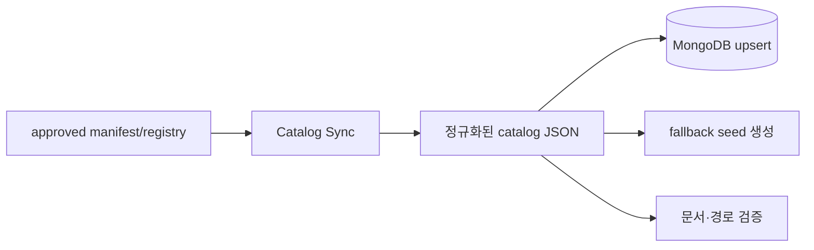

# Business Agent Design Flow 상세 구현 설계서

> 상태: 실행 구현 완료, `user_testing`  
> 작성일: 2026-07-10  
> 실행 구현: 2026-07-10  
> 추천 자산 기준: `registry/capabilities.json`의 `approved` Flow와 Component만 사용

---

## 1. 서비스 목표

사용자가 현재 수행하는 업무를 자연어로 설명하면 다음을 자동으로 정리하는 Agent 설계 서비스를 만든다.

1. 현재 업무 절차와 불편(AS-IS)
2. 자동화 가능 지점과 사람이 계속 판단해야 하는 지점
3. Agent 적용 후 업무 절차(TO-BE)
4. 사용할 수 있는 승인된 Flow와 Component
5. 각 자산이 추천된 구체적인 이유
6. Agent Builder에서 구현할 노드와 연결 순서
7. 단계별 구현 로드맵
8. 데이터·권한·승인·보안 위험과 통제 방법
9. 초보자도 이해할 수 있는 HTML 설계 결과

서비스의 중심은 “최신 기술을 많이 추천하는 것”이 아니라, **현재 프로젝트에서 실제로 검증된 자산으로 구현 가능한 설계를 제안하는 것**이다.

---

## 2. 구현 범위와 승인 전 제약

사용자 요청에 따라 실행 Flow와 전용 Component를 먼저 구현했다. 다만 Business Agent Design은 일반 Flow보다 카탈로그의 신뢰성에 크게 의존하므로, 서비스의 구현 상태와 추천 대상의 승인 상태를 분리한다.

- 실행 Flow와 15개 서비스 전용 Standalone 실행 Node: `user_testing`
- 추천 가능 자산: MongoDB 또는 seed에서 `status=approved`인 항목만
- 현재 `user_testing`인 `reusable_data_flow`, `html_report_flow`: 완료 승인 전까지 자동 추천에서 제외
- LLM 출력이 없거나 graph 계약을 위반하면 deterministic fallback graph 사용
- 실제 Langflow 1.8.2 사용자 실행과 결과 확인 후에만 서비스 상태를 `approved`로 전환

Import 파일은 `business_agent_design/flow/business_agent_design_complete.json`과 `business_agent_design/flow/00_business_agent_design_ALL_FLOWS.json`으로 제공한다. Skill Agent 상위·회의 하위 Flow와 PPT 참조 이미지 HTML 프레젠테이션 Flow를 포함한 실행 가능 6개 Flow를 한꺼번에 넣는 파일은 `flows/00_AGENT_GROUND_ALL_FLOWS.json`이다. JSON 불일치가 확인된 재사용 데이터 Flow는 복구 전까지 제외한다.

---

## 3. 사용자 경험 원칙

### 3.1 기본 입력은 한 칸

일반 사용자는 여러 설정칸을 채우지 않고 한 개의 `업무 설명` 입력을 사용한다.

입력 예시:

```text
매일 오전 생산 실적과 불량 데이터를 엑셀로 내려받아 설비별 이상 여부를 확인합니다.
불량률이 높은 설비는 작업 이력과 정비 이력을 조회해 원인 후보를 정리합니다.
결과는 회의 전에 팀장에게 공유하며 메일은 자동 발송하지 않고 초안만 만들고 싶습니다.
```

설명이 부족하면 서비스를 중단하기보다 합리적인 가정을 명시하고, 결과 하단에 `추가로 확인할 질문`을 제시한다.

### 3.2 결과는 세 층으로 보여준다

1. **한눈에 보는 요약**: 무엇을 어떻게 개선하는지
2. **업무 설계**: AS-IS, TO-BE, 추천 자산과 근거
3. **구현 상세**: 노드, 연결, 입력·출력, 검증과 위험 통제

초보 사용자는 첫 두 층만으로 방향을 이해할 수 있고, 실제 구현자는 세 번째 층까지 내려가 사용할 수 있어야 한다.

### 3.3 BEFORE / AFTER는 실제 Flow Chart로 보여준다

AS-IS와 TO-BE를 단계 목록이나 세로 카드 나열로 보여주지 않는다. 각각 독립된 업무 Flow Chart로 렌더링한다.

필수 표현:

- 시작과 종료 node
- 업무 처리 node와 담당 주체
- 방향이 보이는 연결선과 화살표
- 조건 판단을 나타내는 decision node
- `정상`, `이상`, `승인`, `반려` 같은 branch label
- 분기 후 다시 만나는 경우 merge point
- BEFORE와 AFTER에서 같은 업무 단계를 연결하는 stable step ID
- 유지, 변경, 신규, 사람 검토, 제거 상태

변경 상태는 색상만으로 표현하지 않고 텍스트 label을 함께 사용한다.

| 상태 | 화면 표현 | 의미 |
| --- | --- | --- |
| `unchanged` | 중립색 + `기존과 동일` | 업무 방식이 유지됨 |
| `modified` | 파랑 계열 + `변경` | 기존 단계가 자동화 또는 재설계됨 |
| `added` | 민트/초록 계열 + `신규` | AFTER에 새로 생긴 단계 |
| `human_review` | 주황 계열 + `사람 검토` | 자동화하지 않고 승인·확인을 유지 |
| `removed` | 흐린 빨강 또는 취소선 + `제거` | AFTER에서 사라진 수작업 |

변경된 node에는 `개선 설명` 버튼을 제공한다. 버튼을 누르면 다음 정보가 같은 페이지의 detail panel에 표시된다.

1. 왜 이 단계를 바꾸는가
2. 구체적으로 어떻게 개선하는가
3. 사용할 승인 Flow와 Component
4. 입력·출력과 연결 방식
5. 성공 확인 기준
6. 사람 확인과 위험 통제
7. 추천 근거 trace와 관련 설명서 링크

---

## 4. 전체 아키텍처



운영자용 카탈로그 등록 기능은 일반 사용자 Flow와 분리한다.



---

## 5. 기준 데이터와 책임

### 5.1 Source of Truth

`registry/capabilities.json`을 추천 가능한 자산의 기준 원본으로 사용한다.

- `approved`: 추천 가능
- `user_testing`, `building`, `idea`: 추천 금지
- `deprecated`: 신규 추천 금지, 기존 설계의 대체 안내만 가능

MongoDB는 검색 속도와 의미 검색을 위한 **배포 사본**이다. MongoDB 내용을 사람이 별도로 수정해 registry와 다른 진실을 만들지 않는다.

### 5.2 추천에 필요한 자산 정보

- ID, 이름, 버전, 타입
- 초보자용 요약
- 해결하는 업무 문제
- 입력·출력 계약
- 필요한 외부 시스템과 패키지
- 사용 가능한 연결 대상
- 관련 카테고리와 trigger signal
- 보안 및 승인 위험 태그
- HTML 설명서 경로
- 실제 검증 환경과 날짜
- 알려진 문제 해결 문서

---

## 6. Flow 단계별 상세 설계

### 6.1 `00 업무 입력 정리`

사용자 원문을 변경하지 않고 request envelope에 넣는다.

```json
{
  "request_id": "uuid",
  "raw_work_description": "사용자 원문",
  "language": "ko",
  "created_at": "ISO-8601",
  "assumption_policy": "state_and_continue"
}
```

필수 검증:

- 공백 입력 거부
- 지나치게 짧은 입력에는 작성 예시 제공
- 개인정보나 비밀값으로 보이는 문자열은 HTML 결과에 그대로 재출력하지 않도록 표시

### 6.2 `01 업무 구조화 Prompt 준비`

LLM이 다음 항목을 구조화하도록 변수를 준비한다.

- 업무 목적
- 현재 단계
- 담당자와 승인자
- 사용 데이터와 시스템
- 반복 빈도와 소요시간
- 불편과 오류 위험
- 원하는 결과
- 자동화 금지 또는 사람 확인 조건
- 확인되지 않은 가정

Prompt 문자열을 Python에 길게 하드코딩하지 않고 기본 Prompt Template 노드에서 관리한다. Component는 Prompt에 넣을 구조화된 변수만 제공한다.

### 6.3 `02 업무 구조 검증`

LLM 응답을 JSON으로 파싱하고 다음을 강제한다.

- 최소 한 개의 업무 목적
- 현재 업무 단계의 순서
- 시스템 쓰기, 메일 발송, 승인, 개인정보 관련 문장을 `constraints`와 `risk_signals`에도 반영
- 추정한 정보는 `assumptions`로 분리
- 알 수 없는 시스템과 데이터는 `unknowns`로 분리

### 6.4 `03 Capability 검색 계획`

업무 구조를 검색 조건으로 바꾼다.

```json
{
  "categories": ["data_retrieval", "reporting", "human_review"],
  "trigger_signals": ["생산 실적", "불량", "이력 조회", "회의 전 공유"],
  "required_outputs": ["위험 요약", "원인 후보", "메일 초안"],
  "risk_tags": ["approval_required", "external_message_draft"],
  "top_k": 8
}
```

검색 단계는 `status=approved` 필터를 가장 먼저 적용한다.

### 6.5 `04 추천 후보 정리`

검색 결과 전체를 LLM에 넣지 않고 다음 형식으로 압축한다.

```json
{
  "asset_id": "html_report_flow",
  "asset_version": "1.0.0",
  "asset_type": "flow",
  "why_relevant": "회의 전에 확인할 데이터 요약을 HTML로 만들 수 있음",
  "matched_signals": ["리포트", "공유", "그래프"],
  "required_dependencies": [],
  "risk_notes": [],
  "documentation_path": "html/flows/html_report_flow/index.html"
}
```

추천 후보마다 registry 원문을 가리키는 trace를 유지한다.

### 6.6 `05 Agent 설계 Prompt 준비`

다음 정보를 LLM에 제공한다.

- 검증된 업무 구조
- 승인된 추천 후보
- 실제 Component의 입력·출력 계약
- 사용자 제약과 위험 태그
- 설계 결과 JSON schema
- “카탈로그에 없는 기능은 미검증 제안으로 분리” 규칙

### 6.7 `06 설계 결과 검증`

LLM 결과를 그대로 렌더링하지 않는다.

필수 검증:

- 추천 자산 ID와 버전이 registry에 존재하는지
- 모든 추천 자산이 `approved`인지
- Flow가 요구하는 Component가 실제 존재하는지
- 제안한 연결의 Output/Input 타입이 호환되는지
- 외부 발송이나 시스템 쓰기에 사람 확인 단계가 있는지
- 카탈로그에 없는 제안이 승인 자산 목록에 섞이지 않았는지
- 문서 경로가 실제 존재하는지

검증 실패 항목은 삭제하거나 `구현 전 확인 필요`로 낮춘다.

### 6.8 `07 안전한 HTML Renderer`

검증된 JSON을 고정 템플릿으로 렌더링한다. LLM이 만든 HTML, JavaScript, CSS를 직접 실행하지 않는다.

필수 화면:

- 업무 목표 hero
- BEFORE 업무 Flow Chart
- AFTER 업무 Flow Chart
- 실제 branch와 branch condition label
- 변경 상태 legend
- 변경 node와 변경 edge의 색상 강조
- node별 `개선 설명` 버튼
- 개선 이유·구현 자산·검증·human review detail panel
- 추천 Flow·Component 문서 링크
- Agent Builder 구현 순서와 포트 연결표
- 단계별 로드맵
- 가정과 추가 질문
- 추천 trace 접기/펼치기

#### Flow Chart Renderer 규칙

- LLM이 좌표나 HTML을 만들지 않는다.
- LLM은 `nodes`, `edges`, `branch_label`, `change_state`가 있는 graph JSON만 생성한다.
- Normalizer가 dangling edge, 존재하지 않는 node, label 없는 분기와 순환 구조를 검사한다.
- Renderer가 graph 방향과 node 위치를 계산한다.
- 단순 흐름은 위에서 아래로, 비교 화면은 BEFORE와 AFTER를 나란히 배치한다.
- decision node는 일반 process node와 다른 모양으로 표시한다.
- 같은 `comparison_key`를 가진 BEFORE/AFTER node를 비교해 변경 상태를 결정한다.
- 모바일에서는 두 Chart를 세로로 쌓되 각 Chart 내부의 branch는 유지한다.
- Chart를 읽을 수 없는 환경을 위해 동일 순서의 접근성용 텍스트 설명을 제공한다.

### 6.9 `08 사용자 요약`

Chat Output에는 전체 설계를 반복하지 않고 다음을 짧게 제공한다.

- 추천 Agent 한 줄 설명
- 가장 먼저 구현할 단계
- 핵심 추천 Flow
- 반드시 사람이 확인할 지점
- HTML 결과를 보는 방법

### 6.10 `09 선택적 공유 링크`

`html_report_flow/report_api`가 계속 공용 serving layer로 적합한지 확인한 뒤 재사용한다. 별도 서버를 중복 구현하지 않는다.

---

## 7. 결과 Schema 개요

```json
{
  "request": {},
  "business_profile": {},
  "flow_visualization": {
    "before": {
      "nodes": [],
      "edges": []
    },
    "after": {
      "nodes": [],
      "edges": []
    },
    "change_map": [],
    "legend": []
  },
  "improvement_opportunities": [],
  "recommended_assets": [],
  "agent_builder_blueprint": {
    "nodes": [],
    "connections": [],
    "configuration_steps": []
  },
  "implementation_roadmap": [],
  "risk_controls": [],
  "assumptions": [],
  "questions_to_confirm": [],
  "recommendation_trace": {},
  "unverified_suggestions": []
}
```

### 7.1 Flow node schema

```json
{
  "node_id": "after_history_merge",
  "comparison_key": "history_lookup",
  "label": "작업·정비 이력 자동 병합",
  "actor": "AI Agent",
  "node_type": "process",
  "change_state": "modified",
  "recommended_asset_ids": ["reusable_data_flow"],
  "improvement_detail_id": "imp_history_merge"
}
```

`node_type` 허용값:

- `start`
- `process`
- `decision`
- `merge`
- `human_review`
- `end`

### 7.2 Flow edge schema

```json
{
  "edge_id": "edge_anomaly_to_history",
  "source": "after_anomaly_check",
  "target": "after_history_merge",
  "branch_label": "이상",
  "condition": "anomaly_detected == true",
  "change_state": "modified"
}
```

Decision node에서 나가는 모든 edge는 `branch_label`과 `condition`을 가져야 한다. 분기가 다시 합쳐지면 target이 되는 `merge` node를 명시한다.

### 7.3 Improvement detail schema

```json
{
  "improvement_detail_id": "imp_history_merge",
  "title": "작업·정비 이력 자동 병합",
  "why_change": "여러 시스템을 개별 조회하는 시간을 줄임",
  "how_to_improve": "이상 설비와 기간을 후속 data_request로 전달",
  "recommended_asset_ids": ["reusable_data_flow", "data_result_merger"],
  "connection_guidance": [],
  "acceptance_checks": [],
  "human_review": "민감 정보 필드와 조회 범위를 담당자가 승인",
  "recommendation_trace_ids": []
}
```

각 추천 자산에는 최소한 다음을 포함한다.

- `asset_id`
- `asset_version`
- `why_selected`
- `applies_to_business_steps`
- `required_inputs`
- `produced_outputs`
- `documentation_path`
- `confidence`
- `risk_notes`

---

## 8. MongoDB 사용 계획

### 8.1 컬렉션

| 컬렉션 | 역할 |
| --- | --- |
| `agent_capability_catalog` | 승인된 Flow와 Component 검색 사본 |
| `agent_improvement_cases` | 검증된 업무 개선 사례 |
| `agent_design_runs` | 사용자가 동의한 경우 설계 실행 이력 |

### 8.2 동기화

1. registry 읽기
2. `approved`만 선택
3. 검색용 요약과 embedding text 생성
4. ID와 버전 기준 upsert
5. 더 이상 승인되지 않은 항목 비활성화
6. registry 개수와 MongoDB active 개수 비교
7. fallback seed를 같은 입력에서 생성

민감한 실제 연결값은 registry나 MongoDB 문서에 넣지 않는다.

---

## 9. 서비스 전용 Component 원칙

Business Agent Design 전용 실행 Node는 Langflow 등록 호환성을 위해 `business_agent_design/components/`에 두며, 각 파일은 Standalone이어야 한다. 이 폴더명은 Builder의 Custom Component 등록 방식을 나타낼 뿐 공용 Component Library 자격을 의미하지 않는다.

- 형제 모듈 import 금지
- Prompt 본문 하드코딩 최소화
- 입력·출력 계약과 오류 구조 명시
- registry schema를 입력 경계에서 검증
- LLM 결과를 다음 단계 전에 정규화
- HTML은 deterministic renderer 사용
- 전용 Component를 일반 라이브러리로 승격하려면 별도 사용자 승인 필요

---

## 10. 보안과 위험 통제

- 자동 메일 발송보다 메일 초안 생성을 기본으로 한다.
- 시스템 쓰기, 삭제, 승인, 외부 공유는 human review 단계 없이는 추천하지 않는다.
- 개인·기밀 정보는 HTML과 실행 이력에 최소화한다.
- LLM에 DB 비밀번호, Token, TNS 전체를 전달하지 않는다.
- 추천 자산의 문서 링크와 버전을 남겨 근거를 추적한다.
- HTML renderer는 script injection과 위험한 URL scheme을 차단한다.
- Report API를 사용할 때 만료 시간, 접근 범위, 저장 위치를 명확히 한다.

---

## 11. 단계별 구현 순서

### Phase A. 기반 확정 — 진행 중

- 최소 2개 이상의 Flow를 `approved`로 전환
- Component manifest와 registry schema 안정화
- 현재 Agent Builder 환경 프로필 확정

### Phase B. Registry 검색 MVP — 구현 완료, 사용자 검증 필요

- 로컬 JSON 검색부터 구현
- category, trigger signal, input/output 기준 필터
- 추천 trace 생성
- MongoDB 없이 대표 업무 5건으로 검증

### Phase C. 업무 구조화와 설계 JSON — 구현 완료, 사용자 검증 필요

- 한 칸 입력
- 구조화 Prompt와 Normalizer
- 설계 Prompt와 검증기
- fallback 및 미검증 제안 분리

### Phase D. 서비스 HTML — 구현 완료, 사용자 검증 필요

- BEFORE/AFTER 실제 Flow Chart
- decision, branch label과 merge point
- 변경 node·edge 색상과 상태 label
- `개선 설명` 버튼과 detail panel
- 추천 근거
- 구현 노드와 연결표
- 위험 통제
- 반응형·접근성 검증

### Phase E. MongoDB와 공유 — 선택 기능 구현, 운영 환경 검증 필요

- registry 동기화
- text/vector 검색 비교
- Report API 공유 링크
- 실행 이력 저장은 사용자와 보존 정책 합의 후 추가

---

## 12. 대표 검증 시나리오

최소 다음 업무를 사용한다.

1. 여러 시스템의 생산 데이터를 조회해 회의용 리포트 생성
2. 문서를 검색해 답변하지만 외부 발송은 하지 않는 업무
3. 파일을 읽어 반복 항목을 분류하는 업무
4. 승인 후에만 시스템을 변경할 수 있는 업무
5. 현재 승인된 자산만으로는 구현할 수 없는 업무

각 시나리오에서 확인한다.

- 관련 자산만 추천되는가?
- 미승인 자산이 섞이지 않는가?
- 사용할 수 없는 기능을 확정적으로 말하지 않는가?
- 포트 연결이 실제 계약과 맞는가?
- BEFORE와 AFTER가 카드 목록이 아니라 연결된 Flow Chart로 보이는가?
- 모든 decision branch에 조건 label이 있는가?
- 변경 node와 edge가 상태별 색상·텍스트로 구분되는가?
- `개선 설명` 버튼이 올바른 detail을 여는가?
- human review가 필요한 위치가 명확한가?
- 문서 링크가 열리는가?

---

## 13. 완료 기준

- [ ] 실제 Agent Builder에서 전용 Component가 모두 Standalone으로 등록된다.
- [ ] 한 칸 입력으로 대표 업무 5건의 구조화가 가능하다.
- [ ] `approved` 자산만 추천한다.
- [ ] 추천 ID·버전·이유·문서 링크가 trace에 남는다.
- [ ] Flow/Component 포트 계약과 설계 연결표가 일치한다.
- [ ] BEFORE와 AFTER가 각각 시작·종료·연결선이 있는 Flow Chart로 렌더링된다.
- [ ] decision node의 모든 분기와 조건 label이 표시된다.
- [ ] 변경 node와 edge가 `unchanged`, `modified`, `added`, `human_review`, `removed` 상태로 비교된다.
- [ ] 변경 node마다 `개선 설명` 버튼과 검증된 detail panel이 있다.
- [ ] 모바일에서도 branch 구조와 개선 설명을 읽을 수 있다.
- [ ] 미검증 제안이 승인 자산과 분리된다.
- [ ] 위험 작업에 human review가 표시된다.
- [ ] 안전한 HTML renderer를 사용한다.
- [ ] 모바일과 데스크톱에서 결과를 읽을 수 있다.
- [ ] 사용자가 직접 실행하고 결과의 완성도를 승인한다.

이 기준을 충족하기 전에는 통합 포털에서 실행 가능한 서비스로 표시하지 않는다.
