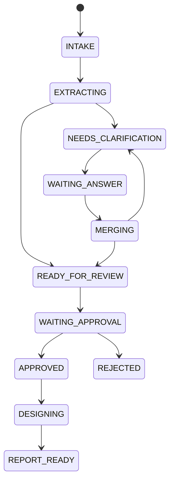

# HITL 상태 머신과 Resume 운영 계약

이 구현에는 서로 섞을 수 없는 두 채널이 있다.

- `F10_work_definition_parent`: Langflow 1.11.1 `Human Input`으로 실제 workflow를 suspend/resume한다.
- `F11_work_definition_chat_turn`: Playground에서 한 turn씩 실행하고 `WAITING_ANSWER` 결과를 반환한다. native pause를 사용하지 않는다.

작업이 시작된 뒤 `channel_mode`, `tenant_id`, `owner_id`, `session_id`는 변경할 수 없다.

## 1. 업무 상태

Component 18이 허용하는 WorkDefinition 의미 상태는 다음과 같다.



각 주요 상태에서 `CANCELLED` 또는 검증 실패에 따른 `BLOCKED`로 갈 수 있지만, `REJECTED`와 `CANCELLED`는 terminal 상태다. 실제 허용 전이 표는 `18_work_definition_store.py`의 `ALLOWED_TRANSITIONS`가 기준이다.

F10의 `WAITING_ANSWER`, `MERGING`, `READY_FOR_REVIEW`, `WAITING_APPROVAL`, router `BLOCKED`, `CANCELLED` 기록은 Component 34가 별도의 `work_runtime_states`와 `work_runtime_events`에 저장한다. `runtime_revision`은 WorkDefinition의 `revision`과 독립적이다. 답변 CAS 저장 직후에는 증가한 semantic revision으로 `MERGING`을 한 번 더 기록해 runtime revision과 조정하고, 그 성공 경로만 다음 completeness/review로 진행한다. review 저장 뒤 `READY_FOR_REVIEW`, approval 요청 저장 뒤 `WAITING_APPROVAL`을 기록한 성공 경로만 최종 Human Input을 연다. runtime persistence 실패 `blocked_path`는 전용 진단으로 종료한다.

Component 35는 F10/F11의 구조화 결과를 다음 단계로 넘기기 전 `ok is True`와 단계별 필수 payload를 검사한다. 원래 `ok=false` 오류는 보존하고, 암묵적 truthy 값·누락된 `ok`·필수 field 누락은 canonical `BLOCKED` 오류로 바꾼다. `success_path`와 `blocked_path`를 물리적으로 분리해 실패 envelope가 completeness, Human Input, 저장, preview 또는 action 후속 경로로 유입되지 않게 한다.

## 2. F10 native HITL 순서

F10은 반드시 Workflow API의 background mode로 실행한다. 동기 `/run` 호출을 native HITL resume와 혼용하지 않는다.

1. Component 10~11이 요청을 정규화하고 Component 18이 최초 WorkDefinition을 revision 0으로 먼저 영속 저장한다. Component 35가 저장 결과의 `ok=true`와 `work_definition`을 확인한 `success_path`만 Component 12/13으로 보낸다.
2. Component 27이 completeness 결과를 분기한다. 부족한 정보가 없으면 Human Input을 건너뛰고 review 경로로, 부족하면 immutable 질문 batch를 `clarification_batches`에 저장한 뒤 해당 회차 Human Input으로 이동한다.
3. Component 34가 `WAITING_ANSWER` runtime state를 저장한 `success_path`에서만 clarification `Human Input`이 `Submit Answers`와 `Cancel` 선택지를 가진 채 workflow를 suspend한다.
4. Langflow 1.11.1은 pending request에 `job_id`, `flow_id`, `session_id`, `request_id`, `kind=node_input`, 허용 decision을 저장한다.
5. UI/backend orchestrator가 pending 목록을 읽고 HITL API의 batch 등록 endpoint를 호출한다.
6. F10 background job을 시작한 Langflow service account와 `LANGFLOW_API_KEY`의 소유자는 반드시 동일해야 한다. HITL API는 그 동일 service account 범위의 F10 pending 목록을 다시 조회하여 job/request/flow/session/action을 검증한 뒤 reference를 질문 batch에 부착한다. 다른 사용자로 시작한 job은 `/pending`에 보이지 않으므로 등록·resume 준비 실패로 처리한다.
7. 사용자가 구조화 답변 폼을 제출하면 API가 question type/choice/revision/tenant/deadline을 검증하고 `ANSWERED_PENDING_RESUME`로 CAS 전이한다.
8. API만 Langflow resume endpoint를 호출한다. 브라우저에는 Langflow API key와 `request_id`를 노출하지 않는다.
9. resume decision은 `{"action_id":"submit_answers"}`다. 선택된 Human Input branch에서 Component 34가 `MERGING`을 저장하고 `success_path`만 Component 14를 실행한다.
10. Component 14는 MongoDB 또는 companion API에서 저장된 답변을 다시 읽고, 현재 WorkDefinition/batch/session/revision, immutable 질문 계약과 제출 시각을 대조한다. Component 35가 `answer_submission`을 확인한 성공 경로만 Merger로 보낸다.
11. Component 15가 답변을 병합하고 revision을 하나 올리며, Component 35가 merged WorkDefinition을 확인한 뒤 Component 18이 `incoming_revision_is_next=true` CAS로 저장한다. 저장 결과가 Component 35를 통과하면 Component 34가 새 semantic revision의 `MERGING` runtime checkpoint를 기록하고, 이 성공 경로만 Component 12가 다시 평가하여 다음 질문 회차 또는 review로 이동한다.
12. 답변 회차는 세 번까지 unroll되어 있다. 세 번째 병합 뒤 round 4의 Component 13/27은 사람에게 네 번째 질문을 만들지 않는 최종 gate이며, gap이 남으면 `CLARIFICATION_ROUND_LIMIT`로 `BLOCKED`, 없으면 review 경로로 이동한다.
13. Component 28이 어느 회차에서든 도달한 유일한 review 경로를 합치고 graph/preview hash를 생성한다. join, graph, preview, review 저장과 Component 18의 `request_approval` 결과는 각각 Component 35를 통과해야 한다. Component 34의 `READY_FOR_REVIEW`와 `WAITING_APPROVAL` 저장까지 성공한 경로만 최종 Human Input을 연다.
14. 최종 `Approve`, `Reject`, `Cancel` branch는 각각 Component 18의 해당 command와 Component 35 결과 gate를 거쳐 성공 또는 진단 output으로 끝난다. `request_changes`는 현재 Flow에서 노출하지 않는다. 수정이 필요하면 승인 전 clarification에서 반영하거나 취소 후 새 session을 시작한다.

각 Component 27 blocked branch도 Component 34의 `BLOCKED` 저장을 거친다. 저장 자체가 실패한 경우 기존 정상 payload를 다음 단계로 전달하지 않고 persistence failure 진단만 반환한다.

Langflow API 계약:

```http
GET /api/v2/workflows/pending?flow_id={F10_UUID}
x-api-key: {server_only_key}
```

```http
POST /api/v2/workflows/{job_id}/resume
x-api-key: {server_only_key}
Content-Type: application/json

{
  "request_id": "{verified_request_id}",
  "decision": {"action_id": "submit_answers"}
}
```

위 형태는 설치된 `langflow==1.11.1`과 `lfx==1.11.5`의 route/schema를 기준으로 검증했다.

## 3. 질문 Batch 등록 시점

Component 13이 실행될 때는 아직 Human Input이 suspend를 만들기 전이므로 workflow `job_id/request_id`를 알 수 없다. 따라서 다음 두 단계가 분리된다.

- Flow 내부: immutable 질문 계약을 먼저 MongoDB에 저장
- Orchestrator: suspend가 관측된 뒤 `job_id/request_id`를 HITL API에 등록

등록 endpoint:

```http
POST /api/work-definitions/{work_id}/question-batches
Authorization: Bearer {hitl_api_token}
X-Tenant-ID: tenant-a
X-Actor-ID: user-a
Idempotency-Key: register-{job_id}-{request_id}

{
  "clarification_batch": {"...": "Component 13 output"},
  "workflow_job_id": "...",
  "workflow_request_id": "..."
}
```

production에서는 pending verification을 끌 수 없다. `LANGFLOW_RESUME_ENABLED`, `LANGFLOW_API_KEY`, `LANGFLOW_F10_FLOW_ID`가 없으면 서비스 readiness가 실패한다.

## 4. 자유서술 답변 제출

```http
POST /api/work-definitions/{work_id}/question-batches/{batch_id}/answers
Authorization: Bearer {hitl_api_token}
X-Tenant-ID: tenant-a
X-Actor-ID: user-a
Idempotency-Key: answer-{client-generated-uuid}

{
  "expected_revision": 2,
  "answers": [
    {"question_id": "q-...", "value": "저장 전에 팀장 검토가 필요합니다."}
  ]
}
```

서버는 다음을 모두 확인한다.

- URL의 work/batch ID와 저장 문서 identity
- `X-Tenant-ID`, `X-Actor-ID`와 owner
- batch status와 expiry
- `expected_revision`
- question ID 중복·누락·최대 개수·값 크기
- `text`, `single_choice`, `single_choice_with_text`, `multi_choice`, `boolean`, `number`별 실제 JSON 타입, choice membership, finite 숫자와 길이 상한
- immutable `answer_deadline_at` 이전 제출인지 여부
- 동일 idempotency key의 request hash

답변을 수락하면 원래 질문 가능 기한은 `answer_deadline_at`로 보존하고 TTL purge용 `expires_at`만 현재 구현의 7일 답변 보존 기간까지 연장한다. Loader는 처리 현재 시각이 아니라 저장된 `submitted_at < answer_deadline_at`을 검사한다.

Resume가 일시 실패하면 답변은 `ANSWERED_PENDING_RESUME`로 남고, 동일 key 재시도는 같은 submission을 반환한다. 새로운 답변으로 덮어쓰지 않는다. resume 응답이 유실되어 Langflow가 409를 반환한 경우 API는 동일 request가 아직 pending인지, 같은 job이 다음 request로 진행했는지, durable workflow 상태가 `in_progress`/`completed`인지 서버 측으로 재조회한다. 소비 사실이 확인된 경우만 reconciled resume로 기록하며, 같은 request가 여전히 pending이면 성공으로 간주하지 않는다.

## 5. F11 Playground 채널

F11은 `Human Input`을 포함하지 않으며 자체적으로 이전 turn을 복원하지 않는다. 호출자가 저장소에서 읽은 현재 WorkDefinition과 active 질문 batch, 구조화된 `playground_payload`를 함께 주는 한 turn 처리 계약이다. start의 최초 저장과 answer loader/merger/store, review join/graph/preview/store/approval, 최종 action store마다 Component 35가 명시적 성공 envelope와 필수 payload를 확인한다. 한 실행은 다음 중 하나를 반환하고 종료한다.

- `WAITING_ANSWER`: 질문, `batch_id`, `expected_revision`
- `READY_FOR_REVIEW`: preview와 다음 action 정보
- `APPROVED` 또는 오류

자유서술 자연어와 action command를 같은 값으로 동시에 해석하지 않는다. Component 36은 중복 key와 nested command 우회를 거부하며 `start`, `submit_answers`, `approve`, `reject`, `cancel`만 허용한다. 답변 command는 구조화된 `playground_payload`로 Component 14에 들어가며, 승인·거절·취소 action은 trusted gateway가 생성한 32~512 byte one-time token 원문을 제출한다. MongoDB에는 token SHA-256과 session/channel/revision/preview/actor/허용 command/expiry만 저장하고 public WorkDefinition 응답에서는 `pending_action`을 제거한다. action은 durable WorkDefinition을 의미 원본으로 사용하므로 요청 payload가 goal이나 preview hash를 바꿀 수 없다. F10 작업을 F11로 이어받거나 그 반대로 바꾸지 않는다.

질문 batch의 `answer_deadline_at` 만료만으로 Langflow 1.11.1 suspended job이 자동 종료되지는 않는다. production에서는 별도 sweeper가 만료된 `clarification_batches`와 pending request를 대조하고, 더 이상 resume하지 않을 job을 권한 있는 Workflow API로 중단한 뒤 terminal `BLOCKED` 또는 `CANCELLED` runtime event를 원자적으로 기록해야 한다. 이 sweeper와 재시작/중복 실행 검증 전에는 F10 native HITL을 production-ready로 승격하지 않는다.

## 6. 동시성·재시도 원칙

- WorkDefinition 저장은 `expected_revision` CAS와 idempotency receipt를 함께 사용한다.
- 답변 병합 후 revision이 먼저 증가한 payload는 Store의 `incoming_revision_is_next=true` 경로만 사용한다.
- 동일 idempotency key + 동일 body는 replay다.
- 동일 idempotency key + 다른 body는 conflict다.
- stale revision, 만료 batch, 이미 소비한 request/action token은 다시 열지 않는다.
- native Human Input의 `request_id`는 단회성이다. 새 pause는 새 request ID와 별도 등록을 요구한다.
- HITL API와 Standalone Component가 같은 canonical collection을 쓰므로 `MONGODB_COLLECTION_PREFIX`는 비어 있어야 하며, non-empty 설정은 시작 시 실패한다.
