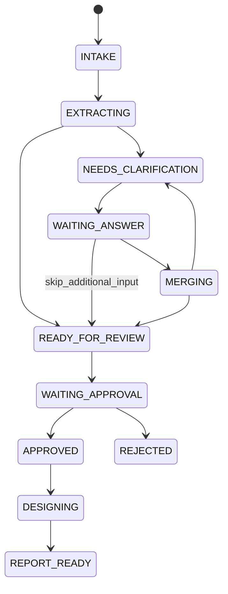

# HITL 상태 머신과 Playground 답변 운영 계약

F10의 업무 정의 채널은 `F10_work_definition_parent` 하나이며, `channel_mode`는 내부적으로 항상 `native_hitl`이다. 사용자는 F10 시작부에서 **업무 설명 원문**, **추가 설계 프롬프트**, **팀 명**, **사번**만 입력한다. `tenant_id`, `owner_id`, `session_id`는 저장·감사·재개를 위한 내부 식별자이며 별도 화면 입력이 아니다. Component 10이 팀 명·사번과 현재 Langflow graph session을 내부 계약으로 변환한다.

자유서술 보완 답변은 별도 웹 폼이나 API에 입력하지 않는다. **`42 보완 답변 HITL` 카드가 Langflow Playground 안에 실제 입력칸을 표시한다.** 사용자는 답변을 채운 뒤 `Submit Answers`를 선택하거나, 지금 줄 수 있는 추가 정보가 없을 때 **`추가 입력 건너뛰기` (`Skip Additional Input`)**를 선택할 수 있다. `Cancel`은 이 두 선택과 별개의 업무 정의 종료 행동이다.

## 1. 업무 상태

Component 18이 다루는 WorkDefinition 의미 상태는 다음과 같다.



각 주요 상태는 `CANCELLED` 또는 검증 실패에 따른 `BLOCKED`로도 끝날 수 있다. `REJECTED`와 `CANCELLED`는 terminal 상태이며, 실제 허용 전이는 `18_work_definition_store.py`의 `ALLOWED_TRANSITIONS`가 기준이다.

Compact F10은 과거의 별도 Runtime State Store/Result Gate Canvas node를 사용하지 않는다. Component 12·13·16·17·18·39·40이 각자의 결과를 검증하고 성공 또는 차단 출력만 연다. 따라서 오류 envelope가 다음 LLM, HITL 카드, 저장 또는 preview 단계로 이어지지 않는다.

## 2. 각 컴포넌트의 역할과 MongoDB 설정

| 컴포넌트 | 역할 | MongoDB 설정 |
| --- | --- | --- |
| `13 재질문 Batch 생성` (3개) | 부족한 정보를 immutable 질문 batch로 저장한다. 첫 질문 회차에는 필요한 revision 0 WorkDefinition도 멱등적으로 준비한다. | **자동:** Secret `MONGO_URL`, Database. 내부 collection: `clarification_batches`, `work_definitions` |
| `42 보완 답변 HITL` (3개) | 저장된 질문 batch를 Playground `node_input` schema 카드로 표시하고, 답변 제출·추가 입력 건너뛰기·취소를 서로 배타적인 native action으로 만든다. | MongoDB 연결 없음 |
| `39 답변 반영·다음 단계` (3개) | Component 42 action을 canonical batch와 대조한다. 답변은 검증·CAS 병합하고, 건너뛰기는 감사 이력과 미확정 항목을 기록한 뒤 검토로 보낸다. | **자동:** Secret `MONGO_URL`, Database. 내부 collection: `clarification_batches`, `work_definitions` |
| `18 WorkDefinition Mongo Store` | 검토 요청·승인·반려·취소 상태와 audit event를 저장한다. | **자동:** Secret `MONGO_URL`, Database. 내부 collection: `work_definitions`, `work_definition_events` |
| `43 최종 승인 경로 Gate` | 마지막 built-in Human Input의 Approve·Reject·Cancel 중 하나만 열고, 선택하지 않은 두 Component 18 저장 branch를 즉시 제외한다. | MongoDB 연결 없음, 모든 입력은 자동 연결 |
| `36 Approved Design Invocation Loader` | 승인본, active catalog pointer, active Skill registry를 다시 읽어 F20 입력을 만든다. | **자동:** Secret `MONGO_URL`, Database. 내부 collection: `work_definitions`, `catalog_active_pointers`, `skill_registry` |

모든 active F10 MongoDB node는 export에서 자동 연결된 Langflow Secret/Global Variable **`MONGO_URL`**을 사용하고 Database는 기본값 **`business_work_design`**으로 둔다. URI를 각 node에 평문으로 복사하지 않는다. collection 이름은 내부 기본값이므로 일반 운영에서는 변경할 필요가 없다.

## 3. Playground-native 보완 질문 순서

1. 사용자가 F10을 Playground에서 실행한다. 필요하다면 운영자가 Langflow Workflow API로 background job을 시작할 수 있지만, 이것은 F10 시작 방식일 뿐 답변 입력 경로를 바꾸지 않는다.
2. Component 10~12가 업무 설명을 정규화하고 완전성을 평가한다. 정보가 충분하면 곧바로 검토 경로로 간다.
3. 정보가 부족하면 질문 생성 LLM과 Component 13이 `clarification_batches`에 `WAITING_ANSWER` 질문 batch를 저장한다.
4. Component 42가 그 batch에서 `schema`를 만든 뒤 Langflow의 native `node_input` pause를 요청한다. 1·2차 Playground 카드에는 `answer_01`~`answer_03`, 마지막 3차 카드에는 필요할 때 `answer_04`까지 입력칸이 나타난다.
5. 사용자는 **같은 Playground 카드**에서 다음 중 하나를 선택한다.
   - 모든 필수 입력을 채운 뒤 `Submit Answers`: 검증된 답변만 WorkDefinition에 병합한다.
   - **`추가 입력 건너뛰기`**: 현재 카드의 질문 전체를 명시적으로 건너뛰고, 새 답변을 만들지 않은 채 검토로 진행한다.
   - `Cancel`: 현재 업무 정의를 종료한다.
6. Playground는 선택된 action과 입력값을 Langflow에 재개 결정으로 보낸다. 내부 형태는 아래와 같지만, 일반 사용자가 `request_id`, API key 또는 curl 요청을 직접 작성할 필요는 없다.

   ```json
   {
     "decision": {
       "action_id": "submit_answers",
       "values": {
         "answer_01": "매주 금요일 16시에 지난 1주 메일만 조회합니다.",
         "answer_02": "프로젝트별 완료·진행·리스크·다음 주 계획 표를 보고 포털에 게시합니다."
       }
     }
   }
   ```

7. Component 42가 안전한 카드 field key를 원래 `question_id`로 복원한다. Component 39는 canonical batch, 질문 계약, 사번, deadline, revision과 중복 실행 방지 키를 다시 확인한다. `Submit Answers`에서 검증된 답변만 MongoDB CAS로 병합한다.
8. `추가 입력 건너뛰기`는 빈 답변 제출이 아니다. Component 39가 별도 skip audit을 저장하고 현재 카드의 `question_id`를 WorkDefinition `unresolved`에 `unknown` provenance로 남긴다. 답을 추정하거나 confirmed로 바꾸지 않으며, 기존 정보와 이 미확정 목록을 포함한 normal preview/review 경로로 보낸다.
9. `Submit Answers`를 선택한 경우에만 Component 39가 다시 평가해 2·3차 질문, review, cancel 또는 blocked 중 하나를 선택한다. 같은 질문 패턴은 최대 세 회까지 반복되며 1·2차 card에는 최대 세 개, 마지막 3차 card에는 최대 네 개의 입력칸을 둘 수 있다. 그 입력까지 답한 뒤에도 blocking gap이 남으면 네 번째 질문 회차를 만들지 않고 `CLARIFICATION_ROUND_LIMIT`로 차단한다. 건너뛰기는 네 번째 회차가 아니라 현재 카드에서 끝나는 review 진입 action이다.
10. 업무가 충분해지거나 명시적으로 추가 입력을 건너뛰면 Component 40·16·17이 검토본을 만들고 Component 18이 `WAITING_APPROVAL`로 저장한다. 마지막 built-in `Human Input`은 **승인 결정 전용**이므로 `Approve`, `Reject`, `Cancel` 버튼만 표시되는 것이 정상이다. 바로 뒤의 Component 43은 사용자의 선택을 읽어 선택하지 않은 18 저장 branch를 조건부 제외하므로, terminal 결과가 실행되지 않은 sibling 저장 node를 읽지 않는다.

### 추가 입력 건너뛰기 운영 규칙

- 이 action의 내부 ID는 `skip_additional_input`이며, Component 42의 `branch_skip_additional_input`만 같은 회차 Component 39의 `skip_trigger`에 자동 연결된다. 사용자가 Canvas 입력값이나 API 요청을 직접 만들 필요는 없다.
- 현재 card에 표시된 질문 전체를 한 번에 건너뛴다. 일부 칸만 비워 둔 제출과 혼용하지 않으며, partial answer를 임의로 저장하지 않는다.
- Component 39는 `clarification_batches.skip_submission`과 WorkDefinition의 `clarification_skip_history`에 멱등 가능한 audit을 남기고, 질문별 `unresolved` record에 질문 ID·target path·reason code와 `unknown` provenance를 기록한다.
- 결과는 `READY_FOR_REVIEW`/`review_path`다. 따라서 기존 정보와 미확정 항목을 Preview에서 확인한 뒤 최종 승인·거절·취소를 선택할 수 있다. `Cancel`처럼 `CANCELLED`로 만들지 않으며, 승인 전에는 F20을 실행하지 않는다.
- 건너뛰기는 답변을 추정하거나 blocking gap을 해소하지 않는다. 또한 추가 질문을 만들지 않으므로 4차 HITL 회차가 아니다.

### 입력 형식 안내

Langflow 1.11.1 Playground의 schema card는 현재 모든 field를 text box로 렌더링한다. Component 42 카드 안의 안내를 우선하며, 주요 입력 규칙은 다음과 같다.

- `text`: 자유 서술
- `single_choice`: 카드에 표시된 선택지 중 하나를 정확히 입력
- `single_choice_with_text`: 선택지를 입력하거나 `{"choice":"__other__","text":"설명"}` 형식 입력
- `multi_choice`: 선택지를 쉼표 또는 줄바꿈으로 구분
- `boolean`: `true/false`, `예/아니오`
- `number`: 숫자

카드의 required 표시는 사용 편의를 위한 1차 안내다. Component 42와 39이 서버 측에서 필수값·선택지·형식·길이·deadline을 다시 검증하므로, 잘못된 값은 다음 단계로 전달되지 않는다.

## 4. 카드에 입력칸이 보이지 않을 때

`Submit Answers`/`추가 입력 건너뛰기`/`Cancel` 버튼만 있고 질문별 입력칸이 없다면, 과거 built-in `Human Input` node 또는 이전 F10 export를 실행한 경우다. built-in `Human Input`은 선택 버튼만 지원한다.

다음 항목을 확인한다.

1. F10에 각 회차별 `42 보완 답변 HITL` component가 있으며, Component 13의 `재질문 Batch` 출력이 42의 `질문 Batch` 입력에 연결되어 있는지 확인한다.
2. 42의 `답변 제출 Data` 출력이 같은 회차 Component 39의 `Native Answer Submission` 입력으로, `Submit Answers` 출력이 `Submit Trigger` 입력으로, `추가 입력 건너뛰기` 출력이 `추가 입력 건너뛰기 Trigger` 입력으로 각각 연결되어 있는지 확인한다.
3. F10 JSON과 `42_f10_clarification_answer_gate.py`를 최신 import/source로 갱신하고 Langflow가 component를 다시 build한 뒤 새 실행을 시작한다. 이미 suspend된 옛 job은 새 schema로 변환되지 않는다.
4. 실제 질문 batch가 `WAITING_ANSWER`, `round_number` 1~3, 1·2차에는 1~3개·3차에는 1~4개의 유효한 질문을 가진지 확인한다. 계약 오류면 42는 입력 카드를 열지 않고 차단 결과를 반환한다.

## 5. API 및 legacy Answer Form 서비스의 위치

F10이 Playground에서 실행되는 정상 경로에는 외부 Answer Form/API 등록, `HITL_API_BEARER_TOKEN`, `LANGFLOW_API_KEY`, `request_id`의 브라우저 노출 또는 수동 resume HTTP 호출이 필요하지 않다. Playground의 인증된 Langflow session이 schema 카드의 `values`를 포함해 재개한다.

`services/hitl_form_api`는 저장소에 남아 있을 수 있으나 **legacy/reference 전용**이다. 과거 외부 폼 연동이나 마이그레이션을 참고하기 위한 서비스이며, 현행 F10의 질문 batch 등록·답변 수집·재개 흐름에 포함하지 않는다. F10 운영 runbook과 E2E 합격 조건은 이 서비스를 시작하거나 호출하는 것을 요구하지 않는다.

운영자가 자동화 목적으로 Workflow API를 사용해 F10을 시작·상태 조회·중단할 수는 있다. 이 경우에도 Flow-to-Flow HTTP 호출은 사용하지 않으며, F10→F20 연결은 내부 `Run Flow(tool_mode=false)` direct mode다.

## 6. 만료·동시성·재시도

- 질문 batch의 `answer_deadline_at` 만료만으로 suspended Langflow job이 자동 종료되지는 않는다. production에서는 별도 sweeper가 만료 batch와 pending request를 대조해 더 이상 재개하지 않을 job을 중단하고 audit event를 남겨야 한다.
- WorkDefinition 저장은 expected revision 기반 CAS와 idempotency receipt를 사용한다.
- Component 39는 현재 revision을 읽고 답변을 다음 revision으로 한 번만 병합한다. 동일 재개 이벤트의 중복 전달은 duplicate 저장이 아니라 replay 또는 conflict로 끝나야 한다.
- native pause의 `request_id`는 Langflow 내부의 단회성 재개 주소다. 사용자가 입력·저장하거나 Canvas 값으로 설정하는 값이 아니다. 새 질문 카드에는 새 request ID가 생긴다.
- `clarification_batches`의 원래 `answer_deadline_at`은 변경하지 않고, 답변 보존을 위한 `expires_at`만 정책 기간까지 연장한다. 제출 시각이 deadline 이전인지로 수락 여부를 판단한다.

## 7. 최종 승인 후 F20 직접 실행

사용자는 F10에서 업무를 승인한 뒤 WorkDefinition을 복사해 F20에 다시 입력하지 않는다.

1. Component 18이 `status=APPROVED`, `approved_hash`, revision을 MongoDB에 저장한다.
2. Component 36이 canonical 승인 WorkDefinition과 request identity를 다시 읽어 schema/status/revision/hash/owner/session/native channel을 검증한다.
3. 같은 scope의 active catalog pointer와 `status=active` Skill registry를 읽고 bounded ACL/group 및 추가 설계 프롬프트를 포함한 `agent-design-invocation/v1`을 만든다.
4. built-in TypeConverter가 strict JSON `text`를 Message로 바꾸고 Langflow 1.11.1 `Run Flow` node가 `tool_mode=false` direct mode로 F20 ChatInput에 전달한다.
5. F20은 설계 미리보기 없이 sealed report handoff Chat Output 하나만 반환하고, F10은 이를 검증한 뒤 F30을 실행한다. 사용자에게 표시되는 최종 Chat Output은 F30 보고서 결과다.

이 연결은 Langflow 내부 Run Flow 계약이며 다른 Flow의 HTTP API를 호출하지 않는다. Component 36의 owner/hash/pointer/Skill 검증이 하나라도 실패하면 `blocked_path`만 열리고 F20은 실행되지 않는다.
