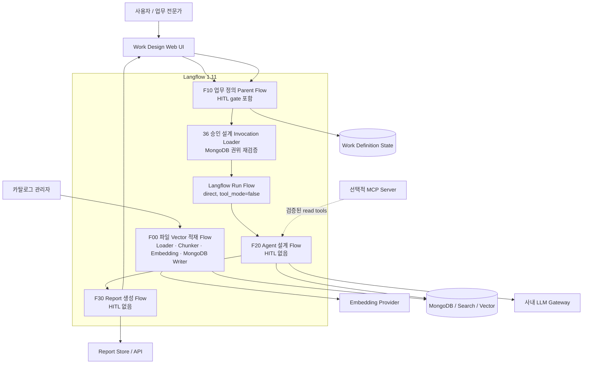
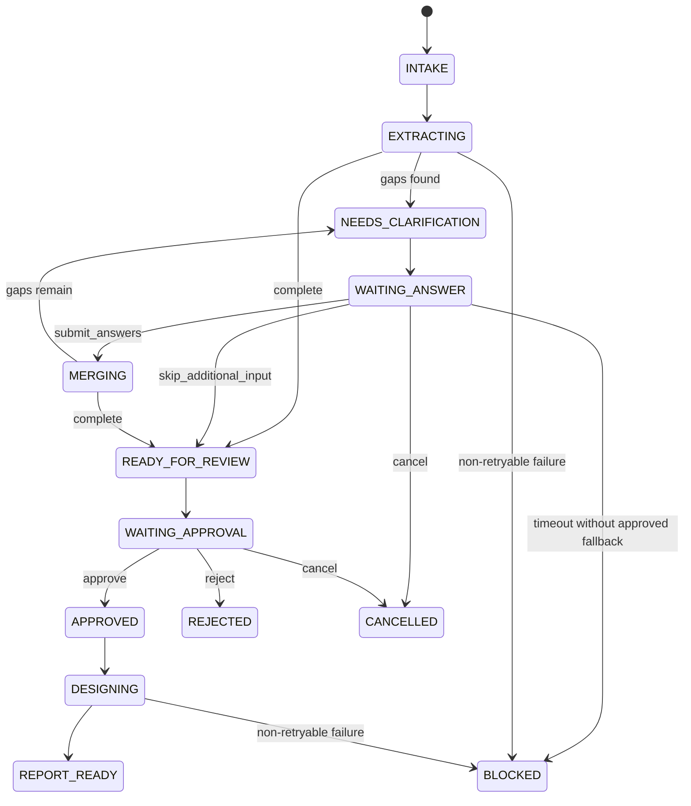

# 업무 방식 정의 및 Agent 설계 시스템 상세 기술 명세서

| 항목 | 값 |
| --- | --- |
| 문서 버전 | `0.5.0` |
| 문서 상태 | `implemented-local-validation` |
| 작성 기준일 | `2026-08-30` |
| 대상 런타임 | Langflow OSS `1.11.x`, 검증 기준 `langflow==1.11.1` |
| 프로젝트 | `business_work_design_agent` |
| 구현 상태 | Langflow Flow 5개, Standalone Component 34개와 Report companion API가 구현됨. F10은 최대 3회의 Playground native HITL 입력 보완과 최종 승인을 거쳐 MongoDB 권위를 재검증하고 Langflow Run Flow direct mode로 F20을 연속 실행함 |
| Custom Component 정책 | Standalone one-file, 로컬/형제 모듈 import 금지 |
| 주 저장소 | MongoDB + Vector/Search index |

## 0. 문서의 해석 규칙

이 문서는 기존 `business_agent_design`을 업그레이드하는 문서가 아니다. 같은 문제 영역에서 검증 가치가 있는 개념은 참고하되, Langflow 1.11을 기준으로 **새 Flow, 새 Component, 새 상태 계약을 만드는 설계서**다.

표현은 다음 세 단계로 구분한다.

- **확인된 사실**: 현재 로컬 파일, Langflow 1.11 공식 문서·소스 또는 지정한 GitHub commit에서 확인한 내용
- **구현 결정**: 이 신규 시스템에서 따라야 할 고정 설계
- **확인 필요**: 사내 배포 환경, 인증, MongoDB 버전처럼 구현 전에 운영자가 확정해야 할 내용

기존 로컬 비교 기준은 [Business Agent Design 구현 명세](../../agent_ground/business_agent_design/BUSINESS_AGENT_DESIGN_IMPLEMENTATION_SPEC.md)와 [프로젝트 마스터 가이드](../../agent_ground/AGENT_GROUND_PROJECT_MASTER_GUIDE.md)다. 기존 구현은 Langflow 1.9.2 대상이므로 Flow JSON과 Component template을 재사용하지 않는다.

---

## 1. 목표와 최종 사용자 경험

### 1.1 시스템 목표

사용자가 자연어로 자신의 업무를 설명하면 시스템이 다음 순서로 결과를 만든다.

1. 설명에서 업무 목적, 담당자, 입력, 절차, 판단, 예외, 시스템, 결과와 위험을 추출한다.
2. 빠진 정보와 충돌을 판단한다.
3. 최대 세 번의 HITL 보완을 하며, 1·2차에는 최대 세 개·마지막 3차에는 최대 네 개의 쉬운 질문으로 답변을 기존 업무 정의에 병합한다.
4. 사용자가 확정한 업무 방식을 순서와 분기가 있는 graph로 만든다.
5. 추가 설계 프롬프트와 사내 Langflow 자산 카탈로그를 함께 사용해 구현 방식을 설계한다.
6. `.py` Component와 `.json` Flow 후보를 hybrid search로 찾고 추천 근거를 남긴다.
7. 현재 업무와 개선 업무, Langflow 구현 blueprint를 반응형 보고서로 제공한다.
8. 사용자가 graph node를 누르면 현재 업무 상세, 개선 방향, 추천 자산, 연결 방식, 검증 기준을 같은 패널에서 확인할 수 있게 한다.

### 1.2 한 문장 제품 정의

> “내 업무를 말로 설명하면, 부족한 내용을 다시 물어 확정된 업무 Flow로 만들고, 사내 Langflow 자산을 근거로 Agent 구현 방법과 개선안을 설계해 주는 Agent.”

### 1.3 핵심 사용자

- 자신의 업무를 Agent화하고 싶지만 Langflow 구성 요소를 잘 모르는 일반 사용자
- 팀의 업무 방식과 개선안을 검토하는 업무 전문가·관리자
- 추천된 설계를 실제 Langflow Flow로 구현하는 Builder
- 사내 Component/Flow 메타데이터를 운영하는 카탈로그 관리자

### 1.4 비목표

초기 버전은 다음을 하지 않는다.

- 업로드된 `.py` 코드나 `.json` Flow를 자동 실행·설치하지 않는다.
- 메타데이터에 없는 포트, 인증 방식, 패키지를 LLM이 만들어 내도록 하지 않는다.
- 승인 없이 메일 발송, DB 쓰기, 외부 시스템 변경을 실행하지 않는다.
- 전체 2만~3만 줄 카탈로그를 LLM prompt에 넣지 않는다.
- LLM이 생성한 HTML·JavaScript·CSS를 그대로 실행하지 않는다.
- `boi-wiki-local`을 MCP 서버 구현으로 간주하지 않는다.
- Langflow 1.9.2 donor JSON이나 edge handle 인코딩을 1.11에서 재사용하지 않는다.

---

## 2. 선행 구현과 외부 참고에서 가져올 것

### 2.1 기존 `business_agent_design`에서 보존할 개념

기존 구현에서 다음 개념은 유지한다.

- 업무 이해 LLM과 Agent 설계 LLM을 분리한다.
- LLM 응답 다음에는 항상 결정론적 Normalizer/Validator를 둔다.
- AS-IS와 TO-BE를 `nodes`, `edges`, `branch_label`, `condition`이 있는 graph JSON으로 표현한다.
- 변경 상태를 `unchanged`, `modified`, `added`, `human_review`, `removed`로 구분한다.
- 추천 자산마다 ID, 버전, 검색 근거와 trace를 남긴다.
- HTML은 고정 renderer가 escape한 데이터만 사용해 만든다.
- 보고서의 flow node와 improvement detail을 stable ID로 연결한다.
- canonical Python/Prompt에서 Flow JSON을 생성하고 embedded source 동기화를 검사한다.

새 구현에서 반드시 보완할 부분은 다음과 같다.

- 현재 구현의 “추가 질문 목록 표시”를 실제 재질문·답변 병합·revision 저장으로 바꾼다.
- 단순 Python 단어 교집합 검색을 lexical/vector/exact/filter/relation hybrid search로 교체한다.
- 카탈로그 업로드에서 사용자가 준 모든 원본 필드와 원본 text를 보존한다.
- `metadata_only` 추천과 `import_ready` 설계를 명확히 분리한다.
- production에서 MongoDB 장애 시 demo seed로 자동 전환하지 않는다.
- node 내부 버튼뿐 아니라 node 전체를 클릭·키보드 선택 가능하게 한다.

### 2.2 `boi-wiki-local`에서 가져올 계약 개념

검토 기준은 공개 저장소의 commit [`afb6e78`](https://github.com/chokukil/boi-wiki-local/commit/afb6e78a5d6a53cf112853e0a41de846862cdc85)이다.

다음 개념을 신규 시스템 언어로 재구성한다.

| 원본 개념 | 신규 시스템 적용 |
| --- | --- |
| 자연어 업무 설명에서 Harness 구성 | 자연어에서 `WorkDefinition` 생성 |
| 부족하면 전문용어 없이 회차별 제한 질문 | `ClarificationQuestionBatch`의 1·2차 `max_questions=3`, 마지막 3차 `max_questions=4` |
| Audit → Frame → Reuse → Roles/DAG → Boundary → Build → Validate → Evolve | Intake → Define → Search → Blueprint → Approve → Render → Evaluate |
| Capture → Distill → Query → Lint → Review | 원문 보존 → 구조화 → 검색 → 계약 검증 → HITL 확정 |
| 역할·DAG·hash-bound handoff | 역할, edge, artifact hash, revision 기반 blueprint |
| Missing evidence remains unknown | 모든 필드에 `confirmed/inferred/unknown/conflicting` 상태 저장 |
| Preview 후 승인, 내용 변경 시 승인 무효 | `preview_hash`와 `approved_hash`가 다르면 재승인 |
| Single/Reduced/Full/No-team | 단일 Flow, Agent+reviewer, 다중 역할, 외부 orchestration 대안 |
| 가장 작은 책임 계층만 수정 | prompt/validator/retrieval/runtime 결함을 분리해 개선 |

주요 참고 파일:

- [boi-harness-builder SKILL](https://github.com/chokukil/boi-wiki-local/blob/afb6e78a5d6a53cf112853e0a41de846862cdc85/.agents/skills/boi-harness-builder/SKILL.md)
- [Harness 설계 결과 template](https://github.com/chokukil/boi-wiki-local/blob/afb6e78a5d6a53cf112853e0a41de846862cdc85/.agents/skills/boi-harness-builder/references/harness-design-template.md)
- [Architecture selection](https://github.com/chokukil/boi-wiki-local/blob/afb6e78a5d6a53cf112853e0a41de846862cdc85/.agents/skills/boi-harness-builder/references/architecture-selection.md)
- [Langflow connector planner](https://github.com/chokukil/boi-wiki-local/blob/afb6e78a5d6a53cf112853e0a41de846862cdc85/.agents/skills/boi-langflow-connector-planner/SKILL.md)
- [MCP connection descriptor](https://github.com/chokukil/boi-wiki-local/blob/afb6e78a5d6a53cf112853e0a41de846862cdc85/templates/mcp/boi-wiki-mcp-connection.json)

해당 commit에는 루트 `LICENSE`, `COPYING`, `NOTICE` 또는 SPDX 표기가 확인되지 않았다. 따라서 본 프로젝트는 아이디어와 계약 원칙만 출처와 함께 참고하며 SKILL 본문, template, script, 코드를 복사하지 않는다. 직접 재사용이 필요하면 작성자 허락 또는 사내 오픈소스 절차를 먼저 확인한다.

### 2.3 MCP, SKILL, HARNESS를 시스템 안에서 해석하는 방식

이 세 가지를 한 종류의 파일로 취급하지 않는다.

| 개념 | 이 시스템에서의 역할 | 런타임 형태 |
| --- | --- | --- |
| MCP | 외부 시스템의 tool/resource/prompt 계약 | 선택적 MCP client 또는 gateway adapter |
| SKILL | 업무를 이해·질문·설계하는 재사용 지침 | versioned Prompt Template + trigger/near-miss metadata |
| HARNESS | 역할, DAG, 산출물, 검증, 실패·재개를 묶는 실행 계약 | Flow graph + schema validator + test/eval pack |

`boi-wiki-local` 저장소는 MCP 연결 descriptor와 Skill/Harness 계약을 제공하지만 MCP 서버 구현체는 아니다. 실제 MCP를 연결할 때는 endpoint를 Git repository에서 추정하지 않고, `initialize → tools/list → 필수 tool 확인`을 통과한 연결만 사용한다. 연결 검사 중 검색·쓰기·실행 tool은 호출하지 않는다.

Skill 신뢰 경계는 다음처럼 고정한다.

- 업로드 catalog의 Skill 설명, README, 임의 prompt text는 untrusted data이며 instruction으로 적용하지 않는다.
- 관리자 승인 `skill_registry`의 ID/version/hash가 일치한 Skill만 고정 system policy 아래의 구분된 `approved_skill_context`에 prompt instruction으로 주입할 수 있다.
- 승인 Skill도 system safety policy, tool allowlist, secret/ACL, Human gate를 덮어쓸 수 없다.
- Skill 안의 Python/shell 실행, 동적 tool 추가, secret 조회·전송 지시는 실행하지 않는다. 실제 tool 호출은 별도 Agent allowlist와 runtime approval 계약으로만 결정한다.

### 2.4 SOPAX Web에서 참고하는 시각화 범위

로컬 `ai-sop-md-sopax-sop-ui`는 화면 복제 대상이나 runtime dependency가 아니다. 이 프로젝트는 해당 Web의 업무 도메인, API, 저장 구조, 편집 동작을 가져오지 않고 다음 **시각 문법**만 참고한다.

- 유형이 드러나는 카드형 node와 node 밖의 input/output port
- SVG 연결선, 화살표, 조건별 색·선 종류와 edge label
- Tool과 Skill을 구분하는 badge, Skill을 접힌 black-box로 표현하는 방식
- 점선 group으로 관련 단계 또는 하위 Flow 범위를 묶는 방식은 향후 시각화 참고 항목이다. 현재 v1 view model은 `groups` metadata를 보존하지만 renderer는 group overlay·접기/펼치기를 그리지 않는다.
- pan, zoom, fit-to-view, 선택 node와 연결 경로 강조
- graph 옆의 상세 설명 영역이라는 정보 구조

다음 항목은 복제하지 않는다.

- 제조 업무에 고정된 category, Tool fixture, SOP hierarchy와 CRUD
- palette drag/drop, port wiring, resize, 삭제, 실행, 저장, import/export 같은 편집기 기능
- 인증, executor, Human Task API, Skill Market 저장 방식
- 고정 폭·최소 폭 layout과 작은 화면에서 detail을 숨기는 반응형 처리

본 시스템의 Report는 **읽고 분석하는 화면**이다. Langflow 개발 Canvas나 SOPAX 편집기를 재구현하지 않는다. node와 edge는 승인된 `WorkDefinition`과 `AgentBlueprint`의 projection이며, 사용자는 node를 눌러 현재 업무, 개선안, 구현 출처, 적용 Skill과 생성 요청 프롬프트를 확인한다.

---

## 3. Langflow 1.11 고정 설계

### 3.1 런타임 기준

구현 대상은 Langflow OSS `1.11.x`이고, 재현 가능한 개발·검증 기준은 `langflow==1.11.1`, `langflow-base==0.11.5`, `lfx==1.11.5`로 고정한다. 이후 1.11 patch를 올릴 때는 이 문서의 호환성 test suite를 다시 통과해야 한다.

- [Langflow 1.11 release notes](https://docs.langflow.org/release-notes)
- [Langflow 1.11.1 GitHub release](https://github.com/langflow-ai/langflow/releases/tag/v1.11.1)
- [Custom Component 공식 문서](https://docs.langflow.org/components-custom-components)
- [Human-in-the-Loop](https://docs.langflow.org/human-in-the-loop)
- [Human Input Component](https://docs.langflow.org/human-input)
- [Workflow API](https://docs.langflow.org/workflow-api)

환경 구축 시 `langflow`, `lfx`, `langflow-base`, Python 버전을 실제 설치 환경에서 출력해 위 고정값과 대조하고 검증 evidence에 기록한다.

### 3.2 Standalone Custom Component 계약

현재 32개 Custom Component를 포함해 모든 신규 Custom Component `.py`는 다음 조건을 만족해야 한다.

1. 파일 하나만 Langflow code editor에 붙여 넣거나 Flow JSON에 embed해도 로드된다.
2. `from .common import ...`, `from helpers import ...`, `sys.path` 조작을 금지한다.
3. 로컬 파일을 runtime module처럼 읽어 import하지 않는다.
4. 작은 helper와 schema constant는 해당 파일 안에 둔다.
5. 표준 라이브러리가 아닌 패키지는 manifest에 선언하고 대상 이미지에 명시적으로 설치한다.
6. secret, URI, token, 사내 주소를 코드에 하드코딩하지 않는다.
7. 구조화 데이터는 `Data`, 채팅 표면은 `Message`, 표는 `DataFrame` 등 typed wrapper를 사용한다.
8. Output method에 반환 타입을 명시한다.
9. 오류를 빈 성공값으로 바꾸지 않는다. `error_code`, `message`, `retryable`, `details`를 반환하거나 명확한 예외를 발생시킨다.
10. `self.status`와 민감정보가 제거된 `self.log()`로 상태를 남긴다.

권장 import 표면:

```python
from lfx.custom import Component
from lfx.io import DataInput, FileInput, HandleInput, MessageTextInput, Output, SecretStrInput
from lfx.schema import Data, Message
```

공식 문서는 `lfx` import path가 Langflow 1.7부터 기본 경로가 되었음을 설명한다. 구현에서는 1.11의 public `lfx` 표면만 사용하고 내부 private module import는 피한다.

`LANGFLOW_COMPONENTS_PATH` 방식으로 배포하면 공식 loader가 category 폴더와 최소 `__init__.py`를 요구한다. 이는 배포 등록용이다. 각 Component 본문은 여전히 다른 로컬 Python 파일에 의존하지 않아야 한다. 사내 환경이 package import 자체를 허용하지 않으면 code editor/embedded Flow source 방식을 사용한다.

저장소의 AST/import guard와 build 검증은 이 source 계약을 지속적으로 검사하지만 arbitrary Python을 안전하게 실행하는 sandbox는 아니다. 운영에서는 관리자 code review, allowlist image, 최소 OS/network 권한과 secret 격리를 함께 적용한다.

### 3.3 Langflow 1.11 HITL의 정확한 사용 범위

확인된 1.11 동작:

- `Human Input`은 flow를 pause하고 checkpoint를 만든다.
- 각 User Action은 branch output이 된다.
- action을 선택하면 선택한 branch만 실행된다.
- timeout/fallback을 설정할 수 있다.
- Workflow API로 pending request 조회와 resume이 가능하다.
- nested `Run Flow`, subflow, flow-as-tool 대상에는 HITL을 넣을 수 없다. gate는 parent flow에 둬야 한다.

중요한 제약:

> Langflow 1.11의 기본 `Human Input`은 자유서술 질문 폼이 아니라 `prompt + action choices` 기반 분기 노드다.

공식 component parameter는 `prompt`, `decisions`, `timeout`, `enable_fallback`이며, [v1.11.1 source](https://github.com/langflow-ai/langflow/blob/v1.11.1/src/lfx/src/lfx/components/flow_controls/human_input.py)는 resume 시 `action_id`로 branch를 고른다. 따라서 질문에 대한 긴 답변을 기본 `Human Input`만으로 받는다고 설계하지 않는다.

본 시스템의 구현 결정은 다음과 같다.

- 기본 `Human Input`은 최종 `승인`, `거절`, `중단`처럼 선택만 필요한 결정에 사용한다.
- 자유서술 재질문은 standalone `42_f10_clarification_answer_gate.py`가 native `node_input` pause payload의 `schema`를 생성해 같은 Playground 카드에 질문별 입력칸으로 표시한다. 답변 제출 시 Langflow가 돌려주는 `{action_id, values}`를 42가 원래 `question_id` 기준 답변으로 복원한다. 사용자가 `skip_additional_input`을 선택하면 42는 empty answer가 아닌 현재 card 전체의 native skip event를 만든다.
- F10은 질문 회차를 최대 3회로 고정하며, 1·2차는 최대 3문항·마지막 3차는 최대 4문항으로 부족한 필수 정보를 수집한다. `39`가 제출 답변을 `clarification_batches`에 기록·검증하고 마지막 3차의 네 번째 입력까지 답한 뒤에도 필수 정보가 부족하면 `CLARIFICATION_ROUND_LIMIT`으로 차단한다. 명시적 skip은 audit과 `unresolved`를 남겨 review로 보내며 `Cancel`이나 4차 질문으로 바꾸지 않는다. 별도 Answer Form/API나 Chat Input 재실행 경로는 사용하지 않는다.
- 최종 승인 뒤 F20은 F10의 Langflow `Run Flow` direct mode(`tool_mode=false`)가 호출한다. F20 child에는 `Human Input`을 넣지 않는다.
- `schema` 기반 Playground 입력칸은 Langflow 1.11.1 local runtime에서 source/template 검증과 native pause payload 테스트를 통과한 계약이다. 실제 배포 전에는 사내 Langflow UI에서 suspend/resume E2E를 추가 확인한다.

### 3.4 Workflow API 사용 계약

Langflow 1.11 API에서 사용할 표면:

```text
POST /api/v2/workflows
GET  /api/v2/workflows/pending?flow_id={flow_id}
GET  /api/v2/workflows/{job_id}/events
POST /api/v2/workflows/{job_id}/resume
```

resume 요청의 최소 개념 형식:

```json
{
  "request_id": "<pending request id>",
  "decision": {
    "action_id": "submit_answers"
  }
}
```

F10 실행 요청은 1.10 형식이 아니라 1.11 형식의 `input_value`, `mode`, `stream_protocol`, `tweaks`, `session_id`를 사용한다. 이 `session_id`는 UI에 보이는 Component 10 입력이 아니라 workflow caller가 run마다 설정하는 Langflow 실행 키이며 Component 10이 graph runtime에서 읽는다. API client contract test로 실제 OpenAPI와 payload를 다시 검증한다. F10이 F20을 실행할 때는 이 HTTP 표면을 다시 호출하지 않고 Canvas의 `Run Flow` component를 사용한다.

---

## 4. 전체 논리 아키텍처

### 4.1 시스템 경계



### 4.2 Flow 분리 원칙

| Flow | 실행 주체 | 역할 | HITL |
| --- | --- | --- | --- |
| `F00_catalog_file_vector_ingest` | 관리자 | JSON/JSONL 파일 1개를 Loader·Chunker·Embedding Model·MongoDB Writer로 처리 | 없음 |
| `F10_work_definition_parent` | 일반 사용자 | 자연어 업무 정의, 재질문, 답변 병합·확정, MongoDB 권위 재검증, Run Flow로 F20 연속 실행 | 포함. 항상 최상위에서 실행 |
| `F20_agent_blueprint_design` | F10의 Run Flow | `agent-design-invocation/v1`을 검증하고 승인 업무·ACL·snapshot·추가 설계 prompt scope 고정, hybrid retrieval, blueprint 생성·검증 | 포함 금지 |
| `F30_responsive_report` | F20 이후 | view model, 안전한 HTML, 저장·URL 반환 | 포함 금지 |
| `F90_search_evaluation` | 운영·QA | 대표 질문 세트로 retrieval 품질 평가 | 없음 |

F20은 재사용 가능한 child Flow로 유지하되 F10의 `Run Flow`가 direct mode(`tool_mode=false`)로 호출한다. F10의 verified `Approve` 뒤 Component 36이 MongoDB canonical 승인본, active catalog pointer, active Skill registry와 인증 owner/groups를 다시 읽어 `agent-design-invocation/v1` 하나를 만든다. Component 36은 같은 Data에 strict JSON `text` projection을 포함하고 built-in TypeConverter가 이를 Message로 변환해 Run Flow의 동적 F20 ChatInput port로 전달한다. F20 ChatInput은 `should_store_message=false`다. 사용자가 WorkDefinition을 복사해 F20을 별도로 실행하지 않는다. F20/F30에는 `Human Input`과 `Requires approval` tool을 넣지 않으며 다른 Flow의 HTTP API를 호출하는 adapter도 두지 않는다.

### 4.3 신규 구현 디렉터리

```text
business_work_design_agent/
  README.md
  manifest.json
  docs/
    TECHNICAL_SPECIFICATION.md
    CUSTOM_COMPONENT_GENERATION_PROMPTS.md
    DATA_CONTRACTS.md
    HITL_STATE_MACHINE.md
    OPERATIONS_GUIDE.md
  schemas/
    catalog_upload.schema.json
    catalog_asset.schema.json
    work_definition.schema.json
    clarification_batch.schema.json
    skill_registry.schema.json
    agent_blueprint.schema.json
    report_view_model.schema.json
  prompts/
    work_extraction.md
    clarification_planner.md
    catalog_reranker.md
    agent_blueprint.md
  components/
    catalog_ingestion/
    work_definition/
    hybrid_retrieval/
    agent_blueprint/
    report/
  flows/
    F00_catalog_file_vector_ingest.json
    F10_work_definition_parent.json
    F20_agent_blueprint_design.json
    F30_responsive_report.json
    F90_search_evaluation.json
    00_business_work_design_ALL_FLOWS.json
  services/
    hitl_form_api/
    report_api/
  scripts/
    build_langflow_1_11_flows.py
    validate_langflow_1_11_runtime.py
    render_sample_report.py
  tests/
  samples/
```

Flow 전용 Python node는 공용 Component catalog에 자동 등록하지 않는다. 다른 Flow에서도 독립적으로 재사용할 수 있는 안정된 입력·출력 계약을 갖춘 경우에만 별도 승인 후 shared Component로 승격한다.

---

## 5. End-to-End 사용자 여정

### 5.1 일반 사용자

1. 사용자가 한 칸에 업무를 자연어로 설명한다.
2. 필요하면 “Agent 설계 시 추가로 고려할 내용”을 별도 입력한다.
3. 시스템은 원문을 변경하지 않고 request envelope에 저장한다.
4. LLM이 업무 후보 구조를 만들고 Normalizer가 schema를 검증한다.
5. Completeness Evaluator가 blocking gap, risk gap, contradiction을 찾는다.
6. 질문이 필요하면 1·2차에는 최대 세 문항, 마지막 3차에는 최대 네 문항을 쉬운 한국어로 제시한다.
7. 사용자는 F10 Playground의 질문 카드에서 답변을 채운 뒤 `Submit Answers`를 선택해 같은 suspended workflow를 resume한다. 현재 줄 수 있는 정보가 없으면 **`추가 입력 건너뛰기`**를 선택할 수 있고, 이는 `Cancel`과 다르다.
8. 답변 제출 시에만 field별 provenance를 유지하며 기존 업무 정의에 병합된다. 건너뛰기 시에는 답을 만들지 않고, 건너뛴 질문과 미확정 항목을 audit/`unresolved`에 남긴다.
9. 답변 제출 후 마지막 3차의 네 번째 입력까지 답했는데도 blocking gap이 있으면 답변 반영 단계가 `CLARIFICATION_ROUND_LIMIT`로 차단하며, 새 실행에서 업무 설명을 보완한다. 건너뛰기는 현재 card에서 바로 Preview/review로 가는 action이며 4차 질문이 아니다.
10. 시스템은 확정 전 업무 graph와 가정·미확정 사항을 preview한다.
11. 사용자가 `확정`, `거절`, `취소`를 선택한다. 수정이 필요하면 승인 전에 반영하거나 취소 후 새 session을 시작한다.
12. 확정 시 Component 36이 MongoDB canonical 승인본·active catalog/Skill·인증 owner/groups를 다시 검증하고, F10의 Run Flow가 F20을 바로 실행한다.
13. hybrid search가 관련 Flow/Component를 찾고 설계 LLM에는 압축된 top-N만 전달한다.
14. Contract Validator가 추천 자산, 포트, dependency, risk를 검증한다.
15. 반응형 report와 짧은 Chat Output을 반환한다.

### 5.2 카탈로그 관리자

1. JSON array, `{ "items": [...] }` 또는 JSONL 파일을 업로드한다.
2. `00 Catalog JSON Loader`가 파일 형식·크기·record 수를 검증하고 JSON/JSONL을 파싱한다.
3. Loader가 각 record를 정규화하고 secret 값을 redaction한 `raw_text_redacted`와 deterministic canonical text를 만든다.
4. `01 Deterministic Chunker`가 canonical text를 설정된 chunk size/overlap으로 bounded 분할한다.
5. built-in `Embedding Model`에서 승인 model/provider를 선택하고 `02 MongoDB Catalog Vector Writer`에 Embeddings handle을 연결한다. advanced `Dimensions`는 provider가 output-size override를 의도적으로 지원할 때만 설정하고, 그 외에는 비워 둔다.
6. Writer가 runtime class·승인 model ID·첫 vector의 실제 dimension·fingerprint로 `embedding-runtime-contract/v2`를 만든 뒤 parent document는 `catalog_assets`, nested vector chunk는 `catalog_asset_chunks.embedding.vector`에 같은 `snapshot_id`로 bulk upsert한다.
7. record·chunk 수, duplicate key, finite vector, 실제 dimension과 runtime contract 누락 여부를 검증한다.
8. 모든 parent/chunk write가 성공한 뒤에만 `catalog_active_pointers`를 새 snapshot으로 갱신한다.
9. `Data to Message`와 `ChatOutput`을 통해 적재 결과와 실패 진단을 반환한다. F00에는 HITL이나 별도 activation 단계가 없다.

### 5.3 Builder

Builder는 report에서 다음을 확인한다.

- 추천 구현 패턴과 선택 이유
- 실제 추천 Flow/Component ID와 버전
- `technical_contract_status=metadata_only` 자산과 `build_readiness=import_ready` 설계의 구분
- node별 input/output, config, secret, permission, risk
- 연결표와 연결 불가 이유
- Human review 위치
- smoke test와 acceptance checklist

---

## 6. 업무 정의와 HITL 상세 계약

### 6.1 `WorkDefinition`의 최소 의미 모델

업무 정의는 LLM의 서술문이 아니라 versioned JSON document를 기준으로 저장한다. 최상위 필드는 다음과 같다.

| 필드 | 내용 |
| --- | --- |
| `work_definition_id` | 업무 정의의 불변 ID |
| `team_name`, `employee_id` | F10 화면에서 받는 팀 명·사번. 업무 표시·감사 메타데이터로 함께 저장 |
| `tenant_id`, `owner_id` | 내부 격리와 권한 판정에 사용하는 식별자. 현재 tenant는 공용 `default`, owner는 사번에서 유도 |
| `session_id` | 사용자가 입력하지 않는 내부 실행/재개 ID. Component 10이 Langflow graph session을 사용해 pending Human Input과 고정 |
| `revision` | 병합할 때마다 1씩 증가하는 optimistic-lock revision |
| `status` | 6.4의 상태 중 하나 |
| `source_requests[]` | 사용자가 입력한 원문, 언어, turn ID, 입력 시각 |
| `goal` | 업무가 만들어야 하는 결과와 목적 |
| `trigger` | 업무가 시작되는 사건·주기·요청 |
| `scope_in`, `scope_out` | 포함·제외 범위 |
| `actors[]` | 수행자, 승인자, 수신자, 시스템 역할 |
| `systems[]` | 사용하는 시스템, API, 파일, DB, 인증·권한 상태 |
| `inputs[]`, `outputs[]` | 입력/출력의 이름, 형식, 민감도, 필수 여부 |
| `steps[]` | 순서, 수행자, 행위, 입력, 출력, 사용 시스템, 소요시간, evidence |
| `decisions[]` | 조건, true/false 또는 다중 branch, 판단 주체, 근거 |
| `exceptions[]` | 실패 조건, 처리, retry, escalation, 종료 상태 |
| `frequency_volume` | 빈도, 건수, peak, 처리 시간 |
| `sla` | 기한, 응답·처리 시간, 지연 허용 기준 |
| `pains[]` | 반복·병목·오류·검색 비용·수작업 지점 |
| `risks_controls[]` | 보안, 개인정보, 승인, 감사, 데이터 변경 위험 |
| `constraints[]` | 사내망, 설치 제한, 허용 모델, 예산, 실행 시간 |
| `success_criteria[]` | 측정 가능한 완료·품질·효율 기준 |
| `automation_intent` | 보조, 반자동, 완전자동 중 기대 수준과 금지 행동 |
| `assumptions[]`, `unresolved[]` | 사용자가 수용한 가정과 남은 미확정 사항 |
| `as_is_graph` | 사용자가 확정한 현재 업무의 `nodes[]`, `edges[]`, branch/condition |
| `preview_hash`, `approved_hash` | 승인 무결성 계약 |

`source_requests[]`는 provenance를 위해 원문을 보존하지만 일반 검색·report projection은 아니다. Component 10은 저장 전에 request와 additional prompt에서 credential assignment, bearer/basic token, JWT, private key, credential URL을 탐지해 `WORK_REQUEST_SECRET_MATERIAL_DETECTED`로 차단하고 값은 오류에 되돌리지 않는다. production의 `work_definitions`와 event 저장소는 tenant+owner read ACL, encryption at rest/KMS, access audit, 업무 원문용 retention·delete/legal-hold 정책을 별도로 적용해야 한다. Component 20은 `source_requests`를 design scope에서 제거하므로 embedding/search/report로 원문이 전달되지 않는다.

중요한 사실 필드는 값만 저장하지 않고 다음 공통 구조를 갖는다.

```json
{
  "value": "GoodDocs의 처리 상태를 매일 갱신한다",
  "status": "confirmed",
  "evidence_turn_ids": ["turn-001", "turn-004"],
  "confidence": 1.0,
  "last_updated_revision": 4
}
```

`status` 허용값은 `confirmed`, `inferred`, `unknown`, `conflicting`이다. LLM이 추론한 내용을 `confirmed`로 승격할 수 없으며, 사용자의 답변이나 승인 규칙만 승격 권한을 가진다. `confidence`는 우선순위 보조값일 뿐 사실 여부를 대신하지 않는다.

### 6.2 Graph 계약

`steps[]`와 `decisions[]`에서 생성되는 `WorkDefinition.as_is_graph`의 기본 구조는 다음과 같다. 개선 후 구조는 이 단계에서 추측하지 않고 `AgentBlueprint.to_be_graph`가 소유한다.

```json
{
  "nodes": [
    {
      "id": "step_receive_mail",
      "kind": "task",
      "label": "대상 메일 수집",
      "actor_ref": "actor_owner",
      "step_ref": "step-01",
      "change_state": "modified",
      "detail_ref": "detail-step-01"
    }
  ],
  "edges": [
    {
      "id": "edge_01_02",
      "source": "step_receive_mail",
      "target": "decision_has_attachment",
      "branch_label": "수집 완료",
      "condition": null
    }
  ]
}
```

노드 유형은 `start`, `task`, `decision`, `human_review`, `system_call`, `subflow`, `end`, `exception`으로 제한한다. edge는 존재하는 node만 참조해야 하고, `decision` node의 모든 outgoing edge에는 사람이 읽을 수 있는 `branch_label`과 기계 검증용 `condition` 또는 명시적인 `default=true`가 있어야 한다. Normalizer는 orphan, cycle, 도달 불가능 node, 종료점 없는 branch를 검사한다. 반복 업무처럼 의도한 cycle은 `loop_policy`와 최대 횟수 또는 종료 조건이 있을 때만 허용한다.

### 6.3 부족 정보 판정과 질문 정책

Completeness Evaluator는 LLM 단독 점수가 아니라 필드 규칙과 graph 검사를 함께 사용한다.

다음 중 하나면 설계를 바로 확정하지 않는다.

- 목적, trigger, 핵심 입력, 핵심 출력, 주요 수행자 중 하나가 `unknown`
- 단계 순서 또는 분기 조건이 서로 충돌
- 외부 시스템에 쓰기·발송·승인·개인정보 처리가 있으나 권한과 Human review 위치가 없음
- 실패 시 처리, SLA 또는 성공 기준이 없어 구현 선택이 달라짐
- 사용자가 말한 범위와 automation intent가 충돌
- 추천 자산 검색에 필요한 핵심 시스템/데이터 이름이 모호함

질문 생성 정책:

1. 1·2차에는 최대 3문항, 마지막 3차에는 최대 4문항을 생성한다. 네 번째 HITL 회차는 생성하지 않는다.
2. `safety/approval → branch/blocker → input/output contract → quality` 순으로 우선한다.
3. 한 문항에서 한 사실만 묻고, 사내 전문용어를 사용자가 먼저 쓰지 않았다면 풀어서 표현한다.
4. 이미 확인된 사실을 다시 묻지 않는다.
5. 선택지가 명확하면 선택지와 “직접 입력”을 함께 제공한다.
6. 질문마다 답이 채울 `target_paths[]`와 질문 이유를 내부적으로 기록한다.
7. 최대 기본 회차는 3이다. 이 값은 tenant policy로 조정할 수 있지만 무한 질문은 허용하지 않는다.
8. 사용자가 `skip_additional_input`을 명시적으로 선택하면 현재 card 전체를 건너뛴 사실과 target path를 audit/`unresolved`에 기록한 뒤 기존 정보만으로 review를 연다. 답을 추정하지 않고, `Cancel` 또는 새 회차로 해석하지 않는다.

`ClarificationQuestionBatch` 최소 계약:

```json
{
  "batch_id": "qb-uuid",
  "work_definition_id": "wd-uuid",
  "revision": 3,
  "expires_at": "2026-08-28T01:00:00Z",
  "questions": [
    {
      "question_id": "q-01",
      "text": "결과를 GoodDocs에 바로 저장해도 되나요, 아니면 담당자 확인 뒤 저장해야 하나요?",
      "target_paths": ["risks_controls", "steps"],
      "answer_type": "single_choice_with_text",
      "choices": ["바로 저장", "담당자 확인 후 저장"],
      "required": true,
      "reason_code": "WRITE_APPROVAL_UNKNOWN"
    }
  ]
}
```

### 6.4 상태 머신과 동시성



저장 가능한 상태는 `INTAKE`, `EXTRACTING`, `NEEDS_CLARIFICATION`, `WAITING_ANSWER`, `MERGING`, `READY_FOR_REVIEW`, `WAITING_APPROVAL`, `APPROVED`, `DESIGNING`, `REPORT_READY`, `REJECTED`, `CANCELLED`, `BLOCKED`다.

- 모든 변경은 `expected_revision`을 요구한다.
- revision이 다르면 덮어쓰지 않고 `409 REVISION_CONFLICT`를 반환한다.
- 같은 answer batch의 중복 제출은 idempotency key로 같은 결과를 반환한다.
- `skip_additional_input`도 별도 idempotency key를 가진 명시적 user action이다. `clarification_batches.skip_submission`, WorkDefinition `clarification_skip_history`, 질문별 `unresolved`/`unknown` provenance를 남기며 답변값을 만들지 않는다.
- 질문 가능 기한은 immutable `answer_deadline_at`으로 보존하고, 수락한 답변의 TTL purge `expires_at`은 현재 구현의 7일 보존 기간으로 연장한다. Loader는 현재 처리 시각이 아니라 `submitted_at < answer_deadline_at`을 검증한다.
- `text`, `single_choice`, `single_choice_with_text`, `multi_choice`, `boolean`, `number`는 실제 JSON type, choice membership, 크기와 finite 숫자 규칙으로 API와 Loader가 동일하게 검증한다.
- 만료됐거나 이미 처리된 Langflow pending request를 resume하지 않는다.
- 현재 구현에는 suspend된 pending request를 기한에 맞춰 자동 종료하는 expiry sweeper가 없다. production 전용 sweeper가 만료 batch와 pending request를 찾아 runtime `BLOCKED` 또는 `CANCELLED` 상태와 audit event를 기록하고, 재개 불가능 상태를 HITL 저장소와 Langflow Workflow API 양쪽에서 reconciliation해야 한다. 이 기능과 시간 기반 E2E 증거가 없으면 production readiness는 실패다.
- `self.ctx`나 Agent memory는 API 요청을 넘는 권위 있는 상태 저장소로 사용하지 않는다.
- 상태 변경 event에는 actor, 이전/새 상태, revision, content hash, trace ID를 남긴다.
- F10의 현재 Canvas는 별도 runtime-state 저장 node나 범용 result-gate node를 펼치지 않는다. 최초 저장·답변 반영·최종 승인 상태는 WorkDefinition의 revision CAS와 append-only event에 남기며, 질문 답변의 재조회·검증·병합·재평가는 `39 답변 반영·다음 단계`가 한 번에 수행한다.
- 각 standalone 단계는 `ok`, `status`, `error`, `work_definition`을 포함하는 결과 계약을 반환하고 실패 시 후속 branch를 열지 않는다. 검토 진입은 `40 검토 진입 Joiner`가 상호 배타적인 성공 결과 하나만 선택하며, 최종 취소·반려·차단은 `41 F10 결과 메시지`가 안전한 안내 메시지로 모은다.

### 6.5 Playground 질문 카드와 답변 반영

권장 production 경로는 다음과 같다.

```text
질문 batch 저장
  → 42 보완 답변 HITL이 native node_input `schema`로 질문별 입력칸 표시
  → 사용자가 Playground에서 Submit Answers / 추가 입력 건너뛰기 / Cancel 중 하나 선택
  → Submit: 42가 `{action_id, values}`를 question_id별 answer_submission으로 복원
  → Skip: 42가 현재 card 전체 question ID의 native skip event를 생성
  → 39 답변 반영·다음 단계가 Submit을 canonical batch에 답변 기록·검증·revision CAS 병합
  → 39은 Skip을 별도 audit과 unresolved/unknown provenance로 기록하고 review_path로 이동
  → Submit 경로만 completeness를 재평가해 다음 회차·검토·취소·차단 중 하나 선택
```

질문 회차는 Flow Canvas에서 최대 3회까지 명시적으로 펼쳐 구성한다. 각 회차는 `12 완전성 평가 → 질문 LLM → 13 질문 Batch → 42 보완 답변 HITL → 39 답변 반영·다음 단계`라는 같은 형태다. 1·2차 질문 카드에는 최대 3개, 마지막 3차 카드에는 최대 4개의 입력칸을 두어 10개 기본 completeness gap을 세 회 안에 수집할 수 있다. 42는 parent Flow에서 native pause를 만들며, 사용자는 답변 제출·명시적 추가 입력 건너뛰기·취소 중 하나를 선택한다. 답변 제출은 다음 회차, 검토, 취소, 차단 중 하나를 열고, 건너뛰기는 audit/`unresolved`를 남긴 정상 review 경로 하나만 연다. 마지막 3차의 네 번째 입력까지 답한 뒤에도 blocking gap이 남으면 같은 `39`가 `CLARIFICATION_ROUND_LIMIT`로 `BLOCKED`를 반환하며 새 질문 또는 가정 수용 경로를 만들지 않는다. 건너뛰기는 4차 질문이 아니며 답을 추정하지 않는다. 동적으로 무한 반복하거나 외부 API를 숨겨 결합하지 않는다.

업무 정의의 별도 실행형 구조화 command 경로는 두지 않는다. F10의 `Approve` 결과만 Component 36으로 전달되며, Component 36은 MongoDB canonical `APPROVED` WorkDefinition과 active catalog/Skill, 인증 owner/groups, exact `native_hitl` channel을 재검증한다. 그 성공 결과인 `agent-design-invocation/v1`만 strict JSON text→Message 변환 뒤 Langflow `Run Flow` direct node로 F20에 전달한다. 따라서 사용자는 승인 업무 JSON을 복사하거나 F20에 별도 input을 넣지 않으며, Component 36 실패 branch에서는 child가 실행되지 않는다.

### 6.6 Preview와 승인 무결성

`preview_hash`는 다음 원칙으로 만든 canonical JSON의 SHA-256이다.

- 포함: 업무 의미 필드, `as_is_graph`, assumptions, unresolved, scope, automation intent
- 제외: 화면 위치, 렌더링 스타일, 생성·조회 시각, trace ID
- object key 정렬, 배열은 의미상 정렬 가능한 것만 stable sort
- 사용자 수정, 답변 병합, `as_is_graph` 변경 시 새 hash 생성

승인 action은 현재 `preview_hash`를 `approved_hash`로 복사한다. 이후 의미 필드가 바뀌어 두 hash가 다르면 설계를 중단하고 재승인 상태로 되돌린다. Agent 설계 결과에는 반드시 사용한 `approved_hash`와 catalog `snapshot_id`를 기록한다.

---

## 7. 카탈로그 업로드와 MongoDB 저장 설계

### 7.1 입력 형식과 파싱

지원 형식은 UTF-8 기반의 다음 세 가지다.

- 하나의 JSON array
- `{ "items": [...] }` wrapper
- 한 줄에 한 object가 있는 JSONL

중괄호 object를 쉼표로만 나열한 fragment, Python literal, 실행 코드가 포함된 파일은 자동 보정하지 않는다. 파싱 오류는 line/record index, error code, 짧은 preview를 격리 report에 남기되 업로드 내용을 실행하지 않는다.

Langflow 파일 입력은 승인된 `FileInput`/내장 file 전달 경로와 `self.resolve_path` 계열의 접근 범위 검사를 사용한다. 사용자가 문자열로 입력한 임의 OS path를 직접 열지 않는다.

필수 필드는 `id`, `title`, `type`이다. 사용자 예시의 `description`, `category`, `version`, `stars_count`, `downloads_count`, `created_at`, `updated_at`, `readme`는 정규화 대상이다. 정의되지 않은 추가 필드는 secret redaction을 거친 `raw_record_redacted`에 보존한다. `type=py`는 `component`, `type=json`은 `flow`라는 검색용 파생값을 만들되 원래 `type` 값은 보존한다.

### 7.2 원문 안전 보존 수준

F00의 “원문 보존”은 검색과 재현에 필요한 record 수준의 안전 보존을 뜻한다.

1. 업로드 파일의 `sha256`, byte size와 record index를 source metadata로 기록한다.
2. 각 record의 모든 필드는 credential/token/password/private-key pattern을 redaction한 `raw_record_redacted`와 그 record의 안전한 JSON text인 `raw_text_redacted`에 보존한다. 탐지된 값은 field 자체를 삭제하지 않고 `[REDACTED]`와 redaction code로 대체한다.
3. 검색·청킹·embedding에는 정규화된 안전 필드로 만든 deterministic `lexical_text_redacted`와 `embedding_text_redacted`만 사용한다.

일반 vector collection에는 byte-exact 파일 원문이나 secret 원문을 저장하지 않는다. 별도의 원본 보관이 규정상 필요하면 사내 승인 object store/KMS/DLP 경계로 분리하며, 이는 F00의 MongoDB vector 적재 계약에 포함하지 않는다. F00은 업로드 내용을 코드나 지시로 실행하지 않는다.

### 7.3 Collection 모델

| Collection | 주요 목적 |
| --- | --- |
| `catalog_active_pointers` | tenant별 현재 활성 snapshot을 한 document로 지정 |
| `catalog_assets` | redacted 원본 record/text, 정규화 metadata, lexical text, 계약 상태 |
| `catalog_asset_chunks` | asset별 redacted lexical/vector search document와 parent 연결 |
| `work_definitions` | 업무 정의 최신 revision과 승인 상태. `source_requests`는 tenant+owner 제한, 암호화, retention 적용 |
| `work_definition_events` | append-only 상태·변경 audit trail. 원문 복제 최소화와 동일 ACL/KMS 적용 |
| `clarification_batches` | 질문, 답변, 만료, 제출 idempotency |
| `skill_registry` | 승인된 Skill ID/version/hash, trigger/near-miss, bounded prompt 본문과 ACL |
| `design_runs` | query plan, retrieval trace, blueprint, validation 결과 |
| `reports` + GridFS | report view model, HTML artifact, hash, 공개 범위 |

`catalog_assets` 예시:

```json
{
  "tenant_id": "tenant-a",
  "snapshot_id": "snap-20260827-001",
  "asset_id": "88c9f008-8256-431b-8691-59f8bb0bf4da",
  "asset_type": "component",
  "title": "HiQ1에서 데이터 검색하기",
  "version": "v1.0.7",
  "description": "...",
  "category": "RAG / Search",
  "readme": "...",
  "raw_record_redacted": {"id": "...", "title": "..."},
  "raw_text_redacted": "{\"id\":\"...\",\"title\":\"...\"}",
  "lexical_text_redacted": "title: ...\ntype: py\ndescription: ...\nreadme: ...",
  "source": {
    "record_index": 0,
    "file_sha256": "...",
    "file_size_bytes": 123456
  },
  "embedding_manifest": {
    "embedding_contract": {
      "schema_version": "embedding-runtime-contract/v2",
      "runtime_class": "package.module.EmbeddingRuntime",
      "model_id": "approved-provider/approved-model",
      "dimension": 1024,
      "fingerprint": "sha256:..."
    },
    "chunk_count": 1
  },
  "stars_count": 45,
  "downloads_count": 78,
  "technical_contract": {
    "status": "metadata_only",
    "inputs": [],
    "outputs": [],
    "dependencies": [],
    "verified_at": null
  },
  "relations": [],
  "acl": {"visibility": "tenant", "groups": []},
  "content_sha256": "..."
}
```

예시의 top-level `description`, `readme`를 포함한 모든 검색 projection도 redaction 이후 값이다. 암호화 원본의 값을 이 collection에 중복 저장하지 않는다.

vector는 별도 `catalog_asset_chunks`에 저장한다.

```json
{
  "tenant_id": "tenant-a",
  "snapshot_id": "snap-20260827-001",
  "asset_id": "88c9f008-8256-431b-8691-59f8bb0bf4da",
  "version": "v1.0.7",
  "asset_type": "component",
  "title": "HiQ1에서 데이터 검색하기",
  "category": "RAG / Search",
  "chunk_id": "whole",
  "chunk_ordinal": 0,
  "lexical_text_redacted": "title: ...\ndescription: ...\nreadme chunk: ...",
  "embedding_text_redacted": "...",
  "embedding": {
    "vector": [0.012, -0.034],
    "contract": {
      "schema_version": "embedding-runtime-contract/v2",
      "runtime_class": "package.module.EmbeddingRuntime",
      "model_id": "approved-provider/approved-model",
      "dimension": 1024,
      "fingerprint": "sha256:..."
    },
    "input_sha256": "..."
  },
  "acl": {"visibility": "tenant", "groups": []}
}
```

`technical_contract.status` 허용값:

- `metadata_only`: 제목·설명·README만 존재
- `ports_extracted`: 실제 Component source 또는 Flow JSON에서 포트를 추출했지만 실행 미검증
- `flow_graph_extracted`: Flow node/edge와 embedded Component 정보를 추출함
- `verified_runtime`: 고정한 Langflow 1.11.1 환경에서 import/smoke test를 통과함

사용자가 제공한 예시처럼 metadata만 있을 때 시스템은 후보와 조합 아이디어를 추천할 수 있지만, 실제 handle 연결이나 `build_readiness=import_ready` Flow를 보장하지 않는다.

`skill_registry`는 업로드 catalog의 자유 텍스트와 분리한다. 관리자 검토를 통과한 immutable version만 `active`로 표시하며 최소 `tenant_id`, `skill_id`, `name`, `version`, `prompt_sha256`, `trigger_rules`, `near_miss_rules`, `prompt_text`, `status`, `acl`, `approved_by`, `approved_at`을 저장한다. 같은 Skill의 본문이 바뀌면 version과 hash를 함께 올린다. F20의 선택·제외 결과는 `design_runs` retrieval trace에 기록하고 Report에는 승인된 필드만 투영한다.

### 7.4 Index와 유일성

최소 index:

- `catalog_assets`: unique `(tenant_id, snapshot_id, asset_id, version)`
- `catalog_assets`: filter `(tenant_id, snapshot_id, asset_type, category)`
- `catalog_assets`: exact/filter index on title, normalized aliases, type, category, technical fields
- `catalog_asset_chunks`: unique `(tenant_id, snapshot_id, asset_id, version, chunk_id)`
- `catalog_asset_chunks`: approved full-text/search index on `lexical_text_redacted`, title, category, technical fields
- `catalog_asset_chunks`: vector index on `embedding.vector`, active pointer runtime v2 contract의 `dimension`과 같은 고정 dimension, tenant/snapshot/ACL prefilter 가능 필드 포함
- `catalog_active_pointers`: unique `tenant_id` (현재 F00은 내부 고정값 `default` 하나만 사용하며 `catalog_id=internal-assets`도 문서에 함께 저장)
- `work_definitions`: unique `(tenant_id, work_definition_id)`
- `clarification_batches`: unique `(tenant_id, batch_id)`와 TTL용 `expires_at`
- `skill_registry`: unique `(tenant_id, skill_id, version)`와 filter `(tenant_id, status)`
- `design_runs`: `(tenant_id, work_definition_id, created_at)`

ACL이 있는 환경에서는 tenant와 visibility/group filter를 search 이후가 아니라 각 lexical/vector search 후보 생성 단계에 적용한다.

### 7.5 적재 pipeline

```text
00 Catalog JSON Loader
 → 업로드 파일 하나 입력 (`tenant_id=default`, `catalog_id=internal-assets`는 내부 고정)
 → 형식·크기·hash 검증, JSON array/items wrapper/JSONL 파싱
 → record schema 검증·정규화·original text redaction
 → canonical lexical/embedding text와 catalog bundle 생성
 → 01 Deterministic Chunker
 → chunk size/overlap·상한 적용과 chunk bundle 생성
 → 02 MongoDB Catalog Vector Writer
 → catalog_asset_chunks.embedding.vector / catalog_assets bulk upsert
 → 전체 write·count·dimension 검증
 → catalog_active_pointers 갱신
 → Data to Message
 → ChatOutput

Embedding Model (model/provider)
 → 02 MongoDB Catalog Vector Writer
```

- `00_catalog_json_loader.py`, `01_catalog_deterministic_chunker.py`, `02_catalog_mongodb_vector_writer.py`는 각각 로컬 프로젝트 모듈 import나 동적 import를 사용하지 않는 Langflow 1.11.1 Standalone Component다.
- F00은 실행 node 6개/edge 5개와 Canvas 설명용 Sticky Note 2개로 구성된다. Sticky Note에는 edge가 없으므로 실행 계약에는 포함되지 않는다. 다른 Flow나 Catalog Worker API를 HTTP로 호출하지 않으며, F00에는 Human Input/activation gate가 없다.
- Loader에는 파일만 표시하고 `tenant_id=default`, `catalog_id=internal-assets`는 내부적으로 bundle/MongoDB 문서에 넣는다. chunk size/overlap은 Chunker, 실제 model/provider/API key는 built-in Embedding Model, MongoDB URI/DB/collection은 Writer에 표시한다. Writer에는 model/version/dimension 입력이 없으며 runtime v2 contract를 vector 응답에서 만든다.
- built-in Embedding Model의 advanced `Dimensions`는 provider output-size override가 의도적으로 필요한 경우만 설정한다. Writer/검색 contract는 이 UI 값이 아니라 실제 반환 vector length를 사용한다.
- 파일 크기, 최대 record 수, chunk 크기·overlap, record별/전체 최대 chunk 수, 임베딩 호출 간격과 MongoDB write batch/연결·서버 선택 timeout을 input으로 제한해 단일 실행의 자원 사용을 bounded하게 유지한다.
- F00은 provider 호출마다 청크 정확히 1개를 전달한다. 임베딩 호출 간격의 기본값·하한은 1초, 상한은 60초이며 첫 호출 전에는 대기하지 않는다.
- `bulk_write(ordered=false)` 계열의 batch 중 하나라도 쓰기 오류를 반환하면 pointer 갱신 없이 전체 실행을 실패 처리한다.
- parse, normalization, embedding, parent/chunk write 중 하나라도 실패하면 `catalog_active_pointers`는 이전 snapshot을 유지한다.
- embedding provider 장애는 명시적 실패로 반환하고 production에서 lexical-only 적재로 조용히 전환하지 않는다.
- Canvas의 **테스트 실행 (저장하지 않음)**은 내부 `dry_run=true`로 provider/MongoDB를 호출하지 않는다. 따라서 runtime contract의 `state`는 `DEFERRED`, `snapshot_id`는 `null`이고 live snapshot을 예측하지 않는다.
- 모든 `catalog_assets`와 `catalog_asset_chunks` upsert 및 검증이 성공한 뒤에만 tenant의 pointer를 새 snapshot으로 원자 갱신한다.
- 동일 파일 재실행은 같은 deterministic record/chunk key를 사용해 upsert하며, 결과의 `file_sha256`, `snapshot_id`, record/chunk count와 오류 요약을 반환한다.

세 MongoDB collection은 각각 parent detail, 검색 chunk/vector, 게시 pointer를 담당한다. `catalog_assets`에는 exact title/alias 조회와 최종 상세 정보에 쓸 자산별 메타데이터·redacted 원문을 한 번 저장한다. `catalog_asset_chunks`에는 여러 검색 chunk와 `embedding.vector`를 저장해 lexical/vector 후보를 만든다. `catalog_active_pointers`는 parent/chunk/vector count가 모두 검증된 snapshot만 가리키므로 부분 적재 snapshot을 검색에서 배제한다.

Langflow built-in `MongoDB Atlas` component는 F00에서 사용하지 않는다. 고정 검증 런타임의 선택 의존성 import가 불완전하고, built-in의 기본 document/output 계약이 F20의 parent/chunk 분리, nested `embedding.vector`, active pointer 게시 계약과 일치하지 않는다. 별도 Writer node가 저장 단계를 Canvas에 드러내면서 이 계약을 유지한다.

### 7.6 Embedding 입력과 runtime contract 규칙

embedding text는 `title → type/category → description → readme → redaction된 전체 record JSON` 순서로 구성한다. title과 명시적 alias는 casefold·공백 규칙으로 별도 정규화한다. 숫자 popularity와 날짜는 embedding 본문보다 별도 ranking feature로 사용한다. 짧은 자산도 `chunk_id=whole`인 한 건을 `catalog_asset_chunks`에 저장한다. text가 provider 한도를 넘으면 경계 문자를 우선한 bounded overlap 방식으로 여러 chunk를 만들고 `catalog_assets` parent를 유지한다. chunk에는 `asset_id`, `version`, `asset_type`, `category`, `ACL`, `chunk_id`, `chunk_ordinal`, redacted lexical text를 기록한다. native fusion mode는 같은 `catalog_asset_chunks` collection에서 lexical/vector 결과를 먼저 fusion하고 그 뒤 `(asset_id, version)` parent로 collapse한다. application RRF mode는 parent lexical 후보와 parent로 collapse한 vector 후보를 결합할 수 있다. 두 mode 모두 최고 matched chunk와 snippet trace를 보존하며 최종 technical contract, ports, relations, popularity는 authoritative parent에서 다시 읽는다.

runtime class, 승인 model ID, dimension, normalization, distance metric 또는 fingerprint가 다른 vector를 같은 index에서 섞지 않는다. 모델 교체는 새 snapshot/index를 구축하고 검색 평가를 통과한 뒤 전환한다.

실제 provider/model/API key 선택은 F00/F20/F90 built-in Embedding Model node의 책임이며 세 node에는 같은 승인 provider/model을 설정한다. Langflow가 전달하는 Embeddings handle은 model/version을 표준 방식으로 안전하게 역조회할 수 있다는 보장이 없으므로, Writer와 query batcher는 configured `available_models` identity 또는 지원된 runtime metadata에서 model ID를 해석한다. `schema_version`, runtime class, model ID, 첫 vector의 실제 dimension과 secret 없는 fingerprint로 `embedding-runtime-contract/v2`를 만들며 model ID 해석 실패 또는 F00/F20/F90 contract 불일치는 fail-closed한다.

---

## 8. Hybrid Search 상세 설계

### 8.1 검색 입력

검색 query는 사용자의 마지막 한 문장만 쓰지 않는다. 승인된 `WorkDefinition`, 추가 설계 prompt, 필요한 시스템, 입력/출력, 단계별 capability를 사용해 다음 sub-query를 만든다.

- 전체 업무 목적 query
- 단계별 capability query
- 시스템/API/제품명 exact query
- `component` 후보 query와 `flow` 후보 query
- 위험·승인·보고처럼 별도 도구가 필요한 query

Query Planner는 먼저 Component 17과 같은 canonical semantic projection으로 승인 WorkDefinition의 hash를 재계산한다. 승인 뒤 의미 변경은 차단하고 raw source request, extension, 처리 batch, UI·시간·trace 필드는 scope에서 제거한다. 정상 hash로 재승인된 의미 필드라도 credential literal이나 secret-bearing key/value가 있으면 `WORK_DEFINITION_SECRET_MATERIAL_DETECTED`로 차단해 embedding/search query로 내보내지 않는다. 검증된 projection, tenant/ACL, active snapshot, 별도 추가 설계 prompt를 `agent-design-scope/v1`의 `design_scope_sha256`에 봉인한다. 각 query의 목적, 기대 asset type, 필수 filter를 구조화한 뒤 plan 전체를 `query_plan_sha256`으로 canonical hash하며, 검색 전에 사용자가 확인하지 않은 제품명을 임의로 추가하지 않는다. Component 19와 23은 design scope hash를 재계산하고 Component 21은 query plan hash를 재계산한다. Component 29는 두 lock을 vector 결과에 보존하고 Component 21은 query vector의 lock과 query plan lock이 모두 일치할 때만 검색한다.

### 8.2 후보 생성과 결합

```text
approved WorkDefinition
 → resolve tenant active snapshot + ACL/type/category filters
 → exact identity/alias match
 → lexical search top-K
 → vector search top-K
 → rank fusion
 → parent asset collapse
 → relation expansion
 → metadata quality guard
 → compact rerank top-N
 → recommendation + trace
```

기본 후보 폭은 lexical 50, vector 50, exact/alias 20이며 운영 평가로 조정한다. exact title/alias/asset-id lane은 normalized field를 가진 `catalog_assets` parent를 직접 조회해 multi-chunk 과대표현을 막는다. 각 vector sub-query는 독립 source로 실행하고 실제 후보에 기여한 query ID만 trace에 남긴다. lexical/vector 후보는 chunk 근거를 보존한 채 동일 tenant/snapshot/ACL filter의 authoritative parent로 enrichment하고, parent가 없는 후보는 제거한다. LLM reranker에는 중복 제거된 상위 20건의 필요한 필드만 전달한다. 전체 README 원문과 전체 카탈로그는 prompt에 넣지 않는다.

MongoDB가 지원하면 [native hybrid search와 rank fusion](https://www.mongodb.com/docs/vector-search/hybrid-search/hybrid-search-overview/)을 사용한다. 현재 공식 기준으로 `$rankFusion`은 MongoDB 8.0 이상, `$scoreFusion`은 8.3 이상이므로 배포 MongoDB의 실제 기능 수준을 startup에서 확인하고 다음 provider mode 중 하나를 명시적으로 선택한다.

- `native_rank_fusion`: 같은 `catalog_asset_chunks` collection의 lexical/vector pipeline을 `$rankFusion`으로 결합한 뒤 parent asset으로 collapse
- `native_score_fusion`: 같은 `catalog_asset_chunks` collection에서 점수 보정이 검증된 lexical/vector pipeline을 `$scoreFusion`으로 결합한 뒤 parent asset으로 collapse
- `application_rrf`: 서로 다른 parent/chunk query 결과를 각각 parent asset으로 collapse한 뒤 애플리케이션에서 reciprocal-rank fusion

`application_rrf` 기본 상수는 `k=60`으로 시작하되 대표 질문 평가로 보정한다. 지원하지 않는 operator를 호출했다가 임의 검색으로 fallback하지 않고 readiness에 실제 mode를 노출한다. native mode는 fusion pipeline에 score details를 요청·projection하고 MongoDB가 실제 반환한 contribution detail에서 query ID/source를 추출한다.

Mongo native fusion input pipeline은 같은 collection에서만 실행한다. 따라서 native mode에서 `catalog_assets` lexical 결과와 `catalog_asset_chunks` vector 결과를 직접 `$rankFusion`/`$scoreFusion`으로 결합하지 않는다. chunk 수가 많은 자산의 과대표현 가능성은 parent collapse 전후의 ranking evaluation으로 확인하고, 기준을 넘으면 application RRF로 전환한다.

결합 순서:

1. tenant, active snapshot, ACL, asset type filter
2. exact ID/title/alias match boost
3. lexical/vector rank fusion
4. 관계 확장: Flow가 포함하는 Component, 같은 패키지, 후속/대체 버전. 확장 대상도 동일 tenant, active snapshot, ACL, asset type 정책으로 다시 조회하며 관계 document에 적힌 stale payload를 그대로 신뢰하지 않음
5. metadata 품질과 technical contract status guard
6. stars/downloads/updated_at은 동점 tie-breaker로만 사용
7. compact LLM rerank 직전에 후보 전체에 tenant/active-snapshot/ACL을 다시 검증하고, 업무 적합성과 누락 조건을 설명하되 원래 rank trace를 보존

인기도가 낮다는 이유로 정확히 맞는 사내 전용 Component를 제거하거나, 최신이라는 이유로 port 정보가 없는 Flow를 `import_ready`로 올리지 않는다.

### 8.3 검색 결과 계약

각 추천은 최소 다음 정보를 포함한다.

```json
{
  "asset_id": "88c9f008-8256-431b-8691-59f8bb0bf4da",
  "version": "v1.0.7",
  "asset_type": "component",
  "title": "HiQ1에서 데이터 검색하기",
  "recommendation_status": "candidate",
  "technical_contract_status": "metadata_only",
  "matched_work_steps": ["step_collect_data"],
  "why": ["HiQ1 데이터 조회 요구와 title/description이 일치"],
  "limitations": ["입출력 포트 미확인", "SMSESSION 만료 처리 확인 필요"],
  "retrieval_trace": {
    "tenant_id": "tenant-a",
    "exact_rank": null,
    "lexical_rank": 2,
    "vector_rank": 5,
    "fused_rank": 1,
    "snapshot_id": "snap-20260827-001",
    "work_definition_id": "wd-example",
    "work_definition_revision": 2,
    "approved_hash": "sha256:...",
    "design_scope_sha256": "sha256:...",
    "query_plan_sha256": "sha256:...",
    "query_ids": ["q-capability-01"]
  }
}
```

`recommendation_status`는 `candidate`, `recommended`, `alternative`, `rejected`로 제한한다. 검색되지 않은 자산을 LLM이 ID와 버전까지 만들어 추가하는 것을 validator가 거절한다. Component 21의 top-level retrieval trace와 Component 22의 candidate context trace는 `tenant_id`, `snapshot_id`, `work_definition_id`, 정수 `work_definition_revision`, `approved_hash`, `design_scope_sha256`, `query_plan_sha256`를 잠근다. Component 22는 기존 trace에 같은 필드가 이미 있다면 값 불일치를 거절한 뒤 권위 있는 top-level 값으로 완성하고, Component 30은 보고서 생성 직전에 승인 WorkDefinition·Blueprint와 이 provenance lock 전체를 다시 비교한다.

### 8.4 평가 기준

`F90_search_evaluation`은 실제 사내 대표 질문과 정답/허용 후보 set을 사용한다.

- Recall@5, Recall@10
- MRR 또는 nDCG@10
- `component`/`flow` type 정확도
- exact ID/title query 성공률
- ACL leakage 0건
- 존재하지 않는 자산 ID 생성 0건
- `metadata_only` 자산이 포함된 설계를 `build_readiness=import_ready`로 오분류한 비율
- latency p50/p95와 LLM rerank token 사용량

평가 dataset은 제조, 문서, 일정, 메일, 데이터 조회, 보고, 범용 API처럼 서로 다른 업무군을 포함하고 catalog snapshot과 함께 versioning한다.

---

## 9. Agent화 설계와 산출물 계약

### 9.1 구현 패턴 선택

Agent라고 부르기 전에 가장 단순한 안정적 패턴을 선택한다.

| 조건 | 권장 패턴 | 선택 이유 |
| --- | --- | --- |
| 단계와 분기가 고정되고 규칙으로 판단 가능 | 결정론적 sequential Flow | 재현성·감사·운영 단순성 |
| 사용자가 질의하고 LLM이 제한된 read tool 중 선택 | Single Agent + allowlisted tools | 동적 선택이 실제로 필요 |
| 큰 업무를 안정된 child Flow로 나눌 수 있음 | Parent orchestrator + 승인된 `Run Flow`/Flow Tool | 책임과 failure boundary 분리 |
| 작성 결과를 독립 검토해야 함 | Producer → deterministic check → Reviewer/Human | 생성과 승인 권한 분리 |
| 서로 독립인 조사 작업이 많음 | 제한된 fan-out/fan-in | latency 절감, 결과 schema 필요 |
| Agent 자율성이 이득보다 위험함 | Agent 없이 Flow/기존 자동화 | 불필요한 자율성 회피 |

복잡하지 않은 기능은 같은 Flow 안에 직접 배치한다. 재사용이 필요한 독립 child Flow만 Langflow의 승인된 `Run Flow`/Flow Tool 계약으로 호출하며, 다른 Flow의 HTTP API를 만드는 방식은 사용하지 않는다. `Run Flow` child에는 HITL을 넣지 않고 Human approval이 필요한 작업은 parent의 실행 전·후 gate로 올린다. 외부 쓰기 tool은 검색 결과에 등장했다는 이유만으로 자동 활성화하지 않는다.

### 9.2 구현 단위 분류와 자산 재사용 결정

설계 결과의 각 node는 먼저 “어디에서 구현할 것인가”를 분류한다. 화면에 보이는 모든 node를 Custom Component로 만드는 방식은 금지한다.

| 구현 단위 | 사용 조건 | 대표 구현 | Report badge |
| --- | --- | --- | --- |
| Langflow built-in | 표준 입력·출력·Prompt·Model·승인·하위 Flow 호출로 충족 | Chat Input/Output, Prompt Template, 승인 Model, Human Input, Run Flow | `기본 요소` |
| 검증된 catalog Component | 실제 `.py` 계약과 1.11.1 runtime이 검증됨 | 기존 Component를 Canvas에 배치 | `기존 Component` |
| 검증된 catalog Flow | 실제 Flow JSON graph와 1.11.1 import가 검증됨 | Flow import 또는 Run Flow | `기존 Flow` |
| 신규 Standalone Custom | 결정론적 변환·검증·adapter가 필요하고 built-in/기존 자산으로 충족 불가 | 이 프로젝트의 one-file `.py` | `신규 Custom` |
| companion service | 자유서술 Web form, SSO, 파일 serving처럼 Flow 경계를 벗어남 | FastAPI/UI | `외부 서비스` |
| human task | 판단·승인·예외 처리가 사람 책임임 | Human Input 또는 승인된 업무함 | `Human` |

Report의 node card, Skill badge, edge, group, detail drawer, legend, zoom control은 **Report UI element**다. Langflow Component가 아니다. `30_report_view_model_builder.py`와 고정 renderer가 이 element에 필요한 데이터를 만들지만 element마다 `.py`를 하나씩 만들지 않는다.

자산 재사용 판정 순서는 다음과 같다.

1. Langflow built-in으로 계약을 충족하면 `builtin`으로 끝낸다.
2. 활성 catalog snapshot에서 같은 capability를 가진 Component/Flow를 찾는다.
3. `verified_runtime` 자산만 실행 계획에 바로 연결한다.
4. `ports_extracted` 또는 `flow_graph_extracted`는 sandbox import/smoke test 전까지 검증 대기 후보로만 표시한다.
5. `metadata_only`는 아이디어와 검색 근거로만 사용하며 실행 node로 연결하지 않는다.
6. 적합한 자산이 없고 one-file adapter/validator로 책임을 닫을 수 있을 때만 `new_standalone_component`를 선택한다.
7. 장시간 처리, UI, SSO, artifact serving, restricted 원본 접근은 `companion_service`로 분류한다.

`implementation_source` 허용값은 다음 여섯 개로 고정한다.

```text
builtin
catalog_component
catalog_flow
new_standalone_component
companion_service
human_task
```

### 9.3 `AgentBlueprint` 핵심 구조

```json
{
  "blueprint_id": "bp-uuid",
  "work_definition_id": "wd-uuid",
  "work_definition_revision": 7,
  "approved_hash": "sha256:...",
  "catalog_snapshot_id": "snap-20260827-001",
  "pattern": "parent_with_child_flows",
  "pattern_reason": "수집, 분석, 보고가 독립 실패 경계를 가짐",
  "to_be_graph": {},
  "roles": [],
  "nodes": [],
  "edges": [],
  "applied_skills": [],
  "recommended_assets": [],
  "generation_requests": [],
  "human_gates": [],
  "secrets_permissions": [],
  "failure_policy": {},
  "observability": {},
  "tests": [],
  "assumptions": [],
  "unresolved": [],
  "build_readiness": "design_only"
}
```

서로 다른 상태 축을 한 enum처럼 섞지 않는다.

| 상태 축 | 소유 위치 | 허용값 | 의미 |
| --- | --- | --- | --- |
| `technical_contract_status` | catalog asset 또는 이를 참조하는 node | `metadata_only`, `ports_extracted`, `flow_graph_extracted`, `verified_runtime`; catalog 자산이 아니면 `null` | 자산 계약을 어디까지 확인했는가 |
| `connection_validation_status` | blueprint edge | `unverified`, `contract_compatible`, `verified_runtime` | 해당 source-target 연결을 어디까지 검증했는가 |
| `build_readiness` | blueprint root | `design_only`, `proposed_unverified`, `import_ready` | 전체 설계가 실제 import 가능한 수준인가 |

문서, JSON Schema, Prompt, Report badge에서 위 underscore 철자를 그대로 사용한다. `technical_contract_status=verified_runtime`인 node가 하나 있다는 사실만으로 blueprint 전체를 `import_ready`로 만들지 않는다.

각 blueprint node는 다음을 갖는다.

- stable `node_id`, 역할, node type, 책임 한 문장
- `implementation_source`, 분류 이유와 구현 출처 badge
- 입력과 출력의 데이터 유형, schema ref, cardinality
- 추천 asset ID/version/status 또는 신규 Standalone 생성 요청
- config와 secret 이름, permission, network dependency
- timeout, retry, idempotency, fallback, failure routing
- upstream/downstream 연결과 mapping
- human review 위치와 승인 권한
- 적용 Skill ID/version/hash, 적용 이유와 target stage
- 신규 Custom일 때만 template version/hash가 있는 생성 요청
- test case와 acceptance condition

node의 구현·Skill·생성 요청 최소 계약은 다음과 같다.

```json
{
  "node_id": "collect-mail",
  "implementation_source": "catalog_component",
  "asset_ref": {
    "asset_id": "asset-uuid",
    "version": "v1.2.0"
  },
  "reuse_decision_reason": "메일 조회 capability와 output port가 검증됨",
  "technical_contract_status": "verified_runtime",
  "applied_skills": [
    {
      "skill_id": "work-definition-interview",
      "name": "업무 구체화",
      "version": "1.0.0",
      "prompt_sha256": "sha256:...",
      "match_reason": "메일 조회 조건이 불완전함",
      "target_stage": "clarification",
      "source_ref": "approved-skill-registry"
    }
  ],
  "port_contract_sha256": "sha256:...",
  "generation_request_ref": null
}
```

node 안에는 생성 요청 본문을 넣지 않는다. `implementation_source=new_standalone_component`인 node의 non-null `generation_request_ref`만 root `generation_requests` registry의 한 항목을 가리킨다. Registry 전문은 [Standalone Custom Component 생성 요청 프롬프트](CUSTOM_COMPONENT_GENERATION_PROMPTS.md)의 고정 template으로 만들며 `generation_request_id`, `target_node_id`, `template_version`, `prompt_sha256`, `component_filename`, `request_text`를 기록한다. LLM이 임의 형식으로 새 생성 요청을 쓰게 하지 않는다. Catalog node는 allowlist가 봉인한 canonical port 계약의 `port_contract_sha256`을 함께 가지며, `asset_ref`는 정확히 `asset_id`/`version`만, 적용 Skill은 승인 registry의 일곱 필드만 권위 projection으로 재구성한다.

### 9.4 Port와 연결 검증

연결 가능 판정은 제목 유사도가 아니라 실제 계약으로 한다.

1. source output과 target input 이름·semantic role 비교
2. Langflow data type 또는 wrapper (`Message`, `Data`, `DataFrame`, tool 등) 호환성
3. scalar/list cardinality
4. required/optional 및 default
5. sync/async와 streaming 여부
6. secret·권한·network zone
7. schema mapping 필요 여부

실제 `.py` source나 Flow JSON이 없어 port를 확인하지 못하면 edge의 `connection_validation_status=unverified`다. source/target schema와 port가 정적으로 맞으면 `contract_compatible`, 고정한 1.11.1에서 두 node를 연결한 Flow import/smoke test까지 통과하면 `verified_runtime`으로 올린다. 모든 필수 node 자산, edge, secret·permission, Flow import가 검증된 경우에만 blueprint root의 `build_readiness=import_ready`를 허용한다. 그 전에는 `design_only` 또는 `proposed_unverified`다.

### 9.5 HARNESS 관점의 실행 계약

각 역할 또는 child Flow는 happy path 설명뿐 아니라 다음을 정의한다.

- 입력 선행조건과 허용하지 않는 입력
- 성공 output schema와 artifact 위치
- 실패 output/error code와 retryable 여부
- retry 횟수, backoff, idempotency key
- 중단 후 재개 checkpoint와 재개할 책임자
- timeout과 escalation
- reviewer의 권한과 승인 대상 hash
- 비개발자가 따라 할 수 있는 smoke walkthrough

공통 실행 결과 envelope:

```json
{
  "ok": false,
  "run_id": "run-uuid",
  "status": "BLOCKED",
  "artifact_refs": [],
  "error": {
    "code": "CATALOG_NOT_READY",
    "message": "활성 카탈로그 snapshot이 없습니다.",
    "retryable": false,
    "details": {}
  },
  "resume": null,
  "trace_id": "trace-uuid"
}
```

---

## 10. Langflow Flow와 Component 구현 목록

### 10.1 Built-in Component 사용

Langflow가 제공하는 Chat Input/Output, Prompt Template, 승인된 Model, `Human Input`, `Run Flow`는 먼저 검토하고 그대로 사용한다. 같은 역할의 Custom Component를 다시 만들지 않는다. 다만 기본 `Human Input`이 제공하지 않는 질문별 자유서술 `schema` pause, Mongo snapshot, hybrid search, schema normalizer, report renderer처럼 계약이 다른 부분은 Standalone Component 또는 동반 API로 구현한다.

| 요구 기능 | 먼저 사용할 Langflow 요소 | 신규 Custom을 만들지 않는 조건 |
| --- | --- | --- |
| 사용자 요청과 결과 채팅 | Chat Input, Chat Output | `Message` 계약으로 충분함 |
| 업무 추출·질문·설계 지침 | Prompt Template + 승인 Model | 생성 결과를 후속 normalizer가 검증함 |
| 승인된 Skill 적용 | versioned Skill 본문을 Prompt Template 변수로 주입 | registry ID/version/hash 검증을 통과함 |
| 승인·거절·취소 action 분기 | Human Input | 자유서술 답변 form과 혼동하지 않음 |
| 하위 업무 Flow 호출 | Run Flow | child에 native HITL이 없음 |
| 자율 tool 선택 | Agent + allowlisted tools | 고정 Flow보다 자율 선택이 실제로 유리함 |
| 고정 순서·조건 분기 | Canvas node/edge와 output branch | 결정론적으로 연결 가능함 |
| 기존 `.py` 자산 | catalog Component | `verified_runtime`이고 port가 호환됨 |
| 기존 `.json` 자산 | Flow import 또는 Run Flow | `verified_runtime`이고 ID/secret을 재설정함 |

다음은 Langflow Canvas에 억지로 넣지 않고 companion service/UI로 구현한다. F00 적재는 이 목록의 companion service가 아니라 동일 Flow의 세 Standalone Component와 built-in Embedding Model이 담당한다.

| 기능 | 분리 이유 |
| --- | --- |
| Report artifact의 인증·라우팅·hosting shell | graph markup은 `31`의 고정 renderer가 만들고 service는 tenant 인증·URL·CSP·제공을 담당함 |
| Report API와 artifact serving | tenant 인증, CSP, URL, download, retention 관리가 필요함 |
| restricted 원본·KMS·DLP adapter | 일반 검색 collection과 권한 경계가 다름 |
| SSO/tenant gateway | 사용자 인증을 Flow 내부에서 새로 구현하지 않음 |
| 선택적 MCP gateway | endpoint allowlist, credential 격리와 tool policy가 필요함 |

경계는 하나로 고정한다. `31_responsive_report_renderer.py`가 읽기 전용 interactive graph HTML artifact를 생성하고, companion Report API는 그 artifact의 인증·저장·CSP·URL·download만 담당한다. companion이 별도 graph layout을 다시 만들지 않는다. Blueprint의 `implementation_source=companion_service`는 설계 대상 업무에 필요한 외부 API/UI/worker를 뜻하며 Report viewer 자체의 node 분류가 아니다.

구현된 Standalone Component는 총 34개다. 생성 요청 prompt pack의 대응은 다음과 같다. 한 생성 요청에는 Component 하나만 넣는다.

| Component 범위 | 책임 성격 | 생성 요청 pack |
| --- | --- | --- |
| `00`~`02` | 파일 1개 parse·정규화, 결정론적 청킹, built-in Embeddings 기반 MongoDB 적재와 pointer 갱신 | `CCP-CATALOG` |
| `10`~`18`, `27`, `28`, `39`~`43` | WorkDefinition 정규화, 완전성, Playground 질문 입력, 답변, review join, 최종 승인 경로, 최종 결과 안내 | `CCP-WORK` |
| `19`~`22`, `29`, `36` | 승인 설계 invocation 조립, 승인 Skill 선택, scoped query plan/embedding, hybrid retrieval, context 제한 | `CCP-SEARCH-SKILL` |
| `23`~`25` | Blueprint·port·readiness 결정론적 검증 | `CCP-BLUEPRINT` |
| `26` | 신규 Custom node용 생성 요청 조립 | `CCP-PROMPT-BUILDER` |
| `30`~`32` | report view model, 고정 renderer, publish adapter | `CCP-REPORT` |

완성형 복사·붙여넣기 요청문은 [Standalone Custom Component 생성 요청 프롬프트](CUSTOM_COMPONENT_GENERATION_PROMPTS.md)에 정의한다.

### 10.2 F00 카탈로그 관리 Flow

| 순서 | Component/Node | 입력 → 출력 | 책임 |
| --- | --- | --- | --- |
| 1 | `00_catalog_json_loader.py` | FileInput 하나 → `catalog_bundle` | JSON/JSONL 파싱, 상한 검증, 정규화·redaction, canonical text와 source hash 생성. `tenant_id=default`, `catalog_id=internal-assets`는 내부 고정 scope로 저장 |
| 2 | `01_catalog_deterministic_chunker.py` | `catalog_bundle` + chunk size/overlap → `chunk_bundle` | identity/hash를 보존한 bounded deterministic chunk 생성 |
| 3 | built-in Embedding Model | model/provider/secret → `Embeddings` | 승인 provider의 embedding 객체를 Writer에 제공. advanced `Dimensions`는 provider output-size override일 때만 사용 |
| 4 | `02_catalog_mongodb_vector_writer.py` | `chunk_bundle` + `Embeddings` + Mongo 설정 → `ingestion_result` | runtime v2 contract 생성, `catalog_assets`/`catalog_asset_chunks.embedding.vector` upsert와 성공 후 active pointer 갱신 |
| 5 | Data to Message | `ingestion_result` → text | 구조화 결과를 Chat Output용 텍스트로 변환 |
| 6 | ChatOutput | text → Message | 적재 성공/실패와 record/chunk/snapshot 요약 반환 |

F00은 실행 node 6개/edge 5개이며 HITL이 없다. Canvas에는 파일 처리와 저장 단계를 설명하는 Sticky Note 2개가 별도로 표시되며 edge를 갖지 않는다. 주 경로는 `00 → 01 → 02 → Data to Message → Chat Output`, side edge는 `Embedding Model → 02`다. Catalog Worker, activation API, 다른 Flow HTTP 호출을 사용하지 않는다. Writer는 모든 parent/chunk/vector write와 검증이 성공한 경우에만 pointer를 마지막으로 갱신한다.

### 10.3 F10 업무 정의 Parent Flow

| 순서 | Component/Node | 책임 |
| --- | --- | --- |
| 1 | `10_work_request_envelope.py` → 추출 Prompt + Model → `11_work_definition_normalizer.py` | 원문과 추가 설계 prompt를 envelope로 보존하고, 업무 후보 JSON을 schema·stable ID·provenance로 정규화 |
| 2 | 질문 1차: `12_work_completeness_evaluator.py` → 질문 LLM → `13_clarification_batch_builder.py` → `42_f10_clarification_answer_gate.py` → `39_f10_answer_commit.py` | 부족 정보 판정, 최대 3문항 생성. 질문이 실제 필요할 때 `13`이 revision 0 WorkDefinition과 immutable batch를 멱등 준비하고, `42`가 Playground 입력칸과 Submit/Skip/Cancel action을 만들며 `39`가 답변 병합 또는 skip audit·unresolved 기록·검토 진입을 한 회차 안에서 처리 |
| 3 | 질문 2차: `12` → 질문 LLM → `13` → `42` → `39` | 1차 **답변 제출** 뒤에도 질문이 필요한 경우에만 동일 계약으로 두 번째 보완을 수행. 추가 입력 건너뛰기는 이 시점의 review 진입 action이다. |
| 4 | 질문 3차: `12` → 질문 LLM → `13` → `42` → `39` | 세 번째이자 마지막 보완 회차. 최대 4문항을 제시해 10개 기본 completeness gap을 세 회 안에 수집하며, 네 번째 입력까지 답한 뒤에도 blocking gap이 남으면 `39`가 `CLARIFICATION_ROUND_LIMIT`로 차단. Skip은 4차 질문을 만들지 않고 미확정 사항을 preview에 남긴다. |
| 5 | `40_f10_review_entry_joiner.py` | 초기/각 회차의 상호 배타적 검토 진입 결과 9개 중 성공 WorkDefinition 하나만 선택하고, 중복·실패·형식 오류는 차단 |
| 6 | `16_work_graph_normalizer.py` → `17_work_preview_hasher.py` | 선택된 WorkDefinition을 AS-IS graph와 preview hash로 정규화 |
| 7 | `18_work_definition_store.py` `review_and_request_approval` → Human Input → `43_f10_final_approval_route_gate.py` → `18_work_definition_store.py` | Preview 검증본을 단일 CAS 저장과 event 기록으로 `WAITING_APPROVAL`로 전환. 43이 최종 선택 하나만 열고 미선택 18 저장 branch를 즉시 제외한다. Revision·중복 실행 방지 키·컬렉션은 자동/내부값이며, `approve`, `reject`, `cancel` action을 저장하고 승인 성공만 다음 단계로 전달 |
| 8 | `36_approved_design_invocation_loader.py` → Data→Message → Langflow `Run Flow` → Chat Output | 승인 canonical 원본·ACL·active catalog/Skill을 재검증해 `agent-design-invocation/v1`을 만들고 F20을 direct mode(`tool_mode=false`)로 실행 |
| 9 | `41_f10_terminal_result_message.py` → Chat Output | 하나의 event-list 입력으로 보완 취소·보완 차단·검토 차단·반려·최종 취소·설계 차단을 한 개의 민감정보 없는 사용자 안내 메시지로 표시 |

F10 Canvas는 질문 1~3차를 명시적으로 보여 주되, 각 회차의 답변 재조회·형식 검증·병합·revision CAS·재평가와 반복 상태·결과 분기를 별도 보조 node로 늘어놓지 않는다. `39`가 회차별 durable answer boundary를 맡고, `40`이 검토 진입을 합치며, `41`이 대표적인 종료 결과를 표시한다. 따라서 Canvas에는 업무 이해와 HITL 흐름에 필요한 node만 남고, 다른 Flow HTTP API나 API wrapper는 사용하지 않는다. Component 파일이 여러 node에서 쓰이는 것은 허용하지만 각 `.py`는 여전히 one-file standalone이어야 한다.

### 10.4 F10 승인 결과에서 F20으로의 권위 handoff

F10의 `Approve` branch만 Component 36과 Run Flow에 연결된다. `36_approved_design_invocation_loader.py`는 edge의 WorkDefinition body를 권위 원본으로 쓰지 않고, 승인 receipt와 원 request envelope에서 tenant/work/owner/session identity를 확인한 뒤 MongoDB `work_definitions`의 canonical 문서를 다시 읽는다. schema, `status=APPROVED`, revision, `approved_hash`, owner/session, `channel_mode=native_hitl`과 재계산한 semantic hash가 모두 일치해야 한다. trusted gateway가 주입한 `authenticated_subject_id`는 canonical owner와 정확히 일치해야 하며, bounded `authenticated_groups`만 ACL projection에 들어간다. 이어 같은 tenant의 `catalog_active_pointers`와 `status=active` Skill registry를 읽고 별도 추가 설계 prompt의 길이/hash/secret을 검사해 `agent-design-invocation/v1` 하나를 만든다.

loader의 `success_path`는 Data→Message를 거쳐 Langflow 1.11.1 `Run Flow` node가 materialize한 F20 ChatInput 동적 port에 연결된다. Run Flow는 child UUID/name을 export에 고정하고 `cache_flow=false`, `tool_mode=false`인 direct 호출이며, F20의 최종 ChatOutput 동적 port를 F10 최종 ChatOutput으로 연결한다. `blocked_path`는 진단 ChatOutput으로 끝나므로 F20이 실행되지 않는다. 이 구조에는 다른 Flow HTTP API, 수동 WorkDefinition 복사, Agent가 선택하는 tool call이 없다. F20은 같은 project/folder에 먼저 import하고 UUID를 유지해야 하며 child 안에는 `Human Input`을 넣지 않는다.

### 10.5 F20 Agent Blueprint Flow

| 순서 | Component/Node | 책임 |
| --- | --- | --- |
| 1 | 단일 ChatInput | F10 Run Flow가 보낸 `agent-design-invocation/v1` JSON text만 받으며 Run Flow의 입력 port를 노출 |
| 2 | TypeConverter JSON parser | ChatInput text를 JSON object로 파싱. 파싱 실패를 downstream 성공으로 바꾸지 않음 |
| 3 | `20_search_query_planner.py` | invocation의 닫힌 schema/status/identity/trust boundary를 검증하고 승인 업무·tenant/ACL·active snapshot·추가 prompt를 `design_scope_sha256`/`query_plan_sha256`으로 고정해 query plan 생성 |
| 4 | `19_skill_context_resolver.py` | invocation의 승인 registry에서 Skill ID/version/hash, trigger/near-miss를 검증하고 적용·제외 trace 반환 |
| 5 | built-in Embedding Model | F00/F90와 동일한 승인 provider/model/secret의 `Embeddings` handle을 `29`에 제공. advanced `Dimensions`는 provider가 output-size override를 의도적으로 지원할 때만 설정 |
| 6 | `29_search_query_embedding_batcher.py` | Embeddings handle에서 모든 query ID의 finite vector를 생성하고 schema version·runtime class·해석된 model ID·첫 vector 실제 dimension·fingerprint의 `embedding-runtime-contract/v2`와 두 scope lock을 보존 |
| 7 | `21_catalog_hybrid_retriever.py` | query plan hash와 runtime v2 vector lock을 active pointer와 재검증한 뒤 Mongo lexical/vector/exact/filter/fusion과 실제 기여 trace, 승인 업무·revision·snapshot·두 hash의 provenance lock 반환 |
| 8 | `22_candidate_context_builder.py` | retrieval trace lock 재검증·완성, scope/lock 보존, 중복 제거, token 제한, metadata-only 표시 |
| 9 | Prompt + Model | invocation의 별도 설계 프롬프트를 승인 Skill과 분리해 구현 패턴, 역할, node, asset 후보 설계 |
| 10 | `23_agent_blueprint_normalizer.py` | TO-BE graph, 구현 출처, 자산 ID 존재, schema, hash/snapshot/scope lock 고정 |
| 11 | `24_port_contract_validator.py` | type/cardinality/permission 연결 검증 |
| 12 | `25_blueprint_readiness_classifier.py` | `design_only`/`proposed_unverified`/`import_ready` 등급 결정 |
| 13 | `26_component_generation_prompt_builder.py` | 신규 Standalone node 0~32개 각각에 고정 template의 생성 요청과 hash를 생성하고, 0개면 분류 blueprint와 빈 목록 반환 |
| 14 | 최종 ChatOutput | generation request/blueprint 결과를 F10 Run Flow의 출력 port로 노출 |

Skill 본문은 untrusted catalog text와 분리된 승인 registry에서만 읽는다. `19`는 bounded tenant/skill/version/prompt 계약, 정확한 lower-case status, timezone-aware `approved_at`, 비어 있지 않은 `approved_by`, trigger/near-miss rule, prompt hash를 먼저 검증하고 `acl.visibility`가 없는 항목을 허용하지 않는다. `group`은 비어 있지 않은 group allowlist, `private`은 비어 있지 않은 subject allowlist가 필요하다. 같은 `(skill_id, version)`이 두 번 이상 있으면 first-wins로 선택하지 않고 충돌한 모든 항목을 `DUPLICATE_SKILL_IDENTITY`로 제외하며, hash 없는 명시 요청도 fail-closed로 제외한다. 검증된 Skill 본문이라도 credential assignment/token/private-key literal을 포함하면 `SKILL_SECRET_MATERIAL_DETECTED`로 제외하고 본문을 결과에 반향하지 않는다. 통과한 본문만 고정 system policy 아래의 bounded `approved_skill_context`로 만들며, 안전 정책·tool allowlist·secret/ACL을 바꾸는 내용은 제거 또는 차단한다. Python/shell/tool/secret 지시는 직접 실행하지 않는다. 승인 Skill context를 추가 설계 프롬프트 입력으로 재사용하지 않으며 downstream은 Query Planner가 만든 동일 design scope/lock을 검증한다. `26`은 Component 25의 분류 envelope, approval/snapshot/readiness 계약, generation contract의 secret 미포함을 다시 확인하며 코드를 생성하거나 실행하지 않는다. target을 비운 F20 기본 경로에서 모든 신규 Standalone node의 생성 요청 text를 1:1로 결정론적으로 조립한다. 신규 node가 없을 때도 terminal output은 성공한 분류 blueprint와 빈 요청 목록이다.

F20/F90도 각각 built-in Embedding Model node를 사용하지만 F00과 같은 승인 provider/model을 설정해야 한다. `29`와 Retriever는 Embeddings handle만으로 임의 model 이름을 신뢰하지 않고 configured `available_models` identity 또는 지원된 runtime metadata에서 model ID를 해석한다. 해석 불가, runtime class/model ID/dimension/fingerprint 불일치, 또는 non-finite vector는 모두 fail-closed한다. contract의 dimension은 advanced `Dimensions` UI 값이 아니라 실제 반환된 첫 vector의 길이이다.

F20의 유일한 transport surface는 위 ChatInput의 `agent-design-invocation/v1`이다. production 권위 조립은 F10의 Component 36이 수행하며, 브라우저나 사용자가 WorkDefinition, ACL, active snapshot, Skill registry를 개별 node tweak로 넣지 않는다. F20을 단독 실행하면서 임의 JSON을 붙여 넣는 방식도 production 경로가 아니다. `design_scope_sha256`과 `query_plan_sha256`은 Component 36이 만든 canonical scope의 downstream 일관성을 보장하지만, caller가 임의로 만든 invocation을 권위 데이터로 승격하지 않는다.

### 10.6 F30 Report Flow

| 순서 | Standalone Component | 책임 |
| --- | --- | --- |
| 1 | `30_report_view_model_builder.py` | AS-IS/TO-BE graph, 구현 출처, 적용 Skill, 생성 요청, retrieval trace를 안전한 view model로 결합 |
| 2 | `31_responsive_report_renderer.py` | 고정된 내부 CSS/JS template과 escape·allowlist된 JSON으로 self-contained 반응형 HTML 생성 |
| 3 | `32_report_publisher.py` | report API/저장소 업로드, view/download URL과 hash 반환 |

`30`은 전달받은 blueprint의 `build_readiness` 문자열을 그대로 표시하지 않는다. node source/runtime contract, port, edge, secret/permission 검증 상태로 기대 readiness와 blocker를 결정론적으로 다시 계산하고 `readiness_assessment`와 정확히 일치하는지 확인한다. `import_ready`인데 blocker가 있거나 빈 graph인 blueprint, metadata-only/unverified 실행 자산, 잘못된 generation request 1:1 binding은 report 경계에서 거절한다. 또한 retrieval trace의 tenant/snapshot/work/revision/approved/design/query lock을 승인 WorkDefinition과 Blueprint에 다시 묶는다. `31`이 interactive graph의 권위 renderer이며 `32`와 Report API는 artifact 인증·저장·제공만 담당한다. node card나 edge마다 별도 Custom Component를 만들지 않는다. 향후 사내 portal SPA로 renderer를 옮길 경우에는 `30`의 동일 view model을 소비하는 별도 version으로 전환하고 한 Component 안에서 두 renderer mode를 임의 선택하지 않는다.

### 10.7 Flow JSON 생성 원칙

- Langflow 1.11.1 UI에서 만든 최소 donor Flow를 정확한 version으로 export한다.
- old 1.9.2 node template, handle string, edge data를 복사하지 않는다.
- `scripts/build_langflow_1_11_flows.py`와 repository의 standalone Component source가 권위 자료이며 `flows/`의 JSON은 생성 artifact다.
- build script가 custom source를 Flow JSON의 `data.node.template.code.value`에 주입한다.
- source hash와 embedded hash가 다르면 CI를 실패시킨다.
- Flow import 후 node template, inputs, outputs, edges를 다시 export해 round-trip diff를 검사한다.
- `00_business_work_design_ALL_FLOWS.json`은 개별 Flow import가 검증된 뒤 만든 bundle이며, production secret 값을 포함하지 않는다.

---

## 11. 반응형 분석 Report 설계

### 11.1 정보 구조

보고서는 다음 section을 같은 `report_view_model`에서 만든다.

1. 업무 요약, 범위, 승인 상태, revision
2. 질문과 확정된 답, 가정, 미확정 사항
3. AS-IS 업무 Flow
4. TO-BE/Agent화 Flow
5. 단계별 개선 효과와 Human review 지점
6. 추천 Component/Flow 카드와 검색 근거
7. node·edge 연결표, 데이터/secret/permission 계약
8. 실패·재시도·재개·감사 계획
9. 구현 우선순위와 acceptance checklist

### 11.2 시각화 문법과 node taxonomy

SOPAX Web에서 확인한 “card node + SVG edge + Skill 구분 + zoom HUD”의 느낌만 사용한다. 색상값, CSS, JavaScript, 화면 구조를 복사하지 않고 이 프로젝트의 design token과 접근성 계약으로 새로 구현한다. `groups` metadata는 안전하게 전달하지만 점선 group overlay와 group 접기/펼치기는 현재 renderer 범위가 아니다.

| node 종류 | 기본 형태 | 핵심 표시 | 사용 조건 |
| --- | --- | --- | --- |
| `start` / `end` | 작은 원형 또는 pill | 시작·종료 label | graph 경계 |
| `work_step` | 흰색 카드 + 역할 accent | 순서, 담당, 입력·출력 요약 | 사람의 현재 업무 단계 |
| `decision` | diamond 또는 diamond icon 카드 | 질문, branch 수 | 업무 판단과 조건 분기 |
| `human_gate` | amber 계열 카드 | 승인자, action, SLA | 승인·검토·예외 판단 |
| `system_call` | typed 카드 | 시스템/asset, I/O port | built-in·기존 Component·기존 Flow |
| `new_custom` | 점선 accent 카드 | `신규 Custom`, 준비 상태 | 새 Standalone Component 필요 |
| `companion_service` | service icon 카드 | API/UI/worker, network zone | Langflow 밖 책임 |
| `skill_group` | `S` badge가 있는 black-box 카드 | Skill 이름·version·적용 단계 | 실행 가능한 Skill subflow를 하나의 node로 나타낼 때만 |
| `exception` | 경고 accent 카드 | error code, retry/escalation | 실패·보완 경로 |

`30_report_view_model_builder.py`는 source graph kind를 다음 우선순위로 presentation kind에 mapping한다.

| source kind | 기본 presentation kind | 결정론적 override |
| --- | --- | --- |
| `start` | `start` | 없음 |
| `end` | `end` | 없음 |
| `decision` | `decision` | 없음 |
| `human_review` | `human_gate` | 없음 |
| `exception` | `exception` | 없음 |
| `task` | `work_step` | TO-BE에서 `new_standalone_component`면 `new_custom`, `companion_service`면 `companion_service`, built-in/catalog 실행 node면 `system_call` |
| `system_call` | `system_call` | `new_standalone_component`면 `new_custom`, `companion_service`면 `companion_service` |
| `subflow` | `system_call` | `group_role=skill`이고 승인된 실행 binding이 있을 때만 `skill_group` |

`human_task`인 일반 수행 단계는 `work_step`, 승인·거절 action과 SLA가 있는 gate만 `human_gate`다. AS-IS의 `task`를 단순히 자동화 후보라는 이유로 `system_call`로 바꾸지 않는다. `new_custom`, `companion_service`, `skill_group` override는 TO-BE graph에만 적용한다.

Skill은 두 방식으로만 표시한다.

1. 일반적인 지침 적용은 대상 node의 `Skill n개 적용` badge다. node detail에서 이름, version, prompt hash, 적용 이유, target stage를 보여준다.
2. 여러 단계를 실제로 감싸는 실행 가능한 Skill만 `skill_group` node 카드로 표시한다. 현재 renderer는 점선 group overlay나 group 접기/펼치기를 제공하지 않는다. 단순 Prompt 지침을 별도 runtime node인 것처럼 과장하지 않는다.

구현 출처 badge는 `기본 요소`, `기존 Component`, `기존 Flow`, `신규 Custom`, `외부 서비스`, `Human`으로 고정한다. 색은 보조 수단이며 모든 badge에 text와 accessible name을 둔다.

edge는 HTML node layer 아래의 SVG layer에서 그린다. source/target port 중심점으로부터 수평·수직 구간을 가진 orthogonal path를 만들고 끝에 arrow marker를 둔다.

| edge 종류 | 시각 규칙 | 필수 label |
| --- | --- | --- |
| 정상 control/data | 실선 + arrow | 전달 데이터 또는 다음 단계 |
| 조건 branch | 실선 + branch accent | 조건식과 업무 용어 결과 |
| default branch | 굵기 또는 `기본` badge | `기본` |
| human approve/reject | 서로 다른 icon/label | 승인 action 이름 |
| retry | 점선 + 회귀 arrow | 횟수/backoff |
| error/escalation | 경고색 점선 | error/escalation 대상 |

edge의 실제 hit area는 보이는 선보다 넓게 두어 mouse와 touch 선택성을 확보한다. branch는 색만으로 구분하지 않고 label, dash pattern, icon을 함께 사용한다. 관련 범위의 `groups` metadata는 view model과 text fallback에 보존한다. 실제 dashed group/swimlane overlay와 접기/펼치기는 후속 renderer version에서 별도 구현·검증한다.

### 11.3 Report graph view model

사용자용 graph는 Langflow Canvas JSON이 아니다. `WorkDefinition.as_is_graph`와 `AgentBlueprint.to_be_graph`를 안전한 presentation model로 투영한다. 좌표는 renderer가 deterministic layout으로 계산하며 원본 업무 의미 hash에 포함하지 않는다. `groups`는 출처 metadata로 보존되지만 현재 renderer는 이를 화면 영역으로 overlay하거나 interactive expand하지 않는다.

> **축약 의사 예시 — 스키마 검증용 JSON이 아님:** 아래 블록은 node·edge·detail·generation request의 관계만 설명하기 위해 필드를 생략한 비유효 축약본이다. 구현 입력이나 테스트 fixture로 복사하지 않는다. 실제 폐쇄형 계약은 [`report_view_model.schema.json`](../schemas/report_view_model.schema.json), 완전한 검증 샘플은 [`report_view_model.json`](../samples/report_view_model.json)을 사용한다. 특히 실제 계약에는 source node/port identity, 14-field presentation port, catalog port-contract hash, Skill source reference, edge mapping/retry policy, detail의 전체 필수 필드와 결정론적 generation request ID가 포함된다.

```text
{
  "graph_id": "to-be-agent-flow",
  "graph_kind": "to_be",
  "build_readiness": "design_only",
  "layout_direction": "left_to_right",
  "nodes": [
    {
      "node_id": "collect-mail",
      "node_kind": "system_call",
      "title": "메일 수집",
      "sequence": 1,
      "implementation_source": "catalog_component",
      "implementation_label": "기존 Component",
      "technical_contract_status": "verified_runtime",
      "summary": "승인된 조건으로 업무 메일을 조회",
      "input_ports": [{"port_id": "query", "label": "조회 조건"}],
      "output_ports": [{"port_id": "messages", "label": "메일 목록"}],
      "applied_skills": [
        {
          "skill_id": "work-definition-interview",
          "name": "업무 구체화",
          "version": "1.0.0",
          "prompt_sha256": "sha256:...",
          "match_reason": "수집 조건 확인",
          "target_stage": "clarification"
        }
      ],
      "detail_ref": "detail-collect-mail",
      "generation_request_ref": null
    },
    {
      "node_id": "summarize",
      "node_kind": "new_custom",
      "title": "업무 요약 생성",
      "sequence": 2,
      "implementation_source": "new_standalone_component",
      "implementation_label": "신규 Custom",
      "technical_contract_status": null,
      "summary": "검증된 mail schema를 업무 항목으로 정규화",
      "input_ports": [{"port_id": "documents", "label": "메일 목록"}],
      "output_ports": [{"port_id": "summary", "label": "업무 요약"}],
      "applied_skills": [],
      "detail_ref": "detail-summarize",
      "generation_request_ref": "gen-example-summarize"
    }
  ],
  "edges": [
    {
      "edge_id": "e-1",
      "source_node_id": "collect-mail",
      "source_port_id": "messages",
      "target_node_id": "summarize",
      "target_port_id": "documents",
      "edge_kind": "data",
      "connection_validation_status": "contract_compatible",
      "label": "조회된 메일",
      "condition": null,
      "is_default": false
    }
  ],
  "groups": [],
  "details": {
    "detail-collect-mail": {
      "current_work": "사용자가 메일 조건을 수동으로 확인",
      "improvement": "검증된 기존 Component로 조건 조회를 표준화"
    },
    "detail-summarize": {
      "current_work": "메일 내용을 사람이 보고 업무 항목으로 정리",
      "improvement": "새 Standalone normalizer의 계약을 먼저 생성·검증"
    }
  },
  "generation_requests": {
    "gen-example-summarize": {
      "generation_request_id": "gen-example-summarize",
      "target_node_id": "summarize",
      "template_version": "ccp-base-2026-08-27.v1",
      "prompt_pack": "CCP-WORK",
      "component_filename": "41_mail_work_summary_normalizer.py",
      "class_name": "MailWorkSummaryNormalizerComponent",
      "prompt_sha256": "sha256:...",
      "request_text": "Langflow OSS 1.11.1에서 실행되는 Standalone Custom Component 하나를 작성해줘..."
    }
  },
  "text_fallback": [
    "1. 메일 수집: 검증된 기존 Component로 조회 조건을 표준화한다.",
    "2. 업무 요약 생성: 신규 Standalone normalizer 계약을 생성하고 검증한다."
  ]
}
```

`node_id`, `port_id`, `edge_id`, `detail_ref`는 graph 안에서 유일해야 한다. 모든 edge endpoint와 detail ref가 실제 node/detail에 존재해야 renderer가 결과를 만들 수 있다. `generation_request_ref`는 `new_standalone_component` node에서만 허용하고 실제 `generation_requests` key를 참조해야 한다.

### 11.4 Graph 상호작용

이 화면은 편집기가 아니므로 drag/drop, node 삭제, port 연결, 저장, 실행 기능을 제공하지 않는다. pan, zoom, fit-to-view, node/edge 선택과 관련 경로 강조만 제공한다.

- desktop에서는 graph 위에 오른쪽 detail drawer를 연다.
- tablet에서는 graph를 유지하고 overlay drawer를 연다. 열 때 닫기 버튼으로 focus를 옮기고 Escape/닫기 후 원래 control로 돌려보낸다. 현재 v1은 Tab focus trap을 구현하지 않는다.
- mobile에서는 같은 pannable graph와 선택 node bottom sheet를 제공한다. 순서형 전체 내용은 JavaScript 비활성 또는 인쇄용 fallback이다.

- node card는 `<article>`/`group` container 안에 카드 주 영역을 채우는 하나의 primary node-select `<button>`을 두고, click·Enter·Space가 같은 `detail_ref`를 연다.
- 구현 출처와 `Skill n개 적용` badge는 기본적으로 비대화형 `<span>`이며 node 선택 후 drawer에서 세부 내용을 펼친다. badge를 별도 control로 만들 필요가 있으면 primary button의 sibling으로 두고 중첩 button을 만들지 않는다.
- 선택 node와 연결된 upstream/downstream edge를 강조한다.
- branch edge에 조건과 yes/no 또는 업무 용어 label을 항상 표시한다.
- edge label과 넓은 hit area를 선택하면 source/target, 전달 데이터, mapping, 조건, default·retry·error 정책을 detail에 연다.
- node drawer에서 적용 Skill의 이름, version, prompt hash, 적용 범위를 확인한다.
- 구현 출처와 Skill badge 및 legend를 제공한다. node kind/Skill/준비 상태 interactive filter는 v1 범위에 포함하지 않는다.
- 색만으로 상태를 구분하지 않고 icon, text badge, 선 종류를 함께 사용한다.
- 작은 화면에서도 scroll/pan 가능한 graph를 유지하고 detail은 bottom sheet로 전환한다.
- JavaScript가 꺼져도 순서형 text fallback에서 전체 내용을 읽을 수 있다.

node detail에는 최소 다음을 표시한다.

- 현재 수행 방식
- 문제·병목·위험
- 개선 방식과 바뀌는 책임
- 구현 출처와 해당 분류를 선택한 이유
- 추천 asset ID, 버전, 계약 확인 수준
- 적용 Skill 이름·version·prompt hash·적용 이유(`match_reason`). 제외 Skill과 제외 이유는 v1 node detail 범위에 포함하지 않는다.
- 신규 Custom일 경우 복사 가능한 생성 요청 prompt와 template hash
- input/output/config/secret/permission
- 성공·실패·재시도·Human review
- 검증 case와 남은 확인 사항
- retrieval query/rank/snapshot trace는 node별 detail이 아니라 보고서의 `검색 근거와 snapshot trace` support section에서 표시한다.

edge detail에는 최소 source/target node·port, 전달 schema와 cardinality, mapping, condition/default, retry/error routing, 검증 상태를 표시한다. SVG path 자체를 keyboard로 탐색하기 어려운 사용자를 위해 동일한 연결을 focus 가능한 edge label과 node detail의 연결 목록으로 제공한다.

### 11.5 Renderer 보안

- LLM은 `report_view_model` JSON까지만 생성·보조하고 HTML을 만들지 않는다.
- renderer가 모든 사용자 문자열을 HTML escape한다.
- Markdown을 허용하면 작은 allowlist parser만 사용하고 raw HTML은 비활성화한다.
- URL은 `https`, 승인된 내부 scheme/host만 허용한다.
- 동적·외부 script, inline event handler, iframe, remote font/CDN을 삽입하지 않는다. renderer version에 고정된 내부 script만 허용한다.
- view model은 executable JavaScript 문자열이 아니라 escape된 `<script type="application/json">` payload로 넣고 `<`, `>`, `&`, Unicode line separator를 안전하게 encode한다.
- renderer version별 고정 script/style hash를 기록해 CSP `script-src`/`style-src`에 사용하며 inline event handler는 두지 않는다.
- graph 좌표는 검증된 deterministic layout으로 만들고 임의 JavaScript를 실행하지 않는다.
- Content Security Policy, download filename, MIME type을 report API에서 설정한다.

### 11.6 반응형·접근성 목표

- 기준 viewport: 360px, 768px, 1280px, 1920px
- 1280px 이상: graph + 고정 폭 detail drawer
- 768~1279px: graph + overlay drawer, drawer가 닫혀도 선택 상태 유지
- 767px 이하: pannable graph + bottom sheet; no-JS/인쇄 시 순서형 text fallback
- WCAG 2.1 AA 수준의 대비와 focus indication 목표
- semantic heading, landmark, table caption, node accessible name
- 모든 기능을 keyboard로 실행 가능
- reduced-motion 설정 존중
- 200% zoom에서도 정보 손실과 가로 body overflow 없음
- print/PDF에서는 detail 전체를 펼친 정적 layout 제공

### 11.7 저장과 반환

`reports`에는 view model, HTML hash, WorkDefinition revision, approved hash, catalog snapshot, renderer version을 저장한다. HTML이 document limit을 넘거나 artifact 정책상 분리가 필요하면 GridFS 또는 승인된 object store에 둔다.

채팅에는 긴 HTML을 그대로 반환하지 않고 다음을 반환한다.

```json
{
  "summary": "업무 정의와 Agent 설계 보고서가 생성되었습니다.",
  "report_id": "report-51dc387ca450f522f2aefd98",
  "view_url": "https://approved-host/reports/report-51dc387ca450f522f2aefd98?capability=SIGNED_VIEW_CAPABILITY",
  "download_url": "https://approved-host/reports/report-51dc387ca450f522f2aefd98/download?capability=SIGNED_DOWNLOAD_CAPABILITY",
  "content_sha256": "sha256:..."
}
```

게시 요청은 기존 bearer와 tenant/actor header를 사용하지만, 반환 URL은 Report API가 직접 서명한 `report-capability/v1` query로 브라우저 열람을 허용한다. claim은 tenant/actor/report/content hash, `view` 또는 `download` purpose, `iat`, `exp`, `jti`를 정확히 포함하며 TTL은 60~3600초다. signed link는 identity header와 혼용하지 않고, 조회 시 저장 report의 tenant/actor/content hash와 다시 대조한다. capability URL은 만료 전 반복 사용할 수 있는 bearer secret이므로 access log·analytics·chat trace에서 query를 삭제하거나 기록하지 않고, 응답은 no-referrer/no-store 정책을 사용한다. service bearer와 signing secret은 URL이나 browser code에 넣지 않는다.

현재 `REPORT_RETENTION_DAYS`는 idempotency reservation의 `expires_at`/TTL만 제어한다. reservation의 `PROCESSING` 상태에는 30~3600초 `REPORT_PROCESSING_LEASE_SECONDS`와 owner/attempt를 기록한다. 동일 request/report만 만료 lease를 CAS reclaim하고, report metadata가 이미 존재하면 immutable HTML hash를 확인한 뒤 `COMPLETED` projection을 복구한다. `reports` 문서와 GridFS HTML blob을 purge하는 lifecycle은 Report API에 구현되어 있지 않으므로, production에서는 보존·legal hold·감사 정책을 반영한 외부 sweeper가 metadata와 대응 blob 및 upload 도중 hard crash가 남긴 orphan blob을 함께 정리해야 한다.

---

## 12. 동반 API, 설정, 보안과 운영

### 12.1 Langflow 밖의 작은 서비스

F10의 질문 답변은 Langflow Playground native HITL 카드 안에서 끝나므로 별도 Answer Form companion endpoint를 사용하지 않는다. 저장소의 `services/hitl_form_api`는 이전 external-form 계약을 검증하는 호환/참고 구현으로만 남아 있으며 F10 runtime dependency가 아니다. production server가 필요한 현재 companion은 Report API이며 FastAPI/Uvicorn을 기본으로 하고 사내 gateway 뒤에 둔다. F00도 companion API를 사용하지 않고 Langflow Flow 내부의 Loader·Chunker·MongoDB Writer와 built-in Embedding Model로 직접 적재한다.

`Report API`:

```text
POST /api/reports
GET  /api/reports/{report_id}
GET  /api/reports/{report_id}/download
```

Report write 요청은 인증 actor와 `Idempotency-Key`를 요구한다. read/download는 기존 header-auth 경로와 게시 응답에서 발급한 purpose별 signed capability 경로를 지원한다. header-auth view/download/metadata는 같은 tenant여도 생성 actor와 다르면 존재 여부를 숨기는 404로 차단한다. capability가 있으면 Authorization/tenant/actor header와 혼용하지 않으며 tamper, expiry, purpose mismatch, report identity/content hash 불일치를 거절한다.

### 12.2 필수 설정

현재 runtime에서 필요한 companion service의 주요 환경변수는 다음 의미로 분리한다.

- Langflow base URL, API token, F10 Flow ID와 F10 Run Flow에 고정된 F20 UUID/name
- `LANGFLOW_DEVELOPER_API_ENABLED=true` 여부와 Workflow API readiness
- MongoDB URI, database, TLS/CA. `MONGODB_COLLECTION_PREFIX`는 비워 두며 non-empty 값은 시작 시 실패한다.
- F00 Loader의 FileInput과 파일·record 상한(tenant/catalog은 각각 `default`/`internal-assets` 내부 고정), Chunker의 chunk size/overlap·chunk 상한, Writer의 청크 1개당 순차 임베딩 호출 간격과 MongoDB write batch 제한
- search/vector index names와 provider mode
- F00/F20/F90 built-in Embedding Model의 같은 provider/model/API key와 승인 model-ID allowlist. F00은 1청크 순차 호출 간격을 적용하며, advanced `Dimensions`는 provider output-size override가 필요한 경우만 설정
- LLM gateway endpoint/model/timeout
- `REPORT_PUBLIC_BASE_URL`, artifact store, 32 UTF-8 byte 이상 `REPORT_VIEW_SIGNING_SECRET`, 60~3600초 `REPORT_VIEW_TOKEN_TTL_SECONDS`, 30~3600초 `REPORT_PROCESSING_LEASE_SECONDS`, idempotency TTL인 `REPORT_RETENTION_DAYS`, 별도 report/GridFS lifecycle sweeper
- tenant/identity claim mapping과 Component 36의 trusted `authenticated_subject_id`/group 주입
- upload size, max records, clarification rounds, timeouts

listen address, 내부 service URL, 사용자용 public URL을 같은 값으로 취급하지 않는다. `0.0.0.0`은 listen address일 뿐 report public URL이 아니다.

### 12.3 Readiness와 fail-closed

`/ready`는 최소 다음을 검사한다.

- MongoDB ping과 required collections/index 확인
- 활성 catalog snapshot 존재
- active pointer runtime v2 contract의 model ID/fingerprint/dimension과 vector index 일치
- 실제 hybrid provider mode 사용 가능
- LLM gateway health 또는 허용된 degrade policy
- Langflow 1.11.1/runtime dependency evidence
- F00 6-node ingest의 MongoDB 쓰기 권한, F00/F20/F90 built-in Embedding Model의 동일 provider/model, model-ID allowlist 해석, 입력 한도와 vector index readiness
- Workflow API 활성화와 test flow pending/resume contract
- F10과 F20이 같은 project/folder에 있고 Run Flow의 F20 ChatInput/ChatOutput 동적 port가 해결되는지 확인
- Component 36이 읽을 canonical approved WorkDefinition, active catalog pointer와 active Skill registry의 권한/readiness
- report store 쓰기·읽기, purpose별 signed browser URL 발급·검증과 query access-log redaction, report/GridFS lifecycle sweeper 상태

production에서 MongoDB, embedding 또는 tenant ACL 설정이 없으면 readiness는 실패한다. F00과 HITL service는 production memory mode나 인증 없는 local mode로 시작하지 않는다. demo seed, in-memory catalog, lexical-only 검색으로 조용히 바꾸지 않는다. local memory adapter는 명시적인 개발 설정에서만 선택하며 운영 결과로 승격하지 않는다.

### 12.4 보안 경계

- 업로드 metadata, README, title은 모두 untrusted data다. 그 안의 “지시”, prompt, URL을 실행하지 않는다.
- 업로드 `.py` 또는 Flow JSON source를 받더라도 별도 격리 분석 전에는 import/execute하지 않는다.
- Custom Component는 arbitrary Python 권한을 가지므로 관리자 배포, code review, allowlist image에서만 운영한다.
- runtime secret은 Langflow secret/global 또는 사내 vault reference로 전달하고 report/log/검색용 `lexical_text_redacted`·`embedding_text_redacted`에 쓰지 않는다. byte-exact 원본의 별도 보존이 필요하면 7.2의 사내 승인 store 경계로 분리한다.
- tenant/ACL filter는 query 후 masking이 아니라 검색 후보 생성 전에 적용한다.
- 외부 쓰기 tool, 메일 발송, 문서 수정에는 least privilege와 parent HITL gate를 둔다.
- MCP endpoint는 allowlist와 TLS 검증을 거치고 연결 확인은 `initialize`, `tools/list`까지만 수행한다.
- 사용자 입력, LLM output, search trace, approval, external call을 같은 `trace_id`로 연결하되 민감 payload는 redaction한다.
- report link는 tenant/actor/report/content hash/purpose/만료에 묶인 signed capability를 사용한다. capability query는 만료 전 replay 가능한 bearer secret으로 취급해 Uvicorn/reverse proxy/access analytics에서 query를 redaction 또는 suppression하고 service bearer/signing secret을 URL이나 browser code에 노출하지 않는다.
- F20의 승인 WorkDefinition, ACL, active snapshot, Skill registry는 F10의 Component 36이 MongoDB canonical source와 trusted identity에서 읽고 검증해 단일 invocation으로 전달한다. browser/caller가 보낸 node tweak나 직접 입력한 invocation을 authority로 사용하지 않는다.

### 12.5 관측성과 운영 지표

최소 log/event 필드:

```text
timestamp, trace_id, run_id, job_id, tenant_id, actor_id_hash,
flow_id, component_name, work_definition_id, revision,
catalog_snapshot_id, stage, status, duration_ms, error_code
```

운영 지표:

- 업무 정의 완료율, 평균 질문 회차, 질문 이탈률
- 승인 전 수정 횟수와 stale revision 충돌
- ingest 처리량, parse/redaction 실패율, F00의 청크별 embedding 호출 실패율과 pointer 갱신 성공률
- 검색 latency, empty result, Recall eval, hallucinated asset 차단 건수
- blueprint validation 실패 원인
- report 생성 성공률, 크기, 렌더링 시간
- Human Input pending, resume, timeout, fallback 건수

timeout 이후 자동 fallback과 늦은 응답 routing은 source만 보고 완료로 간주하지 않는다. 실제 1.11.1 Workflow API를 사용한 시간 기반 E2E test evidence가 있어야 운영 기능으로 표시한다.

---

## 13. 검증 전략과 완료 기준

### 13.1 정적 검증

- 모든 `.py` AST parse와 compile
- `lfx` public import 외 private Langflow import 탐지
- 상대 import, sibling helper import, `sys.path` 조작 탐지
- hard-coded secret/URI와 위험 함수 scan
- Component class, inputs, outputs, return annotation 검사
- schema example validation
- prompt와 embedded Flow source hash 동기화
- HTML renderer XSS corpus test

### 13.2 Langflow 1.11.1 runtime 검증

깨끗한 고정 환경에서 다음을 실행한다.

1. 실제 `langflow`, `lfx`, `langflow-base`, Python 버전 기록
2. 각 Standalone Component 단독 load
3. 입력 template과 output method 노출 확인
4. 개별 Flow JSON import
5. edge와 handle 연결 오류 0건
6. sample payload smoke run
7. export 후 round-trip 구조 비교
8. combined bundle import와 중복 ID 검사

### 13.3 HITL E2E

- v2 Workflow API background 실행
- pending request 조회
- 질문 form 답변 저장
- 올바른 `submit_answers` action resume 및 `skip_additional_input` action resume
- 잘못된 action, stale request, revision conflict 차단
- 질문 타입/choice/boolean/finite number 검증과 answer deadline 전후 경계
- deadline 전에 수락한 답변의 TTL 보존과 deadline 이후 Loader 처리
- resume 응답 유실 409의 pending/durable job reconciliation
- answer merge 후 두 번째 질문 회차
- preview 수정 시 승인 hash 무효화
- 승인 성공 뒤 Component 36의 canonical APPROVED revision/hash/owner/session 재조회와 authenticated owner/group 검증
- active catalog pointer와 active Skill registry로 `agent-design-invocation/v1` 조립
- F10 Run Flow direct mode(`tool_mode=false`)가 F20의 단일 ChatInput과 최종 ChatOutput 동적 port를 사용해 같은 실행에서 child 결과 반환
- Component 36 blocked branch에서 F20 미실행
- nested Flow에 Human Input이 없는지 검사
- timeout/fallback/late answer를 실제 시간 흐름으로 확인
- request, WorkDefinition, 질문 batch, `39 답변 반영·다음 단계`가 `channel_mode=native_hitl` 외 값을 차단
- 각 질문 회차의 `12 → 질문 LLM → 13 → 42 보완 답변 HITL → 39` 연결과 최대 3회 제한(1·2차 최대 3문항, 3차 최대 4문항), `39`의 batch 재조회·CAS·재평가·Submit/Skip/Cancel 상호 배타 분기
- Skip이 answer value를 만들지 않고 batch audit·WorkDefinition `clarification_skip_history`·질문별 `unresolved`/`unknown` provenance를 남긴 뒤 review_path만 열며, `CANCELLED`·4차 질문·F20 호출을 만들지 않음
- `40`의 9개 review entry 중 정확히 하나만 선택하는 계약과 `41`의 취소·반려·차단 결과 민감정보 마스킹

### 13.4 대용량 ingest와 검색 검증

- 실제와 유사한 2만~3만 줄 JSON array와 JSONL
- 알 수 없는 추가 필드 보존
- malformed JSON/JSONL의 line/index 진단과 MongoDB write 미수행
- `raw_record_redacted`, `raw_text_redacted`, `lexical_text_redacted`, `embedding_text_redacted`에서 secret 원문이 제거되는지 확인
- 파일 크기, record/chunk 수, chunk size/overlap, embedding batch/timeout 제한
- JSON array, `{ "items": [...] }`, JSONL이 같은 normalized contract를 생성
- vector가 유한 숫자이고 첫 live vector에서 해석된 runtime v2 dimension과 정확히 일치하는지 검증
- embedding timeout, 일부 batch 실패, MongoDB parent/chunk write 실패 시 active pointer가 바뀌지 않음
- 모든 parent/chunk upsert와 count 검증 성공 뒤 pointer가 마지막으로 갱신됨
- 동일 파일 재적재 시 deterministic asset/chunk key로 중복이 늘지 않음
- F00 graph가 `00 Loader → 01 Chunker → 02 Writer → Data to Message → Chat Output`과 `Embedding Model → Writer`의 실행 node 6개/edge 5개이고, 설명용 Sticky Note 2개에는 edge가 없으며, Human Input, Catalog Worker/API, 다른 Flow HTTP 호출이 없음
- ACL 격리
- exact/lexical/vector 각각 단독과 fusion 결과
- multi-chunk vector 결과가 parent asset으로 collapse되고 matched chunk trace를 보존
- native fusion이 같은 `catalog_asset_chunks` collection에서 fusion 후 parent collapse하는지 검사
- relation expansion과 reranker 직전 ACL/active-snapshot 재검증
- 대표 질문 dataset의 품질 metric과 latency
- LLM prompt에 전체 catalog가 들어가지 않는 token budget test
- 별도 추가 설계 프롬프트와 approved Skill context 분리, design scope/lock downstream 보존

### 13.5 Report 검증

- 360/768/1280/1920px screenshot 또는 browser regression
- desktop/right overlay, tablet overlay, mobile bottom sheet와 no-JS/인쇄용 순서형 fallback 검증
- 모든 node와 focus 가능한 edge label의 click·Enter·Space detail 연결
- node/port/edge/detail stable ID 중복과 dangling ref 0건
- `generation_request_ref`의 source type과 target key 일치
- branch label과 condition 표시
- 구현 출처 badge와 적용 Skill badge가 view model 계약과 일치
- `new_standalone_component` node에서만 생성 요청 prompt가 노출됨
- pan/zoom/fit, 선택 경로 강조, Skill badge·drawer 상세 동작. group overlay·접기/펼치기는 현재 v1 acceptance 대상이 아님
- drag/drop·port wiring·삭제·실행 같은 편집 기능이 Report에 없음
- XSS payload가 text로 escape됨
- 외부/위험 URL 차단
- keyboard/focus/contrast/200% zoom
- JavaScript 비활성 text fallback
- print/PDF layout
- report JSON, HTML, hash, URL 재조회 일치
- 일반 브라우저에서 purpose별 signed capability URL로 view/download 가능하고 tamper/expiry/purpose mismatch/header 혼용이 차단되며 service bearer/signing secret이 노출되지 않음
- Uvicorn/reverse proxy/access analytics가 capability query를 기록하지 않거나 redaction함
- retention sweeper가 만료 report metadata와 대응 GridFS blob을 함께 정리하며 hold 대상은 보존함

### 13.6 사용자 acceptance scenario

다음 시나리오를 한 번에 통과해야 1차 완료다.

> “매일 메일에서 업무 내역을 모아 보고서를 만들고 GoodDocs에 기록한다”라는 설명을 입력한다. 시스템은 대상 메일 조건, GoodDocs 쓰기 승인, 보고서 수신자처럼 설계를 바꾸는 부족 정보를 1·2차에는 최대 세 문항, 마지막 3차에는 최대 네 문항으로 묻는다. 답변과 승인 이후 업무 graph를 확정한다. 활성 catalog에서 메일/GoodDocs/보고 관련 Flow와 Component를 hybrid search로 찾아 metadata-only와 verified-runtime을 구분한다. node·port·secret·Human review·실패 정책이 포함된 blueprint를 만들고, 각 node를 built-in·기존 자산·신규 Custom·외부 서비스·Human으로 분류한다. 반응형 report에서는 node와 Skill badge를 눌러 현재 방식, 개선안, 추천 근거와 Skill version을 확인하며, 신규 Custom node에는 Langflow 1.11.1 Standalone 생성 요청을 복사할 수 있어야 한다.

### 13.7 Definition of Done

- [ ] 고정한 Langflow 1.11.1에서 전체 Component와 Flow import 성공
- [ ] 모든 Custom Component가 one-file standalone 규칙 통과
- [ ] 자유서술 질문 답변 채널과 Human Input decision 역할이 분리됨
- [ ] 3회 질문, 답변 병합, revision, preview/approval hash E2E 통과
- [ ] 2만~3만 줄 파일의 정규화·청킹·embedding·MongoDB snapshot 적재 검증
- [ ] F00 Loader·Chunker·Writer 각각의 입력 한도, edge schema/hash, secret redaction, 실패 시 pointer 유지 검증
- [ ] production readiness가 Mongo/embedding 오류를 숨기지 않음
- [ ] hybrid retrieval trace와 대표 질문 평가 결과 보존
- [ ] `metadata_only` 자산이 포함된 설계를 `build_readiness=import_ready`로 분류하지 않음
- [ ] built-in·기존 자산·신규 Custom·companion·Human 분류와 근거가 모든 blueprint node에 존재
- [ ] 적용 Skill ID/version/hash와 선택·제외 trace가 Report에서 확인 가능
- [ ] 신규 Custom node의 고정 template 생성 요청과 prompt hash 검증
- [ ] node 전체 click/keyboard, 연결선, detail drawer/bottom sheet와 반응형 report QA 통과
- [ ] Component 36이 canonical 승인 상태·identity/ACL·snapshot·Skill registry를 서버 측에서 구성하고 caller 위조를 차단
- [ ] F10 승인 뒤 Run Flow direct mode가 F20 단일 invocation input/output을 사용하며 HTTP Flow API와 수동 WorkDefinition 재입력이 없음
- [ ] signed report capability 발급·브라우저 열람·tamper/expiry/purpose/header 차단·access-log redaction과 report/GridFS lifecycle sweeper E2E 통과
- [ ] security, secret, ACL, audit checklist 승인
- [ ] 비개발자 smoke walkthrough와 운영 rollback 문서 완료

---

## 14. 구현 순서와 선결정 사항

### 14.1 권장 구현 단계

1. **Contract foundation**: JSON Schema, error envelope, state/event, standalone lint부터 확정
2. **Langflow donor baseline**: 1.11.1 신규 Flow export, embedded source build/round-trip test 구축
3. **Catalog ingestion**: 단일 파일 입력, 안전 원문·canonical text, chunk, embedding, MongoDB upsert, 성공 후 pointer 갱신
4. **Hybrid retrieval**: Mongo provider mode, RRF fallback, 대표 질문 evaluation
5. **Work definition**: 추출, normalizer, completeness, 질문/답변 병합, graph
6. **HITL integration**: native schema question card, Workflow API pending/resume, approval hash
7. **Agent blueprint**: 패턴 선택, 자산 추천, port/readiness validation
8. **Report**: view model, renderer, publisher, responsive/a11y/security QA
9. **E2E hardening**: failure/retry/resume, audit, load, backup/rollback, bundle

Flow부터 그린 뒤 계약을 뒤늦게 맞추지 않는다. 각 단계는 이전 단계의 schema와 test evidence를 사용한다.

### 14.2 구현 전에 사내에서 확정할 항목

| 항목 | 선택 필요 내용 | 미확정 시 처리 |
| --- | --- | --- |
| MongoDB 배포 | Atlas/사내 self-managed, server version, Search/Vector 지원 | provider mode 결정 불가, readiness 실패 |
| 인증/tenant | SSO claim, user/group, 관리자 역할 | production 공개 금지 |
| Embedding | 사내 승인 provider/model, model-ID allowlist, vector index dimension, 한도 | snapshot 활성화 금지 |
| LLM | endpoint/model, JSON mode, 데이터 반출 범위 | 외부 LLM 임의 사용 금지 |
| Catalog 원본 | 실제 JSON wrapper, 최대 크기, 삭제/갱신 의미 | sample로 parser contract test 필요 |
| 자산 계약 추출 | `.py`/Flow JSON 원본도 받을 수 있는지 | metadata-only 추천으로 제한 |
| Playground HITL UI | 사내 Langflow 배포본이 `schema` 입력 카드와 resume 값을 그대로 지원하는지 | 실제 suspend/resume smoke test 전 production 승격 불가 |
| Report 배포 | 내부 URL, 인증, 보존, download/PDF 필요 | local artifact까지만 |
| HITL timeout | 업무별 시간, fallback action, late answer 정책 | 자동 fallback 비활성 |
| 승인 권한 | 본인/관리자/보안 담당자별 approval matrix | external write 설계 차단 |

### 14.3 1차 구현 범위 권고

첫 구현은 한 tenant, 한 승인된 embedding model, read-oriented asset 추천, 질문 최대 3회, HTML report까지로 제한한다. 실제 Component 자동 설치, Flow 자동 배포, 외부 시스템 쓰기 실행은 다음 단계로 둔다. 대신 schema와 event에는 이후 확장을 위한 `tenant_id`, `technical_contract`, `human_gates`, `artifact_refs`를 처음부터 포함한다.

---

## 15. 공식·검토 자료

Langflow:

- [Langflow release notes](https://docs.langflow.org/release-notes)
- [Langflow v1.11.1 release](https://github.com/langflow-ai/langflow/releases/tag/v1.11.1)
- [Custom Components](https://docs.langflow.org/components-custom-components)
- [Install custom components](https://docs.langflow.org/deployment-block-custom-components)
- [Human-in-the-Loop](https://docs.langflow.org/human-in-the-loop)
- [Human Input](https://docs.langflow.org/human-input)
- [Run Flow](https://docs.langflow.org/run-flow)
- [Workflow API](https://docs.langflow.org/workflow-api)

MongoDB:

- [Hybrid Search overview](https://www.mongodb.com/docs/vector-search/hybrid-search/hybrid-search-overview/)
- [Vector Search documentation](https://www.mongodb.com/docs/atlas/atlas-vector-search/)

업무/Harness 참고:

- [boi-wiki-local pinned commit](https://github.com/chokukil/boi-wiki-local/tree/afb6e78a5d6a53cf112853e0a41de846862cdc85)
- [boi-harness-builder SKILL](https://github.com/chokukil/boi-wiki-local/blob/afb6e78a5d6a53cf112853e0a41de846862cdc85/.agents/skills/boi-harness-builder/SKILL.md)
- [Harness 설계 template](https://github.com/chokukil/boi-wiki-local/blob/afb6e78a5d6a53cf112853e0a41de846862cdc85/.agents/skills/boi-harness-builder/references/harness-design-template.md)
- [Langflow connector planner](https://github.com/chokukil/boi-wiki-local/blob/afb6e78a5d6a53cf112853e0a41de846862cdc85/.agents/skills/boi-langflow-connector-planner/SKILL.md)

문서에 있는 companion API, schema, collection, component filename, 질문 회차, batch 크기, 평가 metric은 이 신규 시스템의 **설계 결정 또는 초기 기본값**이다. Langflow나 boi-wiki-local의 내장 기능으로 오해해서는 안 된다.
